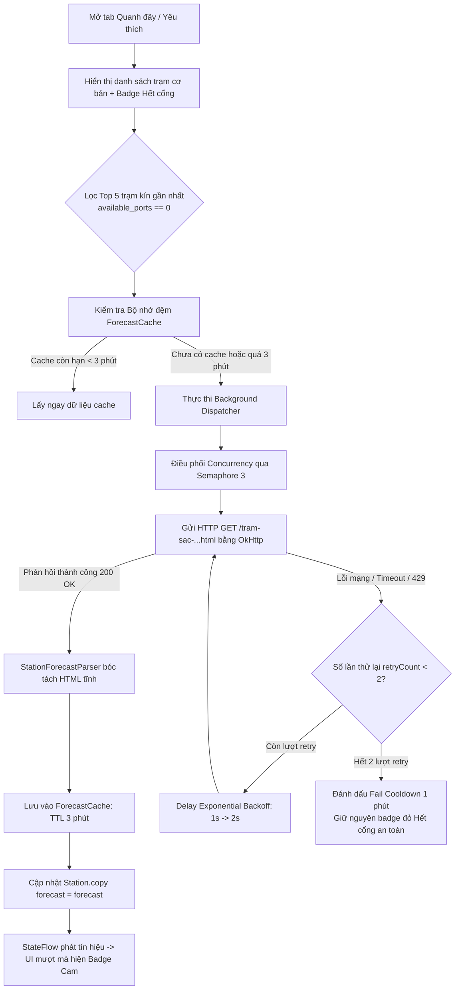

# ⚡ GIẢI PHÁP KIẾN TRÚC VÀ GIAO DIỆN TỐI ƯU
## DỰ BÁO CỔNG SẠC SẮP TRỐNG TRÊN CARD TRẠM (TAB "QUANH ĐÂY" & "YÊU THÍCH")

> **Mục tiêu**: Đưa thông tin dự báo thời gian xe sạc sắp xong (bóc tách từ HTML Server-Side Rendering của EVCS) ra trực tiếp bên ngoài thẻ trạm sạc (`StationCard`) trên cả hai tab **"Quanh đây"** và **"Yêu thích"**, giúp tài xế liếc qua là biết ngay trạm đang kín khi nào có cổng nhả ra mà không cần tốn thao tác bấm vào xem chi tiết.

---

## 🎨 1. Thiết kế Giao diện (UI/UX) Tối ưu Ngoài Card Trạm

Khi một trạm sạc đang kín hoàn toàn (`available_ports == 0`):
- Trạm có **1 hoặc nhiều xe / nhiều mức công suất** sắp xong (ví dụ: 1 xe 250kW trong 8 phút, 2 xe 20kW trong 7-14 phút).
- Giao diện phải trình bày **ngăn nắp, dễ quét mắt trong 1 giây**, phân biệt rạch ròi giữa các trạng thái.

### 1.1 Mockup Trực quan Thẻ Trạm Sạc

```
┌────────────────────────────────────────────────────────────────────────┐
│ Trạm VinFast TTTM Dabaco Mart Quế Võ                    [ ⏱️ Sắp trống ] │
│ 🚗 12 phút • 5.2 km • Đường bộ  |  Mở 24/7 • Miễn phí gửi xe          │
│ 📍 Quốc lộ 18, TT. Phố Mới, Quế Võ, Bắc Ninh                          │
│                                                                        │
│ ┌─ ⚡ DỰ KIẾN CỔNG SẮP TRỐNG ────────────────────────────────────────┐ │
│ │ • 20kW:  ~7-14 phút (2 xe)                                         │ │
│ │ • 250kW: ~8 phút (1 xe)                                            │ │
│ └────────────────────────────────────────────────────────────────────┘ │
│                                                                        │
│ [✧ 20kW: trống 0/4]  [✧ 60kW: trống 0/2]  [✧ 250kW: trống 0/2]         │
│                                                                        │
│ [  🚗 CHỈ ĐƯỜNG  ]                                             [ ♡ ]   │
└────────────────────────────────────────────────────────────────────────┘
```

### 1.2 Thành phần Giao diện Chi tiết

#### A. Header Status Badge (Chuyển màu mượt mà)
* **Ban đầu (khi mới tải danh sách):** Card trạm kín hiển thị badge đỏ bình thường:
  - Text: `Hết cổng`
  - Màu chấm/chữ: `#EF4444` (Đỏ bận)
  - Nền container: `Color(0x26EF4444)`
* **Khi tải xong dữ liệu dự báo:** Chuyển đổi mượt mà (Animated Crossfade / Transition) sang:
  - Text: `⏱️ Sắp trống`
  - Màu chấm/chữ: `#F59E0B` (Cam hổ phách Amber)
  - Nền container: `Color(0x26F59E0B)`
* **Lưu ý:** Nếu trạm có cổng trống (`available_ports > 0`), badge luôn là xanh lá `Hoạt động` và không hiển thị dự báo.

#### B. Forecast Capsule (Hộp Thông tin Dự báo Chi tiết)
* **Vị trí:** Nằm ngay phía trên các chip công suất (`WattageChip`) và bên dưới dòng địa chỉ.
* **Phong cách:**
  - Nền: `Color(0x1AF59E0B)` (Cam hổ phách mờ 10%).
  - Viền: `BorderStroke(1.dp, Color(0x4DF59E0B))` bo góc `10.dp`.
  - Padding: `horizontal = 12.dp, vertical = 8.dp`.
* **Quy tắc hiển thị nội dung:**
  - **Trường hợp 1 (Chỉ có 1 dòng / 1 phiên sạc):** Hiển thị 1 dòng ngắn gọn, súc tích:  
    `⏱️ Dự kiến 2 xe sạc trụ 20kW sẽ xong trong 7-14 phút nữa`
  - **Trường hợp 2 (Nhiều phiên sạc / nhiều mức công suất):** Hiển thị danh sách bullet points thẳng hàng:  
    `⚡ DỰ KIẾN CỔNG SẮP TRỐNG:`  
    `• 20kW:  ~7-14 phút (2 xe)`  
    `• 60kW:  ~13 phút (1 xe)`  
    `• 250kW: ~8 phút (1 xe)`
* **Hiệu ứng xuất hiện:** Dùng `AnimatedVisibility(visible = station.forecast != null, enter = fadeIn() + expandVertically())` để khối dự báo trượt nhẹ xuống mà không gây giật lag giao diện.

---

## ⚙️ 2. Kiến trúc Xử lý Dữ liệu & Tính Năng Ngầm (Architecture & Resilience)



### 2.1 Chiến lược Lọc Đối tượng (Target Selection Strategy)
1. Không gửi request cho toàn bộ 50 trạm quanh đây để tránh nghẽn mạng, tốn 4G/pin và bị server chặn IP.
2. Áp dụng chuẩn xác quy tắc **Top 5 Trạm Kín Gần Nhất**:
   - Điều kiện lọc: `station.totalPlugs > 0 && station.totalAvailablePlugs == 0`.
   - Sắp xếp: Theo khoảng cách thực tế gần nhất đến tọa độ người dùng.
   - Giới hạn: `take(5)` trạm đầu tiên.
   - Áp dụng đồng nhất cho cả tab **"Quanh đây"** và **"Yêu thích"**.

### 2.2 Cơ chế Bộ nhớ đệm In-Memory (Cache TTL 3 Phút)
* **Cấu trúc lưu trữ:** `ForecastCache` sử dụng `ConcurrentHashMap<String, ForecastCacheEntry>`.
  ```kotlin
  data class ForecastCacheEntry(
      val forecast: StationForecast?,
      val cachedAt: Long
  ) {
      val isExpired: Boolean get() = System.currentTimeMillis() - cachedAt > 180_000L // 3 phút
  }
  ```
* **Thời gian sống (TTL):** 3 phút (180 giây). Nếu người dùng lướt đi lướt lại giữa các tab trong 3 phút, dữ liệu lấy tức thì từ RAM, không gọi thêm mạng.
* **Xóa cache thủ công:** Khi người dùng thực hiện thao tác kéo để làm mới (Pull-to-refresh) hoặc ấn nút Làm mới trên thanh công cụ, cache của các trạm sẽ bị xóa ngay lập tức (`forceRefresh = true`).

### 2.3 Cơ chế Thử lại Ngầm với Giảm tải Lũy thừa (Silent Exponential Backoff Retry)
* Khi gọi HTTP GET trang trạm sạc:
  - Nếu gặp lỗi mạng tạm thời (`IOException`, `SocketTimeoutException`, HTTP 502/503/504):
    - **Lần 1:** Thử lại sau `1000ms` (+ jitter ngẫu nhiên 0-300ms).
    - **Lần 2:** Thử lại sau `2000ms` (+ jitter ngẫu nhiên 0-300ms).
  - Nếu sau 2 lần thử lại vẫn không thành công:
    - **Silent Fail:** Ứng dụng **không bao giờ văng lỗi**, không hiện popup cảnh báo rác lên màn hình.
    - Card trạm giữ nguyên trạng thái an toàn là badge đỏ `Hết cổng`.
    - Ghi nhận trạng thái cooldown 1 phút trước khi cho phép quét lại để bảo vệ tài nguyên mạng.

### 2.4 Kiểm soát Băng thông & Đồng thời (Concurrency Throttle)
* Khi quét 5 trạm cùng lúc, không mở 5 luồng tải song song đồng loạt để tránh bị server hiểu nhầm là spam/DDoS.
* Áp dụng `Semaphore(3)`: Chỉ cho phép tối đa 3 request HTTP chạy đồng thời, 2 request còn lại xếp hàng ngắn. Toàn bộ quá trình hoàn tất chỉ trong khoảng ~1.2 giây.

---

## 📋 3. Lộ trình Triển khai (4 Phases)

| Phase | Mục tiêu | Tệp Test Duy Nhất để Kiểm Thử |
|:---:|---|---|
| **Phase 01** | Xây dựng Data Models (`StationForecast`) và bộ bóc tách Regex/JSON `StationForecastParser` từ HTML tĩnh. | `StationForecastParserTest.kt` |
| **Phase 02** | Xây dựng bộ nhớ đệm `ForecastCache` (TTL 3m) và hàm tải có retry ngầm Exponential Backoff trong `EvcsRepository`. | `StationForecastRepositoryTest.kt` |
| **Phase 03** | Tích hợp pipeline quét Top 5 trạm kín gần nhất vào `NearbyViewModel` và `FavoritesViewModel`. | `StationForecastViewModelPipelineTest.kt` |
| **Phase 04** | Cập nhật `StatusBadge` màu cam hổ phách Amber và gắn component `ForecastCapsule` vào `StationCard.kt`. | `StationCardForecastBadgeTest.kt` |

---

## 🎯 4. Giá trị Đem lại cho Người Dùng
1. **Tiết kiệm thời gian & thao tác:** Tài xế không cần nhấn mở từng trạm; chỉ cần nhìn lướt danh sách là biết trạm nào sắp có xe rút sạc.
2. **Trải nghiệm ứng dụng cao cấp (Pro UX):** Màu cam Amber phân định rõ ràng giữa "Hết cổng phải đợi lâu" và "Hết cổng nhưng sắp có chỗ".
3. **Hoàn toàn miễn phí:** Tận dụng 100% dữ liệu SSR do máy chủ nhúng sẵn mà không bị rào cản tài khoản hay bị mã JavaScript web ẩn đi.
