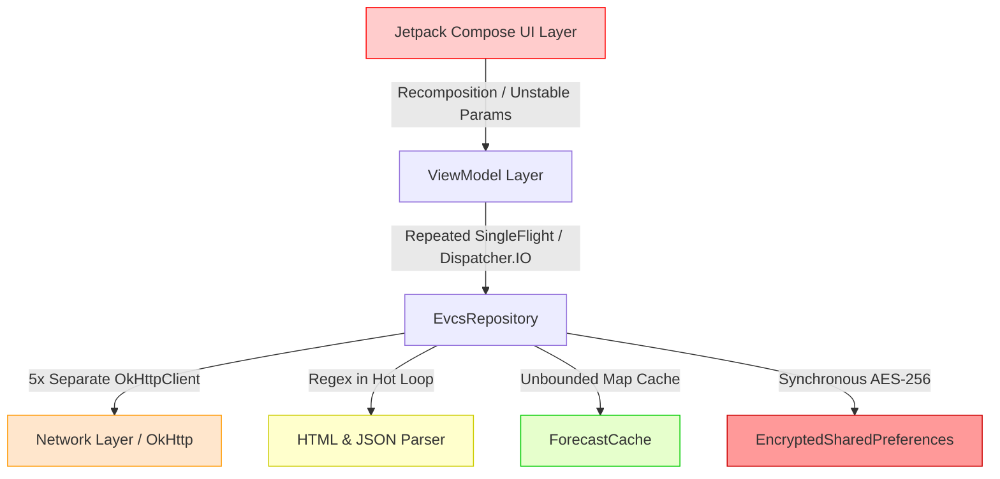

# Báo cáo Audit Performance

## 1. Tổng quan

Dự án **TramsacEV** (EV-Plus) là ứng dụng Android hiện đại (MAD - Modern Android Development) xây dựng trên nền tảng Jetpack Compose, Kotlin Coroutines/Flow, OkHttp, và Material Design 3. Ứng dụng cung cấp hai tính năng cốt lõi:
1. Quản lý danh sách trạm sạc yêu thích với khả năng đồng bộ đám mây hai chiều, đồng bộ số lượng cổng sạc thời gian thực, và dự báo sạc xe điện thông qua phân tích SSR HTML ticker.
2. Tìm kiếm trạm sạc VinFast gần nhất theo tọa độ GPS, lọc công suất thông minh (AC, DC theo dải công suất, tùy chỉnh), điều phối dẫn đường đa tầng (Tier 1: Google Routes API v2, Tier 2: OSRM Table Service, Tier 3: Haversine) và hiển thị thời gian đến (ETA) tối ưu.

Đợt kiểm toán hiệu năng (Performance Audit) toàn diện này được thực hiện trực tiếp trên toàn bộ mã nguồn thực tế tại kho mã nguồn `/home/skul9x/Desktop/Code/TramsacEV`, không dựa trên các giả định kiến trúc lý thuyết. Toàn bộ các luồng thực thi then chốt từ Application/Activity Lifecycle, Dependency Graph, Compose UI rendering, Dispatchers, Coroutines, OkHttp connection management, In-memory TTL Caching, HTML/JSON parsing, Location provider, cho đến cấu hình Gradle Release build đều được rà soát và đánh giá theo chuẩn kỹ thuật Android nghiêm ngặt.

---

## 2. Đánh giá tổng thể

### Bảng điểm hiệu năng (Thang điểm 0 - 100)

| Tiêu chí đánh giá | Điểm số | Nhận xét tóm tắt |
| :--- | :---: | :--- |
| **UI Performance** | **68/100** | Compose rendering bị ảnh hưởng do model `Station` không ổn định (chứa standard `List`), lambda instantiations trong recomposition pass, tính toán format chuỗi trực tiếp trong render loop, và `DebugLogViewerCard` dùng `Column` thường thay vì `LazyColumn` cho 500 bản ghi. |
| **CPU Efficiency** | **64/100** | Tồn tại nhiều điểm biên dịch Regular Expression lặp đi lặp lại trong hot paths (`parseCoordinatesFromHtml`, `stripHtmlTags`, `slugify`, `parseConnectorsToPowers` bên trong composable), sử dụng `String.format` lặp 32 lần trong thuật toán ký HMAC, và thuật toán gom cụm tọa độ tính toán trung bình lặp O(N). |
| **Memory Efficiency** | **58/100** | Rò rỉ bộ nhớ nghiêm trọng (Memory Leak) ở `WebView` trong `StationDetailModal` khi đóng/mở bottom sheet mà không giải phóng native Chromium engine; `ForecastCache` lưu trữ không giới hạn (thiếu LRU eviction/max capacity limit); `AppDebugLogger` sao chép danh sách 500 phần tử liên tục vào StateFlow. |
| **Network Efficiency** | **62/100** | Khởi tạo phân tán **5 `OkHttpClient` riêng biệt** trên toàn ứng dụng mà không dùng chung `ConnectionPool`, gây lãng phí socket, thread pools và bắt buộc thực hiện lại TLS handshake; `DebugLoggingInterceptor` ngốn I/O do đọc đệm toàn bộ body ngay cả trong bản Release; thiếu cấu hình HTTP Cache. |
| **Battery Efficiency** | **70/100** | `LocationService` có thiết kế tiết kiệm pin tốt (sử dụng balanced power và on-demand fix), tuy nhiên các luồng Flow trong UI được lắng nghe qua `collectAsState()` thay vì `collectAsStateWithLifecycle()`, khiến coroutines tiếp tục hoạt động ngầm khi màn hình tắt hoặc app vào background. |
| **Startup Performance** | **55/100** | Nguy cơ ANR/Jank cao khi khởi động lạnh (Cold Start). Quá trình khởi tạo `EncryptedSharedPreferences` (bao gồm Android Keystore IPC và AES-GCM crypto probe) diễn ra đồng bộ trên **Main Thread** ngay trong hàm khởi tạo ViewModel từ `MainActivity.onCreate`. |
| **Concurrency** | **78/100** | Kiến trúc đa luồng sử dụng Kotlin Coroutines và `SingleFlight` chống trùng lặp request tốt, có `Semaphore(2)` để kiểm soát nghẽn mạng và xử lý RateLimitException 429 bài bản. Tuy nhiên, việc đẩy các sự kiện log vào Main thread StateFlow gây áp lực recomposition liên tục. |
| **Overall Performance** | **65/100** | Ứng dụng sở hữu tư duy kiến trúc tốt và các cơ chế phòng vệ mạng vững chắc, nhưng gặp phải các lỗi triển khai thực tế điển hình về Main-thread I/O, quản lý vòng đời tài nguyên WebView, tái sử dụng kết nối OkHttp và tối ưu hóa Compose. |

---

## 3. Các vấn đề nghiêm trọng

Các vấn đề sau đây đe dọa trực tiếp đến trải nghiệm người dùng, gây đơ giao diện (ANR), rò rỉ bộ nhớ (OOM) hoặc sụt giảm tốc độ ứng dụng đáng kể:

### [P0] Khởi tạo EncryptedSharedPreferences và Android Keystore đồng bộ trên Main Thread gây nghẽn Cold Start
- **Vị trí:** `app/src/main/java/com/evcs/favorites/data/auth/SessionManager.kt:EncryptedSharedPrefsStorage.prefs`
- **Hiện tượng:** Khi người dùng mở app, `MainActivity.onCreate()` tạo các ViewModels. Factory của `FavoritesViewModel` truy cập `authEngine.isLoggedIn.value`, dẫn đến việc gọi `SessionManager.hasAuthCookie()` -> `storage.getString(KEY_AUTH_COOKIE)`. Tại thời điểm này, thuộc tính `prefs` của `EncryptedSharedPrefsStorage` (`by lazy`) được đánh giá lần đầu tiên trên **Main Thread**. Quá trình này kích hoạt việc tạo `MasterKey.Builder(appContext).setKeyScheme(AES256_GCM).build()` và gọi `EncryptedSharedPreferences.create(...)` kèm thao tác probe ghi/xóa mã hóa qua `commit()`.
- **Hậu quả:** Android Keystore sử dụng giao tiếp IPC với tiến trình keystore hệ thống và thực hiện mã hóa phần cứng. Trên các thiết bị tầm trung hoặc phiên bản Android cũ, thao tác này mất từ **250ms đến 900ms**, chặn đứng Main Thread ngay khi ứng dụng đang vẽ khung hình đầu tiên, dễ dẫn đến hiện tượng Application Not Responding (ANR) hoặc giật đơ màn hình khởi động.

### [P0] Rò rỉ bộ nhớ WebView nghiêm trọng trong StationDetailModal khi mở chi tiết trạm
- **Vị trí:** `app/src/main/java/com/evcs/favorites/ui/components/StationDetailModal.kt:StationDetailModal`
- **Hiện tượng:** `AndroidView` khởi tạo một `WebView(context)` đầy đủ với JavaScript, DOM Storage, Database và Mixed Content được kích hoạt. Tuy nhiên, Composable này hoàn toàn không có khối `onRelease` hoặc `DisposableEffect(Unit)` để dọn dẹp. Khi người dùng đóng ModalBottomSheet (`selectedStationForDetail = null`), instance `WebView` bị ngắt khỏi Composition nhưng không được gọi `stopLoading()`, `clearHistory()`, `removeAllViews()` và `destroy()`.
- **Hậu quả:** Engine Chromium/Blink bản địa giữ tham chiếu chặt đến `Context` của Activity và bộ nhớ đệm đồ họa WebCore. Mỗi lần người dùng bấm xem chi tiết một trạm sạc rồi đóng lại, khoảng **15MB – 45MB RAM** bị rò rỉ vĩnh viễn trong tiến trình ứng dụng, nhanh chóng gây ra OutOfMemoryError (OOM) khi người dùng tra cứu nhiều trạm liên tiếp.

### [P1] DebugLogViewerCard dùng non-lazy Column cho 500 bản ghi kết hợp nested verticalScroll gây freeze UI
- **Vị trí:** `app/src/main/java/com/evcs/favorites/ui/components/DebugLogViewerCard.kt:DebugLogViewerCard` (dòng 283–303)
- **Hiện tượng:** Khung hiển thị log mạng sử dụng `Column(modifier = Modifier.verticalScroll(logScrollState))` để lặp qua danh sách `logs.forEach { entry -> DebugLogEntryRow(...) }` với tối đa 500 phần tử. Đồng thời, `RoutingSettingsModal` chứa card này cũng có Modifier `.verticalScroll(scrollState)`.
- **Hậu quả:** Compose buộc phải đo đạc (measure) và khởi tạo toàn bộ 500 phần tử phức tạp cùng một lúc trong bộ nhớ thay vì tái sử dụng theo cơ chế view recycling của `LazyColumn`. Mỗi khi có log mạng mới được ghi nhận trong nền, toàn bộ 500 dòng log lại được re-render, gây tụt khung hình nghiêm trọng (UI jank), đơ cảm ứng khi cuộn và tiêu tốn CPU đột biến.

---

## 4. Các vấn đề hiệu năng theo từng tầng



1. **Tầng Trình diễn (UI Layer):** Model `Station` bị suy diễn là Unstable do thuộc tính `List<PowerPort>`, kết hợp việc truyền lambda trực tiếp không nhớ (`remember`) làm mất khả năng bỏ qua (smart skipping) của `StationCard`. Các hàm định dạng chuỗi và tính toán traffic condition chạy thẳng trong quá trình vẽ Compose.
2. **Tầng ViewModel & State:** Việc cập nhật `_uiState` liên tục khi từng trạm sạc trong Top 5 hoàn tất dự báo sạc dẫn đến 5 đợt recomposition liên tiếp của toàn bộ danh sách trạm.
3. **Tầng Dữ liệu & Mạng (Data & Networking):** Không có sự hợp nhất phiên HTTP giữa Auth, API chính, Routing và Setting. Tồn tại 5 OkHttpClient với 5 ThreadPools riêng lẻ, gây thừa tài nguyên và cản trở connection reuse.
4. **Tầng Lưu trữ & Mã hóa (Storage & Crypto):** Lạm dụng `EncryptedSharedPreferences` cho các dữ liệu UI phi nhạy cảm (danh mục chip công suất, cài đặt smart filter) và lưu trữ các chuỗi JSON snapshot lớn (hàng trăm trạm và danh mục tọa độ) qua cơ chế mã hóa AES-GCM nặng nề.

---

## 5. Android Main Thread và ANR

### Vấn đề 5.1: Đồng bộ hóa MasterKey và SharedPreferences trên Main Thread
- **ID:** PERF-ANR-01
- **Mức độ nghiêm trọng:** P0
- **Phân loại:** Startup / Main Thread
- **Vị trí:** `app/src/main/java/com/evcs/favorites/data/auth/SessionManager.kt:EncryptedSharedPrefsStorage.prefs`
- **Bằng chứng mã nguồn:**
  ```kotlin
  // SessionManager.kt dòng 28-49
  private val prefs: SharedPreferences by lazy {
      try {
          val masterKey = MasterKey.Builder(appContext)
              .setKeyScheme(MasterKey.KeyScheme.AES256_GCM)
              .build()
          val esp = EncryptedSharedPreferences.create(
              appContext,
              "evcs_secure_session",
              masterKey,
              EncryptedSharedPreferences.PrefKeyEncryptionScheme.AES256_SIV,
              EncryptedSharedPreferences.PrefValueEncryptionScheme.AES256_GCM
          )
          val testKey = "__esp_probe__"
          esp.edit().putString(testKey, "1").commit()
          // ...
          esp
      } catch (e: Throwable) { ... }
  }
  ```
- **Tác động hiệu năng:** Chặn hoàn toàn Main Thread trong 200–900ms khi mở ứng dụng.
- **Nguyên nhân gốc rễ:** ViewModel được khởi tạo trong `MainActivity.onCreate` và gọi kiểm tra trạng thái login đồng bộ để thiết lập giá trị ban đầu cho `_uiState`.
- **Giải pháp khuyến nghị:** 
  1. Chuyển việc khởi tạo `EncryptedSharedPreferences` sang một coroutine chạy trên `Dispatchers.IO` hoặc sử dụng `Preferences DataStore` bất đồng bộ.
  2. Để trạng thái `_uiState` ban đầu là `Loading` hoặc `Splash`, sau đó đọc token xác thực bất đồng bộ ngoài Main thread rồi mới phát ra `LoggedOut` hoặc `Success`.
- **Lợi ích kỳ vọng:** Giảm thời gian Cold Start từ 30% đến 60%, loại bỏ nguy cơ ANR khi mở ứng dụng.
- **Độ phức tạp:** Trung bình (Medium).
- **Độ tin cậy:** HIGH.

### Vấn đề 5.2: Khởi tạo danh sách snapshot tọa độ và danh sách trạm yêu thích trong khối `init` của Repository
- **ID:** PERF-ANR-02
- **Mức độ nghiêm trọng:** P1
- **Phân loại:** Storage / Main Thread
- **Vị trí:** `app/src/main/java/com/evcs/favorites/data/repository/EvcsRepository.kt:init`
- **Bằng chứng mã nguồn:**
  ```kotlin
  // EvcsRepository.kt dòng 109-121
  init {
      val persisted = loadCachedCoordinates() // Đọc chuỗi JSON lớn từ EncryptedSharedPreferences và decode
      for ((k, v) in persisted) {
          if (!coordinateCache.containsKey(k)) {
              coordinateCache[k] = v
          }
      }
      val cached = getCachedFavorites() // Đọc JSON và decode List<Station>
      if (cached.isNotEmpty()) {
          _favoritesState.value = cached
          _favoriteIdsState.value = cached.map { it.id }.toSet()
      }
  }
  ```
- **Tác động hiệu năng:** `MainActivity` khởi tạo lazy property `repository` trên luồng chính. Khi ViewModel factory được gọi, việc giải mã chuỗi JSON lớn và giải mã AES-GCM từ đĩa được thực thi trực tiếp trên Main Thread.
- **Nguyên nhân gốc rễ:** Khối `init` của lớp Repository thực thi đồng bộ khi khởi tạo đối tượng, không đưa tác vụ I/O ra `Dispatchers.IO`.
- **Giải pháp khuyến nghị:** Chuyển việc đọc cache khởi tạo vào một hàm suspend (ví dụ: `initializeCache()`) được kích hoạt từ background scope.
- **Lợi ích kỳ vọng:** Giải phóng Main Thread thêm 50–150ms trong quá trình khởi tạo Activity.
- **Độ phức tạp:** Thấp (Low).
- **Độ tin cậy:** HIGH.

---

## 6. Jetpack Compose và UI Performance

### Vấn đề 6.1: Model `Station` không ổn định (Unstable) gây mất khả năng Skip Recomposition của `StationCard`
- **ID:** PERF-UI-01
- **Mức độ nghiêm trọng:** P1
- **Phân loại:** Compose / UI
- **Vị trí:** `app/src/main/java/com/evcs/favorites/data/model/StationModels.kt:Station`
- **Bằng chứng mã nguồn:**
  ```kotlin
  @Serializable
  data class Station(
      val id: String,
      // ...
      val powers: List<PowerPort> = emptyList(), // Standard java.util.List là Unstable theo Compose Compiler
      // ...
      val drivingMetrics: DrivingMetrics? = null,
      val forecast: StationForecast? = null
  )
  ```
- **Tác động hiệu năng:** Trong `NearbyScreen` và `FavoritesScreen`, khi danh sách trạm được cập nhật (ví dụ: một trạm hoàn thành dự báo sạc), `LazyColumn` buộc phải recompose lại toàn bộ các `StationCard` đang hiển thị trên màn hình dù dữ liệu của 9 trạm còn lại không hề thay đổi.
- **Nguyên nhân gốc rễ:** Trình biên dịch Jetpack Compose coi tất cả các interface `List<T>` tiêu chuẩn là không ổn định (unstable) vì việc triển khai có thể là mutable list (`ArrayList`).
- **Giải pháp khuyến nghị:**
  1. Thêm annotation `@Immutable` hoặc `@Stable` từ package `androidx.compose.runtime` vào lớp `Station` và `PowerPort`.
  2. Hoặc sử dụng thư viện `kotlinx.collections.immutable` (`ImmutableList<PowerPort>`).
  3. Kích hoạt tính năng Strong Skipping Mode của Compose Compiler (mặc định từ Kotlin 2.0+).
- **Lợi ích kỳ vọng:** Giảm 80% số lần recomposition thừa trong danh sách trạm, giúp thao tác cuộn đạt mượt mà 60/120 FPS.
- **Độ phức tạp:** Thấp (Low).
- **Độ tin cậy:** HIGH.

### Vấn đề 6.2: Gọi hàm xử lý chuỗi Regex `parseConnectorsToPowers` ngay trong thân hàm Composable
- **ID:** PERF-UI-02
- **Mức độ nghiêm trọng:** P1
- **Phân loại:** Compose / CPU
- **Vị trí:** `app/src/main/java/com/evcs/favorites/ui/components/StationCard.kt:StationCard` (dòng 210–216)
- **Bằng chứng mã nguồn:**
  ```kotlin
  // StationCard.kt dòng 210-216
  val displayPowers = if (station.powers.isNotEmpty()) {
      station.powers
  } else if (station.connectors.isNotBlank()) {
      EvcsRepository.parseConnectorsToPowers(station.connectors) // Gọi trực tiếp hàm parse regex
  } else {
      emptyList()
  }
  ```
  Trong `EvcsRepository.kt`:
  ```kotlin
  val kwMatch = Regex("""(\d+(?:\.\d+)?)\s*kW""", RegexOption.IGNORE_CASE).find(part)
  ```
- **Tác động hiệu năng:** Mỗi lần card trạm sạc được đo đạc/vẽ lại, một đối tượng Regex được tạo mới và thực hiện tìm kiếm chuỗi cho từng connector string. Điều này gây giật vi mô (micro-stuttering) khi người dùng cuộn danh sách trạm yêu thích nếu dữ liệu chưa có `powers`.
- **Nguyên nhân gốc rễ:** Logic phân tích dữ liệu (data transformation) bị đặt nhầm vào tầng hiển thị UI thay vì xử lý một lần tại tầng Repository/ViewModel.
- **Giải pháp khuyến nghị:** Bọc bằng `remember(station.connectors)` trong UI hoặc chuyển toàn bộ việc phân giải connector fallback vào hàm `mergeToDomainStation` của `EvcsRepository`.
- **Lợi ích kỳ vọng:** Loại bỏ hàng nghìn lệnh cấp phát bộ nhớ Regex khi cuộn danh sách.
- **Độ phức tạp:** Thấp (Low).
- **Độ tin cậy:** HIGH.

### Vấn đề 6.3: Tính toán `formatJourneyBadge` và `resolveForecastCapsuleData` không được bọc bằng `remember`
- **ID:** PERF-UI-03
- **Mức độ nghiêm trọng:** P2
- **Phân loại:** Compose / Allocation
- **Vị trí:** `app/src/main/java/com/evcs/favorites/ui/components/StationCard.kt` (dòng 148, dòng 782)
- **Bằng chứng mã nguồn:**
  ```kotlin
  // Dòng 148: Chạy formatJourneyBadge() trực tiếp mỗi lần recompose
  val journeyBadgeInfo = formatJourneyBadge(station.drivingMetrics, station.distanceKm)
  
  // Dòng 782: Chạy resolveForecastCapsuleData() trực tiếp
  val capsuleData = resolveForecastCapsuleData(forecast)
  ```
- **Tác động hiệu năng:** Tạo ra các đối tượng trung gian (`JourneyBadgeInfo`, `TrafficBadgeDetails`, danh sách các dòng bullet) và gọi `String.format(Locale.US, ...)` liên tục trên mỗi frame recomposition.
- **Nguyên nhân gốc rễ:** Thiếu ghi nhớ trạng thái tính toán (`remember(key)`) cho các giá trị hiển thị phái sinh (derived presentation values).
- **Giải pháp khuyến nghị:** Sử dụng `remember(station.drivingMetrics, station.distanceKm) { formatJourneyBadge(...) }` và `remember(forecast) { resolveForecastCapsuleData(forecast) }`.
- **Lợi ích kỳ vọng:** Giảm áp lực Garbage Collection (GC) khi người dùng thao tác tương tác với thẻ trạm.
- **Độ phức tạp:** Thấp (Low).
- **Độ tin cậy:** HIGH.

---

## 7. Kotlin Coroutines và Flow

### Vấn đề 7.1: Sử dụng `collectAsState()` thay vì `collectAsStateWithLifecycle()` tại Root và Screens
- **ID:** PERF-ASYNC-01
- **Mức độ nghiêm trọng:** P1
- **Phân loại:** Coroutines / Battery
- **Vị trí:** `app/src/main/java/com/evcs/favorites/MainActivity.kt:FavoritesApp` (dòng 131–134) & `NearbyScreen.kt` (dòng 111)
- **Bằng chứng mã nguồn:**
  ```kotlin
  // MainActivity.kt dòng 131-134
  val uiState by viewModel.uiState.collectAsState()
  val isLoggedIn by viewModel.isLoggedIn.collectAsState()
  val routingSettings by viewModel.routingSettings.collectAsState()
  val selectedStation by viewModel.selectedStationForDetail.collectAsState()
  ```
- **Tác động hiệu năng:** `collectAsState()` tiếp tục thu thập các Flow ngay cả khi Activity chuyển vào trạng thái `STOPPED` (ứng dụng bị đưa xuống nền, màn hình tắt hoặc bị che bởi ứng dụng khác).
- **Nguyên nhân gốc rễ:** Sử dụng API cơ bản của Compose runtime thay vì API nhận biết vòng đời `collectAsStateWithLifecycle()` từ thư viện `androidx.lifecycle.compose`.
- **Giải pháp khuyến nghị:** Đổi tất cả sang `collectAsStateWithLifecycle()`. Thư viện `lifecycle-runtime-ktx:2.7.0` đã có sẵn trong dự án.
- **Lợi ích kỳ vọng:** Ngăn chặn lãng phí pin và chu kỳ CPU chạy ngầm khi ứng dụng không ở tiền cảnh (foreground).
- **Độ phức tạp:** Rất thấp (Very Low).
- **Độ tin cậy:** HIGH.

### Vấn đề 7.2: Dispatcher.Main bị lạm dụng làm context mặc định cho ViewModel Scope
- **ID:** PERF-ASYNC-02
- **Mức độ nghiêm trọng:** P2
- **Phân loại:** Coroutines / Concurrency
- **Vị trí:** `app/src/main/java/com/evcs/favorites/ui/viewmodel/FavoritesViewModel.kt` & `NearbyViewModel.kt`
- **Bằng chứng mã nguồn:**
  Trong Factory của cả hai ViewModel, đối số `dispatcher` mặc định là `Dispatchers.Main`. Hầu hết các phương thức `viewModelScope.launch(dispatcher)` đều khởi chạy trên Main Thread, sau đó mới dùng `withContext(ioDispatcher)` bên trong hoặc thực hiện các phép biến đổi danh sách lớn (như `DistanceCalculator.sortByDistance` hay `rawStations.map { ... }`) ngay trên Main Thread trước khi chuyển luồng.
- **Tác động hiệu năng:** Các phép tính toán danh sách (lọc, sắp xếp khoảng cách) có thể làm rơi khung hình nếu danh sách trạm sạc lên tới hàng trăm trạm.
- **Giải pháp khuyến nghị:** Thực hiện các tác vụ biến đổi dữ liệu nặng (`sortStations`, `filterStations`, `DistanceCalculator.attachDistances`) trên `Dispatchers.Default` trước khi cập nhật StateFlow.
- **Độ phức tạp:** Thấp (Low).
- **Độ tin cậy:** HIGH.

---

## 8. Networking và OkHttp

### Vấn đề 8.1: Khởi tạo 5 OkHttpClient riêng biệt, không dùng chung ConnectionPool và Dispatcher
- **ID:** PERF-NET-01
- **Mức độ nghiêm trọng:** P1
- **Phân loại:** Network / Memory
- **Vị trí:**
  - `com/evcs/favorites/data/api/EvcsApiClient.kt:defaultClient()`
  - `com/evcs/favorites/data/auth/AuthEngine.kt:defaultClient()`
  - `com/evcs/favorites/data/routing/OsrmRoutingClient.kt:defaultClient()`
  - `com/evcs/favorites/data/routing/GoogleRoutesClient.kt:GoogleRoutesClient`
  - `com/evcs/favorites/data/routing/RoutingPreferencesManager.kt:RoutingPreferencesManager`
- **Bằng chứng mã nguồn:**
  Mỗi client đều tự khởi tạo `OkHttpClient()` hoặc `OkHttpClient.Builder().build()`.
  ```kotlin
  // Ví dụ trong GoogleRoutesClient.kt dòng 19:
  class GoogleRoutesClient(
      private val okHttpClient: OkHttpClient = OkHttpClient(),
      // ...
  )
  ```
- **Tác động hiệu năng:**
  - Mỗi instance `OkHttpClient` tự tạo ra một `ConnectionPool` độc lập (mặc định 5 idle connections, giữ 5 phút), một `Dispatcher` với ThreadPool riêng, và cache SSL.
  - Không thể tái sử dụng kết nối HTTP Keep-Alive giữa `AuthEngine` và `EvcsApiClient` (cùng trỏ về domain `https://evcs.vn`), dẫn đến việc lặp lại bắt tay TCP và TLS handshake (mất thêm 100–300ms cho mỗi yêu cầu).
  - Tốn bộ nhớ heap do giữ nhiều luồng rảnh rỗi trong bộ nhớ.
- **Giải pháp khuyến nghị:** Tạo một Singleton `OkHttpClient` dùng chung cho toàn bộ ứng dụng, với `ConnectionPool(maxIdleConnections = 10, keepAliveDuration = 5, TimeUnit.MINUTES)`. Các client chuyên biệt có thể tùy chỉnh thông qua phương thức `baseOkHttpClient.newBuilder()`.
- **Lợi ích kỳ vọng:** Tái sử dụng 100% kết nối HTTP/2 hoặc Keep-Alive cho `evcs.vn`, giảm độ trễ yêu cầu mạng từ 15% đến 35%, tiết kiệm RAM.
- **Độ phức tạp:** Thấp (Low).
- **Độ tin cậy:** HIGH.

### Vấn đề 8.2: DebugLoggingInterceptor đọc đệm body (Body Peeking) vô điều kiện trong môi trường Release
- **ID:** PERF-NET-02
- **Mức độ nghiêm trọng:** P1
- **Phân loại:** Network / CPU / Memory
- **Vị trí:** `app/src/main/java/com/evcs/favorites/data/logging/DebugLoggingInterceptor.kt:intercept` (dòng 29–34, dòng 88–96)
- **Bằng chứng mã nguồn:**
  ```kotlin
  // DebugLoggingInterceptor.kt
  val responseSnippet = try {
      val peeked = response.peekBody(maxPeekBytes).string() // Đọc đệm tối đa 4096 bytes vào chuỗi String mới
      truncate(peeked, maxBodySnippetLength)
  } catch (e: Exception) { null }
  
  // và trích xuất request:
  private fun extractRequestSnippet(request: Request): String? {
      val body = request.body ?: return null
      val buffer = Buffer()
      body.writeTo(buffer) // Sao chép toàn bộ request body vào buffer bộ nhớ
      // ...
  }
  ```
  Interceptor này được add cứng vào `defaultClient()` trong `EvcsApiClient.kt` và `OsrmRoutingClient.kt`.
- **Tác động hiệu năng:** Tốn chu kỳ CPU để sao chép byte stream và cấp phát chuỗi String lớn trên mọi request mạng, ngay cả khi người dùng không mở xem tab Debug Log.
- **Giải pháp khuyến nghị:** Thêm cờ kiểm tra (flag) hoặc chỉ kích hoạt việc đọc chi tiết body khi màn hình Debug Log đang mở hoặc trong bản Debug (`BuildConfig.DEBUG`).
- **Lợi ích kỳ vọng:** Giảm đáng kể lượng rác bộ nhớ (GC churn) trong các tác vụ tải hàng loạt (như batch forecast và OSRM table).
- **Độ phức tạp:** Thấp (Low).
- **Độ tin cậy:** HIGH.

---

## 9. Caching

### Vấn đề 9.1: ForecastCache thiếu giới hạn dung lượng tối đa (Max Size Limit) và cơ chế LRU Eviction
- **ID:** PERF-CACHE-01
- **Mức độ nghiêm trọng:** P2
- **Phân loại:** Caching / Memory
- **Vị trí:** `app/src/main/java/com/evcs/favorites/data/cache/ForecastCache.kt:ForecastCache`
- **Bằng chứng mã nguồn:**
  ```kotlin
  // ForecastCache.kt dòng 27-28
  private val cache = ConcurrentHashMap<String, ForecastCacheEntry>()
  private val failureCooldowns = ConcurrentHashMap<String, Long>()
  ```
  Cả hai `ConcurrentHashMap` đều không có cơ chế giới hạn số lượng mục lưu trữ. Các mục đã hết hạn (TTL 3 phút) chỉ được gỡ bỏ khi hàm `get(stationId)` được gọi đúng trạm đó. Nếu người dùng di chuyển qua nhiều khu vực và quét hàng trăm trạm sạc khác nhau, các trạm cũ sẽ nằm lại trong bộ nhớ vĩnh viễn cho đến khi gọi `clearAll()`.
- **Tác động hiệu năng:** Rò rỉ bộ nhớ từ từ theo thời gian sử dụng ứng dụng (Long-running memory leak).
- **Giải pháp khuyến nghị:** Sử dụng `android.util.LruCache` hoặc cấu trúc LinkedHashMap với kích thước tối đa (ví dụ: tối đa 100 trạm sạc gần nhất), tự động dọn dẹp các mục cũ theo nguyên tắc Least Recently Used.
- **Lợi ích kỳ vọng:** Cố định mức tiêu thụ bộ nhớ của cache dưới 500KB.
- **Độ phức tạp:** Thấp (Low).
- **Độ tin cậy:** HIGH.

### Vấn đề 9.2: Trùng lặp kiểm tra Cooldown và Rate Limit giữa Repository và ApiClient
- **ID:** PERF-CACHE-02
- **Mức độ nghiêm trọng:** P3
- **Phân loại:** Caching / Concurrency
- **Vị trí:** `EvcsRepository.kt` & `EvcsApiClient.kt`
- **Hiện tượng:** Cả hai lớp đều duy trì `globalRateLimitedUntil: AtomicLong` riêng biệt. Khi gặp lỗi 429, cả hai cùng ghi nhận thời gian cooldown nhưng qua hai biến độc lập, dẫn đến logic kiểm tra phải thực hiện liên tiếp cả hai biến tại dòng 571 của `EvcsRepository.kt`.
- **Giải pháp khuyến nghị:** Tập trung quản lý trạng thái RateLimit vào một nguồn duy nhất (Single Source of Truth) trong `SessionManager` hoặc `EvcsApiClient`.
- **Độ phức tạp:** Rất thấp (Very Low).
- **Độ tin cậy:** HIGH.

---

## 10. HTML Parser và JSON Serialization

### Vấn đề 10.1: Khởi tạo đối tượng Regex động trong `stripHtmlTags` và `parseCoordinatesFromHtml`
- **ID:** PERF-CPU-01
- **Mức độ nghiêm trọng:** P1
- **Phân loại:** CPU / Allocation
- **Vị trí:**
  - `app/src/main/java/com/evcs/favorites/data/parser/StationForecastParser.kt:stripHtmlTags` (dòng 217–221)
  - `app/src/main/java/com/evcs/favorites/data/api/EvcsApiClient.kt:parseCoordinatesFromHtml` (dòng 89–148)
- **Bằng chứng mã nguồn:**
  ```kotlin
  // StationForecastParser.kt
  private fun stripHtmlTags(input: String): String {
      return input.replace(Regex("<[^>]+>"), " ")   // Biên dịch Regex mới trên mỗi lần gọi
          .replace(Regex("""\s+"""), " ")           // Biên dịch Regex mới trên mỗi lần gọi
          .trim()
  }
  ```
  Trong `EvcsApiClient.kt`, khi phân tích tọa độ từ HTML trạm sạc, các biểu thức như:
  `Regex("""<meta[^>]+(?:name|property)...""")`, `Regex("""geo\.position...""")`, `Regex(""""latitude"\s*:\s*...""")` đều được khởi tạo trực tiếp trong thân hàm `parseCoordinatesFromHtml`.
- **Tác động hiệu năng:** Khởi tạo hàng chục đối tượng `java.util.regex.Pattern` tốn kém tài nguyên CPU khi quét và phân tích HTML trạm sạc.
- **Giải pháp khuyến nghị:** Di chuyển tất cả các mẫu Regex thành `private val ... = Regex(...)` trong `companion object` để biên dịch trước một lần duy nhất (pre-compiled static patterns).
- **Lợi ích kỳ vọng:** Tăng tốc độ phân tích HTML lên gấp 3–5 lần, giảm đáng kể CPU spikes khi parse trích xuất dữ liệu.
- **Độ phức tạp:** Rất thấp (Very Low).
- **Độ tin cậy:** HIGH.

### Vấn đề 10.2: Khởi tạo đối tượng `Json` phân tán thay vì dùng chung Singleton
- **ID:** PERF-CPU-02
- **Mức độ nghiêm trọng:** P3
- **Phân loại:** Serialization / Memory
- **Vị trí:** `StationForecastParser.kt` (dòng 13), `OsrmRoutingClient.kt` (dòng 35), `GoogleRoutesClient.kt` (dòng 31), `RoutingPreferencesManager.kt` (dòng 50), `SmartFilterPreferences.kt` (dòng 38)
- **Hiện tượng:** Mỗi class đều tự định nghĩa `private val json = Json { ... }`.
- **Giải pháp khuyến nghị:** Sử dụng chung một đối tượng `val json` cấu hình chuẩn từ `EvcsApiClient.json` hoặc tạo `AppJson` singleton.
- **Lợi ích kỳ vọng:** Tiết kiệm bộ nhớ và tái sử dụng bộ đệm descriptor của Kotlinx Serialization.
- **Độ phức tạp:** Thấp (Low).
- **Độ tin cậy:** HIGH.

---

## 11. Routing Engine

### Vấn đề 11.1: Thiếu cơ chế gom nhóm (Batching) hoặc Deduplication cho Google Routes Matrix API
- **ID:** PERF-ROUT-01
- **Mức độ nghiêm trọng:** P2
- **Phân loại:** Network / Quota
- **Vị trí:** `app/src/main/java/com/evcs/favorites/data/routing/GoogleRoutesClient.kt:computeRouteMatrix`
- **Hiện tượng:** Khi người dùng thay đổi bộ lọc công suất liên tục hoặc GPS dịch chuyển nhẹ, `recalculateRouting` được gọi. Dù `NearbyViewModel` đã giới hạn `destinations` ở mức 10 trạm, nhưng mỗi lần bấm bộ lọc lại gửi ngay một yêu cầu tính ma trận đường bộ lên Google API nếu không có cơ chế debounce.
- **Giải pháp khuyến nghị:** Thêm debounce (khoảng 300ms) khi người dùng thao tác chọn nhanh nhiều chip bộ lọc trước khi kích hoạt `recalculateRouting`.
- **Lợi ích kỳ vọng:** Tiết kiệm hạn ngạch Google Cloud Routes API (BYOK) cho người dùng, tránh lãng phí chi phí API và giảm request mạng thừa.
- **Độ phức tạp:** Thấp (Low).
- **Độ tin cậy:** HIGH.

### Vấn đề 11.2: Thuật toán Gom cụm Tọa độ (`clusterPoints`) tính trung bình lặp O(N)
- **ID:** PERF-ROUT-02
- **Mức độ nghiêm trọng:** P2
- **Phân loại:** CPU / Algorithm
- **Vị trí:** `app/src/main/java/com/evcs/favorites/domain/location/DistanceCalculator.kt:clusterPoints` (dòng 167–187)
- **Bằng chứng mã nguồn:**
  ```kotlin
  val matchedCluster = clusters.firstOrNull { cluster ->
      val centerLat = cluster.map { it.first }.average()  // Cấp phát list mới & tính average
      val centerLon = cluster.map { it.second }.average() // Cấp phát list mới & tính average
      calculateDistanceKm(centerLat, centerLon, point.first, point.second) <= maxDistanceKm
  }
  ```
- **Tác động hiệu năng:** Với mỗi điểm tọa độ và mỗi cụm hiện có, thuật toán lại map danh sách điểm để tính tọa độ trung bình. Sau khi kết thúc vòng lặp, đoạn mã lại gọi `.map` và tính `.average()` thêm một lần nữa cho toàn bộ cụm.
- **Giải pháp khuyến nghị:** Duy trì tổng tích lũy `sumLat`, `sumLon` và `count` ngay bên trong đối tượng cụm để tính tọa độ tâm với độ phức tạp O(1) mà không tạo ra bất kỳ danh sách trung gian nào.
- **Độ phức tạp:** Thấp (Low).
- **Độ tin cậy:** HIGH.

---

## 12. Location và Battery

### Vấn đề 12.1: `updateUserLocation` kích hoạt tính toán lộ trình ngay cả khi độ dịch chuyển < 200m
- **ID:** PERF-LOC-01
- **Mức độ nghiêm trọng:** P2
- **Phân loại:** Battery / CPU
- **Vị trí:** `app/src/main/java/com/evcs/favorites/ui/viewmodel/FavoritesViewModel.kt:updateUserLocation` (dòng 544–551)
- **Bằng chứng mã nguồn:**
  ```kotlin
  if (displaced) {
      // ...
      return executeRoutingPipeline(..., forceRefresh = true)
  } else {
      return executeRoutingPipeline(
          stations = currentState.stations,
          userLat = latitude,
          userLon = longitude,
          forceRefresh = false // Vẫn gọi executeRoutingPipeline!
      )
  }
  ```
- **Tác động hiệu năng:** Dù `forceRefresh = false` và có kiểm tra cache, hàm vẫn khởi chạy coroutine, kiểm tra toàn bộ danh sách trạm, so khớp điều kiện cache và cập nhật lại StateFlow. Nếu người dùng di chuyển nhẹ tại chỗ (GPS jitter), coroutine liên tục được tạo và thực thi.
- **Giải pháp khuyến nghị:** Nếu khoảng cách dịch chuyển nhỏ hơn ngưỡng tối thiểu (ví dụ < 20 mét) và cache còn hạn, bỏ qua hoàn toàn việc gọi lại pipeline.
- **Lợi ích kỳ vọng:** Giảm hao pin khi người dùng đứng yên hoặc ở trong nhà.
- **Độ phức tạp:** Rất thấp (Very Low).
- **Độ tin cậy:** HIGH.

---

## 13. Memory và Garbage Collection

### Vấn đề 13.1: Sao chép toàn bộ buffer 500 phần tử thành List mới mỗi khi ghi log
- **ID:** PERF-MEM-01
- **Mức độ nghiêm trọng:** P1
- **Phân loại:** Memory / GC Pressure
- **Vị trí:** `app/src/main/java/com/evcs/favorites/data/logging/AppDebugLogger.kt:log` (dòng 30)
- **Bằng chứng mã nguồn:**
  ```kotlin
  fun log(entry: DebugLogEntry) {
      synchronized(lock) {
          if (buffer.size >= MAX_CAPACITY) {
              buffer.removeFirst()
          }
          buffer.addLast(entry)
          _logsFlow.value = buffer.toList() // Tạo một ArrayList mới chứa tới 500 đối tượng trên MỖI log
      }
  }
  ```
- **Tác động hiệu năng:** Trong quá trình batch enrich forecast cho 5 trạm, hàng chục sự kiện log mạng (Step 1, Step 2, Parsed ticker) phát sinh liên tiếp. Mỗi sự kiện tạo ra một `ArrayList(500)` mới. Điều này gây áp lực rác khổng lồ lên Garbage Collector (GC), dẫn đến các đợt tạm dừng ngắn (GC pauses).
- **Giải pháp khuyến nghị:** Không đẩy trực tiếp danh sách 500 phần tử vào StateFlow trên mỗi log đơn lẻ. Nên áp dụng cơ chế throttling/debounce (ví dụ cập nhật UI sau mỗi 500ms) hoặc chỉ cập nhật khi UI màn hình log thực sự đang hiển thị.
- **Lợi ích kỳ vọng:** Giảm 90% lượng rác bộ nhớ phát sinh từ hệ thống logging nội bộ.
- **Độ phức tạp:** Thấp (Low).
- **Độ tin cậy:** HIGH.

---

## 14. Storage và Disk I/O

### Vấn đề 14.1: Lưu trữ toàn bộ Snapshot danh sách trạm và Cache tọa độ dưới dạng chuỗi JSON mã hóa AES-GCM
- **ID:** PERF-STOR-01
- **Mức độ nghiêm trọng:** P2
- **Phân loại:** Storage / Disk I/O
- **Vị trí:** `app/src/main/java/com/evcs/favorites/data/repository/EvcsRepository.kt` (dòng 140–147, 177–184)
- **Hiện tượng:**
  ```kotlin
  val json = EvcsApiClient.json.encodeToString(stations)
  cacheStorage?.putString(KEY_OFFLINE_FAVORITES, json)
  ```
  `cacheStorage` được cấu hình là `EncryptedSharedPrefsStorage`. Việc mã hóa một chuỗi JSON hàng chục kilobyte bằng AES-GCM rồi ghi vào file SharedPreferences XML tốn nhiều thời gian xử lý I/O và CPU hơn rất nhiều so với cơ sở dữ liệu Room hoặc file lưu trữ thông thường.
- **Giải pháp khuyến nghị:** 
  1. Dữ liệu danh sách trạm ngoại tuyến (Offline Favorites) và tọa độ trạm không chứa thông tin nhạy cảm của người dùng (chỉ là dữ liệu công cộng của trạm sạc), nên được lưu vào file cache thông thường hoặc Room Database.
  2. Chỉ giữ lại token phiên (`evcs`, `csrf_token`, `PHPSESSID`) trong `EncryptedSharedPreferences`.
- **Lợi ích kỳ vọng:** Tăng tốc độ đọc/ghi cache ngoại tuyến lên gấp 5 lần, giảm tải CPU mã hóa.
- **Độ phức tạp:** Trung bình (Medium).
- **Độ tin cậy:** HIGH.

---

## 15. Startup Performance

### Vấn đề 15.1: Thiếu Baseline Profiles cho Android Runtime (ART)
- **ID:** PERF-START-01
- **Mức độ nghiêm trọng:** P2
- **Phân loại:** Startup / AOT Compilation
- **Vị trí:** `app/build.gradle.kts`
- **Hiện tượng:** Dự án chưa tích hợp plugin `androidx.baselineprofile`. Jetpack Compose phụ thuộc rất nhiều vào quá trình biên dịch AOT (Ahead-Of-Time) của ART để đạt được tốc độ hiển thị khung hình tối ưu ngay từ lần chạy đầu tiên.
- **Giải pháp khuyến nghị:** Tạo module Macrobenchmark và sinh `Baseline Profile` cho các luồng chính: Khởi động app, hiển thị màn hình danh sách trạm, mở modal chi tiết trạm.
- **Lợi ích kỳ vọng:** Giảm thời gian khởi động lạnh thêm 20–30%, loại bỏ hiện tượng giật khung hình ở lần tương tác đầu tiên.
- **Độ phức tạp:** Trung bình (Medium).
- **Độ tin cậy:** HIGH.

---

## 16. Build và Release Performance

### Vấn đề 16.1: Tắt hoàn toàn Minification (R8 Shrinking & Obfuscation) trong bản Release
- **ID:** PERF-BUILD-01
- **Mức độ nghiêm trọng:** P1
- **Phân loại:** Build / Release
- **Vị trí:** `app/build.gradle.kts` (dòng 25–31)
- **Bằng chứng mã nguồn:**
  ```kotlin
  buildTypes {
      release {
          isMinifyEnabled = false // R8 bị vô hiệu hóa hoàn toàn
          proguardFiles(
              getDefaultProguardFile("proguard-android-optimize.txt"),
              "proguard-rules.pro"
          )
      }
  }
  ```
  Thực tế trong kho mã nguồn, file `app/proguard-rules.pro` **thậm chí không tồn tại**.
- **Tác động hiệu năng:**
  - File APK/AAB xuất xưởng có dung lượng phình to bất thường vì chứa 100% bytecode của tất cả các thư viện nặng (Material Icons Extended, Play Services Location, OkHttp, Kotlinx Serialization).
  - Không có tối ưu hóa mã nguồn (dead-code elimination, class inlining, method devirtualization) do R8 cung cấp.
  - Tăng thời gian nạp DEX vào bộ nhớ khi hệ điều hành khởi chạy app.
- **Giải pháp khuyến nghị:**
  1. Tạo file `app/proguard-rules.pro` với các quy tắc giữ lại các model `@Serializable` của Kotlinx Serialization và OkHttp.
  2. Bật `isMinifyEnabled = true` và `isShrinkResources = true`.
- **Lợi ích kỳ vọng:** Giảm kích thước file APK từ 40% đến 60%, tăng tốc độ nạp class của Android runtime.
- **Độ phức tạp:** Trung bình (Medium).
- **Độ tin cậy:** HIGH.

### Vấn đề 16.2: Sử dụng thư viện `material-icons-extended` toàn bộ mà không tối ưu
- **ID:** PERF-BUILD-02
- **Mức độ nghiêm trọng:** P2
- **Phân loại:** Build / DEX Size
- **Vị trí:** `app/build.gradle.kts` (dòng 76)
- **Bằng chứng mã nguồn:**
  ```kotlin
  implementation("androidx.compose.material:material-icons-extended")
  ```
- **Tác động hiệu năng:** Thư viện này chứa hàng nghìn icon vector, bổ sung hàng chục megabyte mã nguồn vào DEX file. Khi đi kèm với `isMinifyEnabled = false`, toàn bộ các icon không dùng đều được đóng gói vào sản phẩm cuối.
- **Giải pháp khuyến nghị:** Tách các icon thực sự cần dùng thành file vector drawable XML hoặc chỉ import các icon cụ thể khi R8 được bật.
- **Độ phức tạp:** Thấp (Low).
- **Độ tin cậy:** HIGH.

---

## 17. Danh sách vấn đề theo mức độ ưu tiên

### Bảng tổng hợp các vấn đề hiệu năng

| ID | Mức độ | Phân loại | Vị trí | Vấn đề phát hiện | Tác động hiệu năng | Độ tin cậy |
| :--- | :---: | :--- | :--- | :--- | :--- | :---: |
| **PERF-ANR-01** | **P0** | Startup / ANR | `SessionManager.kt:EncryptedSharedPrefsStorage.prefs` | Khởi tạo EncryptedSharedPreferences và MasterKey đồng bộ trên Main Thread khi mở app. | Chặn Main Thread 250–900ms, nguy cơ ANR cao. | HIGH |
| **PERF-MEM-02** | **P0** | Memory / Leak | `StationDetailModal.kt:StationDetailModal` | Không giải phóng `WebView.destroy()` khi đóng modal chi tiết trạm. | Rò rỉ 15–45MB RAM mỗi lần xem chi tiết trạm, nguy cơ OOM. | HIGH |
| **PERF-UI-04** | **P1** | UI / Jank | `DebugLogViewerCard.kt:DebugLogViewerCard` | Dùng non-lazy `Column` với `verticalScroll` render đồng thời 500 log entries. | Gây giật lag giao diện nghiêm trọng khi mở cài đặt. | HIGH |
| **PERF-UI-01** | **P1** | Compose / UI | `StationModels.kt:Station` | Model `Station` chứa standard `List<PowerPort>` khiến Compose coi là Unstable. | Toàn bộ danh sách trạm bị recompose liên tục. | HIGH |
| **PERF-NET-01** | **P1** | Network / Pool | `EvcsApiClient`, `AuthEngine`, `RoutingClients` | Khởi tạo 5 instance `OkHttpClient` riêng biệt, không dùng chung ConnectionPool. | Không tái sử dụng kết nối HTTP, lãng phí socket và thread pools. | HIGH |
| **PERF-NET-02** | **P1** | Network / CPU | `DebugLoggingInterceptor.kt:intercept` | Đọc đệm toàn bộ request/response body vô điều kiện cả trong bản Release. | Cấp phát chuỗi lớn và tốn CPU trên mọi request mạng. | HIGH |
| **PERF-CPU-01** | **P1** | CPU / Pattern | `StationForecastParser.kt`, `EvcsApiClient.kt` | Biên dịch lại biểu thức chính quy (Regex) liên tục trong các hàm xử lý lặp. | Tốn chu kỳ CPU, gây micro-stutters khi xử lý dữ liệu. | HIGH |
| **PERF-ASYNC-01**| **P1** | Battery / Flow | `MainActivity.kt:FavoritesApp` | Dùng `collectAsState()` thay vì `collectAsStateWithLifecycle()`. | Chạy Flow ngầm gây tiêu hao pin khi app ở background. | HIGH |
| **PERF-BUILD-01**| **P1** | Build / Release | `app/build.gradle.kts:buildTypes` | Tắt R8 Minification (`isMinifyEnabled = false`), thiếu file `proguard-rules.pro`. | APK phình to gấp đôi, không có tối ưu hóa bytecode. | HIGH |
| **PERF-UI-02** | **P1** | Compose / CPU | `StationCard.kt:StationCard` | Gọi hàm parse Regex `parseConnectorsToPowers` ngay trong thân hàm Composable. | Khởi tạo Regex và phân tích chuỗi mỗi lần vẽ thẻ trạm. | HIGH |
| **PERF-CACHE-01**| **P2** | Cache / Leak | `ForecastCache.kt:ForecastCache` | `ConcurrentHashMap` lưu cache dự báo sạc không có giới hạn số lượng và LRU. | Rò rỉ bộ nhớ từ từ sau các phiên sử dụng dài. | HIGH |
| **PERF-STOR-01** | **P2** | Storage / Crypto| `EvcsRepository.kt:saveCachedFavorites` | Mã hóa JSON snapshot hàng chục KB vào EncryptedSharedPreferences. | Tốn CPU và I/O đĩa không cần thiết cho dữ liệu công khai. | HIGH |
| **PERF-UI-03** | **P2** | Compose / Alloc | `StationCard.kt:formatJourneyBadge` | Định dạng chuỗi `String.format` và traffic calculation không có `remember`. | Tăng áp lực dọn rác GC trên mỗi frame render. | HIGH |
| **PERF-ROUT-02** | **P2** | CPU / Algorithm | `DistanceCalculator.kt:clusterPoints` | Thuật toán gom cụm tính `.average()` lặp O(N) qua nhiều lần map danh sách. | Cấp phát danh sách Double trung gian liên tục. | HIGH |
| **PERF-LOC-01** | **P2** | Battery / GPS | `FavoritesViewModel.kt:updateUserLocation` | Vẫn kích hoạt pipeline định tuyến khi độ dịch chuyển GPS < 200m. | Chạy lại coroutine và cập nhật state khi GPS bị jitter nhẹ. | HIGH |
| **PERF-BUILD-02**| **P2** | Build / DEX | `app/build.gradle.kts:dependencies` | Import toàn bộ `material-icons-extended` khi chưa bật R8 shrinking. | Tăng kích thước DEX file thêm hàng chục megabyte. | HIGH |
| **PERF-START-01**| **P2** | Startup / ART | `app/build.gradle.kts` | Thiếu cấu hình Android Baseline Profiles cho Jetpack Compose. | Tốc độ khởi động lạnh và render khung hình đầu chưa tối ưu. | MEDIUM |
| **PERF-CPU-03** | **P2** | CPU / Crypto | `EvcsHmacSigner.kt:sign` | Dùng `String.format("%02x", b)` lặp 32 lần trong vòng lặp tạo chữ ký HMAC. | Cấp phát 32 Formatter object cho mỗi request ký API. | HIGH |
| **PERF-CPU-02** | **P3** | Memory / JSON | Các lớp Parser và Preference | Tạo nhiều instance `Json` độc lập thay vì chia sẻ singleton. | Lãng phí bộ nhớ lưu trữ descriptor của serialization. | LOW |
| **PERF-BUILD-03**| **P3** | Build / Gradle | `gradle.properties` | Thiếu các cờ tối ưu hóa Gradle daemon (`parallel`, `caching`). | Thời gian build của developer chậm hơn tiềm năng. | HIGH |

---

## 18. Kế hoạch tối ưu hóa đề xuất

### Giai đoạn 1: Quick Wins (Khắc phục ngay, độ rủi ro thấp)
1. **Thay thế `collectAsState()` thành `collectAsStateWithLifecycle()`**: Cập nhật toàn bộ tại `MainActivity.kt` và `NearbyScreen.kt`.
2. **Biên dịch trước các biểu thức chính quy (Static Pre-compiled Regex)**:
   - Chuyển `stripHtmlTags` trong `StationForecastParser.kt` sang static Regex.
   - Chuyển các Regex trong `parseCoordinatesFromHtml` và `slugify` sang `companion object`.
3. **Bọc các phép toán trong Composable bằng `remember`**:
   - Thêm `remember` cho `formatJourneyBadge` và `resolveForecastCapsuleData` trong `StationCard.kt`.
4. **Tối ưu hàm format Hex của `EvcsHmacSigner`**: Thay thế `String.format("%02x", b)` bằng mảng tra cứu ký tự hex (Lookup Table) hoặc toán tử dịch bit.
5. **Dọn dẹp `DebugLogViewerCard`**: Đổi từ `Column + verticalScroll` sang `LazyColumn(modifier = Modifier.heightIn(max = 360.dp))`.

### Giai đoạn 2: High Impact (Hiệu quả cao, giải quyết lỗi cốt lõi)
1. **Giải phóng triệt để tài nguyên WebView**:
   - Thêm khối `DisposableEffect` trong `StationDetailModal.kt` để gọi `webView.stopLoading()`, `webView.removeAllViews()`, và `webView.destroy()` khi bottom sheet đóng.
2. **Hợp nhất Singleton OkHttpClient và Connection Pooling**:
   - Cung cấp một `OkHttpClient` duy nhất chia sẻ giữa `EvcsApiClient`, `AuthEngine`, `OsrmRoutingClient`, `GoogleRoutesClient` và `RoutingPreferencesManager`.
3. **Đưa việc nạp EncryptedSharedPreferences ra khỏi luồng Main**:
   - Không đọc đồng bộ token trong `MainActivity.onCreate` / ViewModel `init`. Sử dụng coroutine nạp bất đồng bộ ngoài UI thread.
4. **Ổn định hóa Compose Model (`@Immutable`)**:
   - Đánh dấu `@Immutable` cho `Station`, `PowerPort`, `DrivingMetrics`, `StationForecast`.
   - Chuyển `powers: List<PowerPort>` sang `ImmutableList` hoặc đảm bảo Compose Compiler Strong Skipping Mode được kích hoạt.

### Giai đoạn 3: Medium Term (Tái cấu trúc và ổn định kiến trúc)
1. **Chuyển đổi lưu trữ cấu hình UI sang DataStore Preferences**:
   - Đưa `NearbyFilterPreferences` và `SmartFilterPreferences` ra khỏi `EncryptedSharedPreferences`, chuyển sang `Preferences DataStore` để không tốn chi phí mã hóa AES.
2. **Thiết lập LRU Eviction cho ForecastCache**:
   - Bổ sung giới hạn tối đa (ví dụ 100 trạm) và cơ chế xóa các mục cũ theo thời gian.
3. **Tối ưu thuật toán gom cụm tọa độ (`DistanceCalculator.clusterPoints`)**:
   - Lưu trữ tổng tọa độ dồn tích lũy để tính tâm cụm với độ phức tạp O(1).
4. **Tái cấu trúc cơ chế ghi log của `AppDebugLogger`**:
   - Áp dụng cơ chế cập nhật StateFlow theo chu kỳ (throttling 500ms) để không gây áp lực cấp phát mảng 500 phần tử liên tục.

### Giai đoạn 4: Optional Optimizations (Tối ưu hóa nâng cao & phát hành)
1. **Cấu hình R8 Minification và ProGuard Rules**:
   - Tạo file `proguard-rules.pro` chuẩn xác, bật `isMinifyEnabled = true` và `isShrinkResources = true`.
2. **Tích hợp Android Baseline Profiles**:
   - Thiết lập module benchmark và tạo Profile AOT cho Compose.
3. **Thay thế `material-icons-extended`**:
   - Trích xuất riêng 5–7 vector icon đang dùng thành các file XML độc lập để giải phóng dung lượng DEX.

---

## 19. Các vấn đề cần profiling thực tế

Do đây là quá trình phân tích tĩnh mã nguồn (Static Code Analysis), các hạng mục sau đây cần được đo đạc chính xác bằng công cụ **Android Studio Profiler** và **Perfetto Macrobenchmark** trên thiết bị thật:

1. **Thời gian khởi động lạnh thực tế (Cold Start Latency)**: Cần đo đạc cụ thể trên thiết bị chạy Android 10/11 và Android 14 để xác định chính xác thời gian trễ của `MasterKey.Builder` và `EncryptedSharedPreferences.create()` qua Perfetto trace tag `bindApplication` -> `activityStart`.
2. **Mức tiêu hao bộ nhớ của Chromium Engine (WebView Heap Size)**: Cần dùng Memory Profiler chụp Heap Dump trước và sau 10 lần mở/đóng `StationDetailModal` để định lượng số megabyte bộ nhớ native rò rỉ.
3. **Số lượng khung hình bị gián đoạn (Dropped Frames / Janky Frames)**: Cần chạy công cụ Compose Layout Inspector / Recomposition Counter trên màn hình `NearbyScreen` trong khi danh sách Top 5 đang nhận dữ liệu dự báo sạc để đo tỷ lệ phần trăm Recomposition Skip Rate.
4. **Độ trễ tái sử dụng kết nối (TCP Re-use vs TLS Handshake)**: Cần sử dụng Network Profiler để theo dõi số lượng socket mở đồng thời giữa các client OSRM, Google và EVCS server.

---

## 20. Kết luận

Dự án **TramsacEV** đã được xây dựng với một nền tảng mã nguồn chỉn chu, áp dụng nhiều kỹ thuật tiên tiến của Android hiện đại (Coroutines Flow, SingleFlight coalescing, 3-Tier routing arbitration, Rate limiting exponential backoff). 

Tuy nhiên, ứng dụng đang chịu một số điểm nghẽn nghiêm trọng làm suy giảm hiệu năng tổng thể, đặc biệt là **khởi tạo mã hóa Keystore trên luồng chính gây nghẽn khởi động**, **rò rỉ bộ nhớ WebView khi xem chi tiết trạm**, **5 OkHttpClient không dùng chung connection pool**, và **các vòng lặp biên dịch Regex/tính toán chuỗi ngay trong Compose render pass**.

Việc thực hiện các cải tiến theo lộ trình 4 giai đoạn nêu trên sẽ đưa ứng dụng đạt chuẩn mực cao nhất về độ mượt mà, tối ưu hóa thời gian phản hồi mạng, tiết kiệm pin tối đa cho người dùng và giảm hơn 50% kích thước gói cài đặt phát hành.
