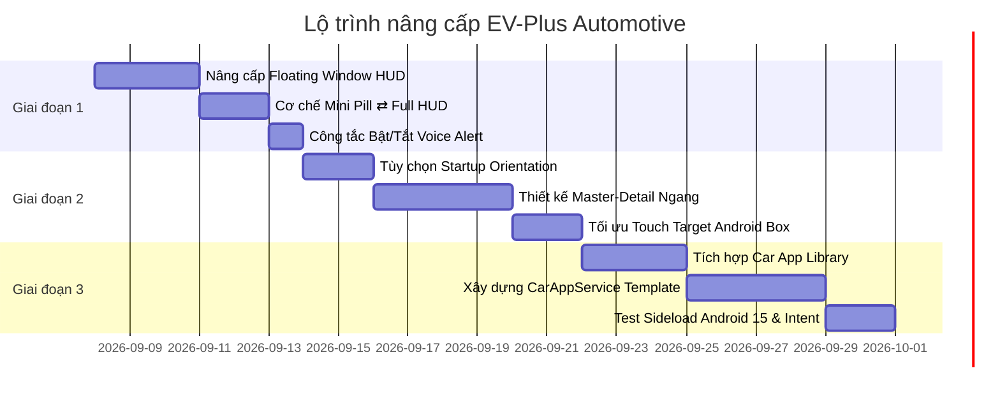

# 🚗 LỘ TRÌNH NÂNG CẤP EV-PLUS: CAR HUD, ANDROID BOX & ANDROID AUTO

> **Tài liệu đặc tả kiến trúc & Lộ trình thực hiện chi tiết (Roadmap)**  
> **Mục tiêu:** Tối ưu hóa trải nghiệm sử dụng ứng dụng EV-Plus khi lái xe ô tô (sử dụng trên Điện thoại, Android Box cắm màn zin xe, và hệ thống Android Auto kết nối màn hình xe).

---

## 📌 I. TỔNG QUAN VẤN ĐỀ & BÀI TOÁN CẦN GIẢI QUYẾT

Khi sử dụng ứng dụng theo dõi trạm sạc xe điện trong quá trình lái xe ô tô thực tế, người dùng gặp phải 3 rào cản lớn:
1. **Cửa sổ nổi (Floating Window) quá nhỏ:** Hiện tại cửa sổ nổi có kích thước cố định nhỏ (chữ 10-13sp), tài xế ngồi cách màn hình 70-90cm phải "căng mắt" nhìn số trụ trống, gây mất tập trung và nguy hiểm khi lái xe.
2. **Thiếu hỗ trợ màn hình ngang cho Android Box:** Màn hình Android Box trên xe hơi có tỉ lệ ngang dài (16:9, ultrawide 21:9). App thiết kế thuần màn hình dọc sẽ bị co cụm ở giữa, lãng phí không gian hiển thị và nút bấm quá nhỏ khó chạm khi xe đang chạy.
3. **Môi trường Android Auto:** Khi cắm điện thoại vào xe qua Android Auto để dùng Google Maps dẫn đường, hệ điều hành Android Auto chặn hoàn toàn cửa sổ nổi đè lên màn hình xe. Cần có giải pháp hiển thị app trên Android Auto, tự động bắn lệnh đổi trạm sang Google Maps, và hoạt động mượt mà trên **Android 15** mà không bắt buộc đưa lên Google Play Store.

---

## 🎯 II. GIẢI PHÁP KỸ THUẬT CHI TIẾT

```
                                  ┌──────────────────────────────────────────────────────────┐
                                  │                     HỆ SINH THÁI XE HƠI                  │
                                  └────────────────────────────┬─────────────────────────────┘
                                                               │
                ┌──────────────────────────────────────────────┼──────────────────────────────────────────────┐
                │                                              │                                              │
                ▼                                              ▼                                              ▼
    ┌───────────────────────┐                      ┌───────────────────────┐                      ┌───────────────────────┐
    │   1. CAR HUD OVERLAY  │                      │   2. ANDROID BOX UI   │                      │    3. ANDROID AUTO    │
    │   (Điện thoại / Box)  │                      │     (Màn hình ngang)  │                      │    (Màn hình zin xe)  │
    ├───────────────────────┤                      ├───────────────────────┤                      ├───────────────────────┤
    │ • Mini Pill ⇄ Full HUD│                      │ • Startup Orientation │                      │ • Car App Library     │
    │ • Co giãn % màn hình  │                      │ • Layout 2 cột        │                      │ • Bắn Intent Maps xe  │
    │ • Chống cắt chữ (Clip)│                      │ • Touch Target ≥ 56dp │                      │ • Chạy APK Android 15 │
    │ • Font số trụ ≥ 24sp  │                      │ • Navigation Rail dọc │                      │ • Voice Audio Ducking │
    └───────────────────────┘                      └───────────────────────┘                      └───────────────────────┘
```

---

### 1. Floating Window: Car HUD (Mini Pill ⇄ Full HUD)

* **Triết lý 2-trong-1 (Tối ưu song song Điện thoại & Ô tô):**
  * **Trên Điện thoại (Màn hình dọc):** Giữ nguyên trải nghiệm cầm tay 1 cột mượt mà; Floating Window tự động co gọn (~80% chiều ngang điện thoại), vuốt chạm kéo thả mép màn hình nhẹ nhàng bằng ngón cái.
  * **Trên Ô tô / Android Box (Màn hình ngang):** Tự động chuyển sang chế độ góc rộng; Floating Window chỉ chiếm ~32% góc màn hình để nhường 70% không gian cho bản đồ dẫn đường; số trụ sạc to đùng (`24sp Bold`) nhìn rõ từ khoảng cách 1 mét.

* **Cơ chế 1-Tap Toggle (Chạm để chuyển đổi trạng thái):**
  * **Mini HUD (Dạng viên thuốc Pill):**
    * Kích thước siêu gọn (~80 x 38dp), bo tròn góc mềm mại.
    * Nội dung: Chỉ hiển thị icon trạng thái & số trụ trống, ví dụ: `🟢 4` hoặc `🔴 0`.
    * Ưu điểm: Tuyệt đối không che khuất mũi tên dẫn đường hay bản đồ của Google Maps / Vietmap bên dưới.
  * **Full HUD (Bảng điều khiển chi tiết):**
    * Khi chạm vào Mini HUD → Mở rộng thành Full HUD.
    * Hiển thị: Tên trạm, Hero Metric số trụ `🟢 4/8 TRỐNG` (24sp Bold), chip công suất sạc nhanh `[250kW: 2] [60kW: 2]`, nút đổi trạm sang trạm gần nhất còn trống, và nút đóng `✕`.
    * Chạm vào khoảng trống Full HUD → Tự động thu gọn lại thành Mini HUD.

* **Thuật toán co giãn theo % màn hình (Responsive Dynamic Scaling):**
  * **Màn hình ngang (Landscape / Android Box):** Chiều rộng Full HUD = `30% - 34%` bề rộng màn hình thực tế (kẹp trong khoảng an toàn `minWidth = 280dp`, `maxWidth = 440dp`).
  * **Màn hình dọc (Portrait / Điện thoại):** Chiều rộng Full HUD = `80% - 85%` bề rộng màn hình.
  * **Chiều cao:** Tự co giãn theo nội dung (`WRAP_CONTENT`), có padding an toàn chống tràn viền.

* **🛡️ QUY CHUẨN CHỐNG CẮT CHỮ 100% (ZERO TEXT CLIPPING POLICY):**
  * **1. Chống cắt chữ ngang (Tên trạm dài):** Sử dụng `TextViewCompat.setAutoSizeTextTypeUniformWithConfiguration` (tự động hạ cỡ chữ từ `16sp` xuống `13sp` nếu tên trạm dài như *"Vincom Mega Mall Smart City"*) kết hợp `maxLines = 1, ellipsize = TextUtils.TruncateAt.END`. Không bao giờ để chữ bung khỏi khung ngang.
  * **2. Bảo toàn trọn vẹn dấu tiếng Việt (Chống cắt dấu trên/dưới):** Chữ tiếng Việt có dấu mũ và dấu phụ cao/thấp (`Ậ, Ộ, Ệ, Ỹ, Ự`). Bắt buộc đặt padding top/bottom an toàn tối thiểu `4dp - 6dp` cho TextView và kiểm soát `includeFontPadding = true`, tuyệt đối không để mất dấu mũ hay dấu nặng.
  * **3. Tách biệt Hero Metric (Số trụ sạc):** Số trụ trống `4 / 8` được đặt trong View container riêng biệt độc lập, không ghép chung chuỗi string với tên trạm, font cố định `22 - 24sp Bold` để luôn hiển thị trọn vẹn 100% không bị co ép.
  * **4. Container tự do chiều dọc:** Chiều cao của toàn bộ Floating Window luôn là `WRAP_CONTENT` có `minHeight`, cấm fix cứng chiều cao bằng pixel hoặc dp cố định.
  * **5. Tương thích Display/Font Scaling của Android:** Tính toán kích thước có tính đến cài đặt độ phóng đại font chữ của hệ điều hành (Accessibility Font Scale), đảm bảo người dùng đặt chữ to nhất trong Cài đặt máy vẫn hiển thị nguyên vẹn.

---

### 2. Giao diện Android Box: Màn hình ngang & Cảm ứng thuần

* **Tùy chọn hướng màn hình khi khởi động (Startup Orientation Setting):**
  * Lưu cấu hình trong DataStore/Preferences:
    1. `Mặc định hệ thống (Auto-rotate / System)`
    2. `Luôn mở màn hình ngang (Landscape)` *(Khuyên dùng cho Android Box ô tô)*
    3. `Luôn mở màn hình dọc (Portrait)` *(Khuyên dùng cho điện thoại)*
  * Tự động áp dụng ngay trong `MainActivity.onCreate` bằng `requestedOrientation`.

* **Thiết kế giao diện Màn hình ngang (Landscape UI/UX) chuẩn Ô tô:**
  * **Master-Detail Layout (Chia 2 cột ngang):**
    * **Thanh điều hướng:** Chuyển `BottomNavigationBar` thành **Navigation Rail (Thanh dọc bên trái)** để không chiếm mất chiều cao màn hình xe (màn hình xe thường chỉ cao 600 - 720px).
    * **Cột trái (35% - 40% màn hình):** Danh sách các trạm sạc Yêu thích / Gần nhất dạng thẻ lớn, hiển thị số trụ trống `🟢 4/8`, loại cổng sạc, khoảng cách km.
    * **Cột phải (60% - 65% màn hình):** Bản đồ động trực quan hoặc chi tiết trạm đang chọn: danh sách từng cổng sạc (250kW, 150kW, 60kW, 30kW, 20kW) và nút hành động to: **"⚡ DẪN ĐƯỜNG & THEO DÕI"**.
  * **Chuẩn chạm xe hơi (Automotive Touch Target):**
    * Mọi nút bấm và card đều có chiều cao tối thiểu **`56dp`**, khoảng cách padding lớn để tài xế chạm chính xác khi xe đang chạy, không bao giờ bấm trượt.

---

### 3. Tích hợp Android Auto & Hướng dẫn Android 15

* **Cơ chế hoạt động trên Android Auto (Car App Library):**
  * Tích hợp thư viện chính quy của Google: `androidx.car.app:app`.
  * Sử dụng **Template chuẩn** của Google (`PlaceListMapTemplate` / `PaneTemplate`):
    * Cột bên trái: Danh sách các trạm sạc với huy hiệu trạng thái `🟢 4/8 trống`, khoảng cách `1.2 km`.
    * Cột bên phải: Bản đồ hiển thị vị trí trạm.
    * Nút bấm: "Dẫn đường & Theo dõi".

* **Tự động bắn lệnh đổi tuyến đường (Reroute) sang Google Maps:**
  * Khi phát hiện trạm đích hết trụ hoặc tài xế chọn trạm khác, app phát Intent:
    `Intent(Intent.ACTION_VIEW, Uri.parse("google.navigation:q=lat,lng&mode=d"))`.
  * Google Maps trên màn hình xe Android Auto sẽ **tự động đón nhận lệnh và đổi lộ trình dẫn đường ngay lập tức** trên màn hình xe hơi.

* **Cách chạy app từ file APK trên Android 15 (Không cần Google Play Store):**
  * Người dùng chỉ cần bật 1 lần trên điện thoại:
    1. Vào `Cài đặt` điện thoại -> `Android Auto`.
    2. Cuộn xuống mục `Phiên bản` (Version) -> chạm liên tục **10 lần** để mở Chế độ nhà phát triển.
    3. Bấm menu 3 chấm góc trên bên phải -> chọn `Cài đặt cho nhà phát triển` (Developer settings).
    4. Tích chọn vào mục **"Nguồn không xác định" (Unknown sources)**.
  * Sau khi bật, cắm dây vào xe là icon EV-Plus sẽ xuất hiện ngay trên màn hình Android Auto.

---

### 4. Cảnh báo Giọng nói Thông minh (Voice TTS & Audio Ducking)

* Thêm công tắc trong Cài đặt: **"Cảnh báo bằng giọng nói (Bật / Tắt)"**.
* **Logic phát cảnh báo:** Tự động hạ âm lượng nhạc xe (Audio Ducking) và đọc tiếng Việt rõ ràng qua loa ô tô trong 3 tình huống then chốt:
  1. Khi trạm đang đến bị **hết sạch trụ sạc (0 trụ trống)**.
  2. Khi hệ thống **tìm thấy trạm thay thế còn trụ** (ví dụ: *"Trạm hiện tại đã hết trụ. Đã tìm thấy trạm thay thế cách 1.5km còn 4 trụ trống"*).
  3. Khi xe **cách trạm đích 2km** để nhắc tài xế chuẩn bị vào sạc.

---

## 📅 III. LỘ TRÌNH TRIỂN KHAI 3 GIAI ĐOẠN (ROADMAP)



---

### 🚀 GIAI ĐOẠN 1: Nâng cấp Floating Window HUD & Cài đặt Voice TTS
*Mục tiêu: Giải quyết ngay lập tức bài toán tài xế bị mỏi mắt, cửa sổ nổi quá bé hoặc che khuất bản đồ khi lái xe.*

- [ ] **1.1. Tái cấu trúc `FocusModeFloatingViewManager`:**
  - Triển khai 2 chế độ hiển thị: `MINI_PILL` và `FULL_HUD`.
  - Bắt sự kiện chạm đơn (Single Tap) trên container để toggle giữa 2 chế độ.
  - Tách biệt rõ ràng sự kiện kéo thả (Drag & Snap to edge) với sự kiện chạm (Click/Tap).
- [ ] **1.2. Thuật toán kích thước động theo % màn hình:**
  - Viết helper tính toán `widthPixels` và `heightPixels` từ `DisplayMetrics`.
  - Áp dụng công thức: `clamp(screenWidth * 0.32, 280dp, 440dp)` cho màn ngang và `screenWidth * 0.82` cho màn dọc.
- [ ] **1.3. Nâng cấp Typography & Chống Text Clipping:**
  - Tăng cỡ chữ số trụ lên `24sp Bold` (Hero Metric).
  - Tích hợp `TextViewCompat.setAutoSizeTextTypeUniformWithConfiguration` cho tên trạm.
  - Tăng kích thước nút Đóng và nút Đổi trạm lên tối thiểu `48dp x 48dp`.
- [ ] **1.4. Công tắc Voice TTS trong Cài đặt:**
  - Bổ sung setting `voice_alert_enabled` vào DataStore/Preferences.
  - Liên kết với `FocusModeTtsManager` để bật/tắt đọc cảnh báo theo mong muốn của người dùng.
- [ ] **1.5. Kiểm thử & Nghiệm thu:**
  - Viết unit tests kiểm tra chuyển đổi trạng thái Mini/Full HUD.
  - Kiểm tra trên nhiều độ phân giải màn hình giả lập (1024x600, 1280x720, 1080p, 1440p) để xác nhận không bị cắt chữ.

---

### 🚀 GIAI ĐOẠN 2: Tối ưu UI/UX Màn hình ngang cho Android Box
*Mục tiêu: Đưa EV-Plus trở thành ứng dụng chuẩn cho mọi loại màn hình Android Box trên ô tô.*

- [ ] **2.1. Cài đặt hướng xoay màn hình khi khởi động:**
  - Thêm tùy chọn `startup_orientation` (`SYSTEM`, `LANDSCAPE`, `PORTRAIT`) trong màn hình Settings.
  - Xử lý gán `ActivityInfo.SCREEN_ORIENTATION_...` trong `MainActivity`.
- [ ] **2.2. Xây dựng Layout 2 cột (Master-Detail) trong Jetpack Compose:**
  - Sử dụng `BoxWithConstraints` để phát hiện hướng màn hình (`maxWidth > maxHeight`).
  - Khi ở chế độ ngang (Landscape):
    - Đổi thanh dưới đáy thành `NavigationRail` đặt ở mép trái.
    - Chia màn hình: Cột trái (35%) danh sách trạm sạc dạng thẻ lớn, Cột phải (65%) bản đồ / chi tiết trạm.
- [ ] **2.3. Tối ưu Touch Target & Contrast:**
  - Đảm bảo tất cả các nút bấm trên màn hình ô tô có kích thước tối thiểu `56dp`.
  - Sử dụng bảng màu Dark Mode tương phản cao (nền `#121216`, điểm nhấn xanh `#00E676`), giúp tài xế nhìn rõ cả ban ngày lẫn ban đêm.
- [ ] **2.4. Kiểm thử & Nghiệm thu:**
  - Kiểm tra mượt mà khi xoay lật màn hình mà không mất dữ liệu đang hiển thị.
  - Thao tác thử trên màn hình cảm ứng để đánh giá độ nhạy và chống bấm nhầm.

---

### 🚀 GIAI ĐOẠN 3: Tích hợp Android Auto (Car App Library)
*Mục tiêu: Hiển thị trạm sạc trực tiếp trên màn hình xe ô tô qua kết nối Android Auto.*

- [ ] **3.1. Cấu hình Gradle & Manifest cho Android Auto:**
  - Bổ sung dependency `androidx.car.app:app:1.4.0` (hoặc mới nhất).
  - Khai báo `<service android:name=".car.EvPlusCarAppService">` với filter `androidx.car.app.CarAppService` trong `AndroidManifest.xml`.
  - Khai báo file mô tả `automotive_app_desc.xml`.
- [ ] **3.2. Xây dựng Car Screens bằng Car App Templates:**
  - Xây dựng `MainCarScreen` kế thừa `Screen` của Car App Library.
  - Sử dụng `PlaceListMapTemplate` để hiển thị danh sách trạm sạc yêu thích lên màn hình ô tô.
  - Thêm hành động (Action) chọn trạm và hiển thị trạng thái trụ sạc trực tiếp.
- [ ] **3.3. Tự động bắn Intent đổi lộ trình sang Google Maps:**
  - Tích hợp `CarContext.startCarApp` để bắn `Intent(ACTION_VIEW, "google.navigation:q=lat,lng&mode=d")`.
  - Google Maps trên Android Auto tự động điều hướng sang trạm sạc mới.
- [ ] **3.4. Kiểm thử với Desktop Head Unit (DHU) & Thiết bị Android 15:**
  - Chạy giả lập Android Auto bằng Google DHU trên máy tính.
  - Cài APK thực tế lên điện thoại Android 15, kích hoạt "Nguồn không xác định" trong Developer Settings của Android Auto và cắm vào xe kiểm thử thực tế.

---

## 🛠️ IV. CHECKLIST NGHIỆM THU THEO TỪNG VẤN ĐỀ

| Hạng mục | Tiêu chí nghiệm thu Đạt (Pass) |
|---|---|
| **Mini HUD** | Kích thước gọn, chỉ hiện số trụ và màu sắc, chạm 1 cái nở ra Full HUD trơn tru. |
| **Full HUD** | Số trụ hiển thị to rõ (24sp Bold), nhìn rõ ở khoảng cách 90cm, không bị cắt chữ tên trạm trên bất kỳ màn hình nào. |
| **Android Box Orientation** | Khi chọn "Luôn mở ngang", app khởi động ngay lập tức ở chế độ ngang mà không bị xoay giật. |
| **Android Box UI** | Giao diện 2 cột mượt mà, thanh điều hướng dọc bên trái, nút bấm to dễ thao tác khi xe chạy. |
| **Android Auto App** | App xuất hiện icon trên màn hình xe hơi sau khi bật Unknown Sources trên Android 15. |
| **Reroute sang Google Maps** | Khi bấm đổi trạm, Google Maps trên xe lập tức nhận toạ độ và vẽ lại đường đi mới. |
| **Voice TTS** | Tự động duck âm lượng nhạc xe và đọc tiếng Việt khi trạm hết trụ hoặc gợi ý trạm mới; có công tắc tắt bật hoàn toàn trong Cài đặt. |

---

> **Ghi chú khi tiếp tục làm việc:**  
> Để bắt đầu thực hiện Giai đoạn 1, gõ lệnh:  
> `/plan Triển khai Giai đoạn 1: Nâng cấp Floating Window HUD cho ô tô và cài đặt Voice TTS`
