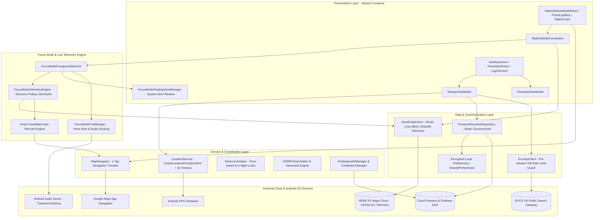

# ⚡ EV Plus (EV+) - Hệ Thống Giám Sát Trạm Sạc & Dẫn Đường Xe Điện Thông Minh

> **Ứng dụng Android Native thuần khiết (Jetpack Compose & Kotlin Modern Architecture)** hỗ trợ tài xế xe điện tra cứu trạm sạc, theo dõi tình trạng trụ sạc khả dụng theo thời gian thực (Live DC Telemetry), dẫn đường thông minh với bóng nổi đè trên bản đồ (Floating Capsule Overlay over Google Maps), cảnh báo giọng nói tiếng Việt (Voice TTS) và đồng bộ trạm yêu thích đám mây (Local-First Cloud Firestore).

[-green.svg?style=for-the-badge&logo=android)](https://developer.android.com)
[-purple.svg?style=for-the-badge&logo=kotlin)](https://kotlinlang.org)
[](https://developer.android.com/jetpack/compose)
[](#-kiến-trúc-hệ-thống-architecture)
[-red.svg?style=for-the-badge&logo=here)](https://www.here.com)
[](https://firebase.google.com)
[](https://developer.android.com/identity/sign-in/credential-manager)

---

## 📑 Mục Lục
1. [📖 Giới Thiệu (Overview)](#-giới-thiệu-overview)
2. [🌟 Tính Năng Cốt Lõi (Key Features)](#-tính-năng-cốt-lõi-key-features)
3. [⚡ Chế Độ Focus Mode & Dẫn Đường Thời Gian Thực](#-chế-độ-focus-mode--dẫn-đường-thời-gian-thực)
4. [🛠️ Tech Stack Chi Tiết (Detailed Tech Stack)](#️-tech-stack-chi-tiết-detailed-tech-stack)
5. [🏛️ Kiến Trúc Hệ Thống (System Architecture)](#️-kiến-trúc-hệ-thống-system-architecture)
6. [📂 Cấu Trúc Thư Mục (Project Structure)](#-cấu-trúc-thư-mục-project-structure)
7. [🛡️ Cơ Chế Phòng Thủ Chống Click-Spam & Edge Cases](#️-cơ-chế-phòng-thủ-chống-click-spam--edge-cases)
8. [🚀 Hướng Dẫn Cài Đặt & Biên Dịch (Getting Started)](#-hướng-dẫn-cài-đặt--biên-dịch-getting-started)
9. [🧪 Kiểm Thử & Đảm Bảo Chất Lượng (Testing & QA)](#-kiểm-thử--đảm-bảo-chất-lượng-testing--qa)
10. [🔒 Bảo Mật & Quyền Riêng Tư](#-bảo-mật--quyền-riêng-tư)

---

## 📖 Giới Thiệu (Overview)

Khi di chuyển bằng xe điện, một trong những nỗi lo lớn nhất của người lái xe là đến nơi thì trạm sạc bị **kẹt kín trụ, súng sạc hỏng hoặc trạm quá tải**. Các ứng dụng thông thường chỉ dừng lại ở việc hiển thị vị trí tĩnh hoặc bắt buộc người dùng chuyển đổi qua lại giữa app bản đồ và app tra cứu trạm sạc.

**EV Plus** giải quyết triệt để vấn đề này bằng mô hình **Live Telemetry Tracker & Overlay HUD**:
- **Khởi động tức thì (0ms Startup)** nhờ kiến trúc Local-First.
- **Giám sát số lượng súng sạc trống / đang sạc / bảo trì** trực tiếp từ hệ thống dữ liệu trạm sạc theo từng phân cấp công suất thực tế (20kW, 30kW, 60kW, 120kW, 150kW, 180kW, 250kW, 300kW, 360kW).
- **Viên nang nổi (Floating Capsule Overlay)** đè mượt mà trên ứng dụng Google Maps giúp tài xế theo dõi số trụ sạc trống theo từng giây mà không cần rời khỏi màn hình dẫn đường.
- **Trợ lý âm thanh tiếng Việt (Voice Announcements)** tự động đọc thông báo và giảm nhẹ âm lượng nhạc (Audio Ducking) khi trạm sạc sắp hết chỗ hoặc đã hết cổng sạc khả dụng.
- **Điều hướng thay thế 1-Chạm (1-Tap Smart Auto-Reroute)**: Tự động tính toán và đề xuất trạm sạc gần nhất có cùng cấp công suất khả dụng khi trạm đích bị đầy.

---

## 🌟 Tính Năng Cốt Lõi (Key Features)

### 1. ⚡ Tra Cứu Trạm Sạc & Cổng Sạc Trực Tiếp (Live Telemetry)
- Tìm kiếm trạm sạc quanh vị trí GPS hiện tại với độ trễ siêu thấp (<200ms).
- Phân loại rõ ràng các loại cổng sạc: **20kW DC** (hỗ trợ xe VF3/VF5), **30kW, 60kW, 120kW, 150kW, 180kW, 250kW, 300kW, 360kW DC** và **11kW/22kW AC**.
- Hiển thị trực quan: Cổng đang rảnh (Xanh lá), Đang sạc (Xanh dương), Bảo trì/Lỗi (Xám/Đỏ).
- Hỗ trợ bộ lọc nhanh: Chế độ sạc AC/DC, Cấp công suất DC mong muốn, Trạm còn chỗ trống.
- **Tự động cuộn lên đầu (Auto-Scroll)** khi người dùng làm mới dữ liệu hoặc thay đổi bộ lọc.

### 2. 🖼️ Thư Viện Ảnh Trạm Sạc & Phóng To Toàn Màn Hình (Photo Gallery & Lightbox)
- **VinFast CDN Direct Decoder**: Tự động bóc tách và giải mã URL ảnh gốc VinFast từ chuỗi Base64 tham số `url=`, vượt qua hoàn toàn cơ chế chặn 403 Cloudflare của proxy trung gian.
- **Image Lightbox Modal**: Trải nghiệm xem ảnh toàn màn hình với cử chỉ vuốt mượt mà, hỗ trợ zoom đa điểm và tải ảnh bất đồng bộ tối ưu bộ nhớ với Coil.

### 3. 🔐 Đăng Nhập 1-Chạm Google Credential Manager & Guest Mode
- Hỗ trợ chế độ **Khách (Guest)** dùng ngay không cần tài khoản.
- Tích hợp **Google Credential Manager (1-Tap Sign-In)** thế hệ mới nhất của Android, an toàn và liền mạch.
- Tự động lắng nghe trạng thái đăng nhập qua `StateFlow<AuthState>`.

### 4. ☁️ Đồng Bộ Trạm Yêu Thích Đám Mây (Local-First Firestore Sync)
- **Zero-Latency (0ms Startup)**: Dữ liệu trạm yêu thích luôn được đọc từ Local Storage trước để hiển thị ngay lập tức.
- **3-Way Conflict Resolution**: Tự động hợp nhất (Merge) danh sách trạm đã lưu khi người dùng từ chế độ Khách chuyển sang đăng nhập Google, không bao giờ bị mất trạm đã ghim.
- Cập nhật thời gian thực 2 chiều với Cloud Firestore (`users/{uid}/userdata/favorites`).

### 5. 🗺️ Tính Cự Ly & Dẫn Đường 1-Chạm (Distance & 1-Tap Navigation)
- **1-Tap Google Maps Navigation**: Mở trực tiếp ứng dụng Google Maps với tọa độ chính xác của trạm sạc để bắt đầu dẫn đường tức thì.
- **OSRM Road Network Engine**: Tính toán cự ly lộ trình đường sá thực tế mã nguồn mở.
- **Haversine Baseline (Offline 0ms)**: Tính toán khoảng cách đường thẳng ngay lập tức không phụ thuộc mạng.

---

## ⚡ Chế Độ Focus Mode & Dẫn Đường Thời Gian Thực

Focus Mode là tính năng độc quyền được thiết kế chuyên biệt cho tài xế xe điện khi đang trên đường di chuyển đến trạm sạc:

```text
[Bấm ⚡ Focus Mode] ➔ [Khởi chạy Google Maps dẫn đường]
                    ➔ [Hiện bóng nổi Floating Capsule đè trên Google Maps]
                    ➔ [Polling telemetry 15s -> 10s -> 5s theo khoảng cách]
                    ➔ [Cảnh báo giọng nói tiếng Việt khi trạm đầy/còn chỗ]
                    ➔ [1-Tap Đổi lộ trình sang trạm khả dụng gần nhất]
```

### Chi Tiết Kỹ Thuật Của Focus Mode:
1. **Kiến Trúc Dữ Liệu 2 Tầng (2-Tier Hybrid Telemetry)**:
   - **Tier 1 (Ưu tiên)**: Kết nối trực tiếp tới **HERE EV Stations API** sử dụng xác thực **OAuth 1.0a HMAC-SHA256 Client Credentials** (hoặc VinFast extracted API key), lấy dữ liệu trạng thái cổng sạc trực tiếp theo chu kỳ.
   - **Tier 2 (Dự phòng)**: Tự động chuyển đổi sang EVCS API nếu mất kết nối Tier 1.
2. **Chu Kỳ Polling Động Tiết Kiệm Pin (Adaptive Distance-Based Polling)**:
   - Khoảng cách **> 3km**: Polling mỗi **15 giây** (tiết kiệm pin & 4G).
   - Khoảng cách **1.5km - 3km**: Polling mỗi **10 giây**.
   - Khoảng cách **< 1.5km (Đang tiếp cận trạm)**: Polling siêu tốc mỗi **5 giây** để phát hiện xe khác vừa cắm sạc.
3. **Bóng Nổi Hệ Thống (Draggable Floating Capsule Overlay)**:
   - Vẽ trực tiếp lên `WindowManager` qua quyền `SYSTEM_ALERT_WINDOW (TYPE_APPLICATION_OVERLAY)`.
   - Hỗ trợ cử chỉ chạm kéo thả (Drag & Drop), tự động hít vào mép màn hình (Edge Snapping).
   - Hiển thị số cổng sạc DC trống, khoảng cách còn lại và nút bấm Đổi lộ trình nhanh.
   - Cơ chế dự phòng **Persistent Notification Fallback** trên Android 13+ nếu người dùng không cấp quyền vẽ bóng nổi.
4. **Trợ Lý Cảnh Báo Giọng Nói Tiếng Việt (Vietnamese Voice TTS Engine)**:
   - Tích hợp Android `TextToSpeech` với locale `vi-VN`.
   - Cơ chế **Transient Audio Ducking** (`AUDIOFOCUS_GAIN_TRANSIENT_MAY_DUCK`): Tự động hạ âm lượng nhạc nền/radio trên xe khi đọc cảnh báo và khôi phục âm lượng ngay sau khi đọc xong.
   - Quy tắc thông báo thông minh: Cảnh báo khi trạm còn 1 trụ cuối, cảnh báo khi trạm hết sạch chỗ, và thông báo chúc mừng khi trạm có cổng sạc vừa giải phóng.
5. **Thuật Toán Điều Hướng Thông Minh (Smart Candidate Auto-Reroute)**:
   - Khi trạm đích bị đầy, hệ thống quét các trạm lân cận trong bán kính 15km có cổng sạc DC rảnh với mức công suất $\ge$ công suất trạm đích (`typeWatts >= targetMaxDcWatts`), sắp xếp theo khoảng cách thực tế và hiển thị nút chuyển hướng 1-chạm.

---

## 🛠️ Tech Stack Chi Tiết (Detailed Tech Stack)

Dự án tuân thủ nghiêm ngặt chuẩn **Modern Android Development (MAD)** với các công nghệ tiên tiến nhất:

### 1. Nền Tảng & Ngôn Ngữ
| Công nghệ | Phiên bản | Mô tả chi tiết |
|---|---|---|
| **Android SDK** | `API 26` (8.0 Oreo) - `API 34` (14 Upside Down Cake) | Tương thích 95%+ thiết bị Android trên thị trường |
| **Kotlin** | `1.9.23` | Ngôn ngữ hiện đại, Type-safe, Null-safety, Data Classes, Extension Functions |
| **Java Target** | `JVM 17 (OpenJDK / Eclipse Temurin 17)` | Tối ưu hóa runtime và hỗ trợ đầy đủ công cụ jlink |
| **Build System** | Gradle `8.4` (Kotlin DSL `.gradle.kts`) | Cấu hình build dạng type-safe script |

### 2. Giao Diện Người Dùng (UI & Presentation Layer)
| Thư viện / Framework | Phiên bản | Vai trò & Ứng dụng |
|---|---|---|
| **Jetpack Compose BOM** | `2024.04.01` | Declarative UI framework hiện đại của Google |
| **Compose Material 3** | `1.2.1` | Hệ thống thiết kế Material You với bảng màu Emerald EV |
| **Compose Foundation & Animation** | `1.6.6` | Hiệu ứng chuyển động mượt mà, BottomSheet, Gestures, LazyColumn |
| **Coil Compose** | `2.6.0` | Tải và cache ảnh bất đồng bộ, nạp ảnh S3 VinFast tối ưu RAM với RGB_565 |
| **Accompanist Permissions** | `0.34.0` | Quản lý và yêu cầu quyền hệ thống động (Location, System Alert Window) |

### 3. Kiến Trúc Ứng Dụng (Architecture & Reactive State)
| Thành phần | Công nghệ | Chi tiết triển khai |
|---|---|---|
| **Pattern** | Clean Architecture + MVVM + UDF | Tách biệt Presentation / Domain / Data / Telemetry Layer |
| **State Management** | Kotlin `StateFlow` & `SharedFlow` | Quản lý luồng dữ liệu phản ứng (Reactive Streams) |
| **Concurrency** | Kotlin Coroutines (`1.8.0`) | Xử lý đa luồng ngầm phi phong tỏa (Non-blocking I/O) |
| **Synchronization** | Coroutine `Mutex` & `AtomicLong` | Đồng bộ hóa thao tác dữ liệu thread-safe, chống race condition |
| **Lifecycle** | AndroidX Lifecycle ViewModel & Compose `2.7.0` | Quản lý vòng đời màn hình và bảo toàn trạng thái ViewModel |

### 4. Hệ Thống Nền Tảng & Dịch Vụ Android (System Services)
| Dịch vụ | API Framework | Mục đích sử dụng |
|---|---|---|
| **Foreground Service** | `Service` + `NotificationManager` | Duy trì tiến trình polling telemetry nền khi ứng dụng ẩn |
| **System Overlay Window** | `WindowManager (TYPE_APPLICATION_OVERLAY)` | Vẽ viên nang bóng nổi Focus Mode đè trên ứng dụng Google Maps |
| **Text-To-Speech (TTS)** | `android.speech.tts.TextToSpeech` | Tổng hợp giọng nói tiếng Việt (vi-VN) cho các thông báo trạng thái trạm |
| **Audio Manager** | `AudioManager (AUDIOFOCUS_GAIN_TRANSIENT_MAY_DUCK)` | Giảm âm lượng nhạc nền/radio khi phát cảnh báo âm thanh |
| **Location Services** | Google Play Services Location `21.2.0` | `FusedLocationProviderClient` định vị GPS thời gian thực |
| **App Navigation Deep Links** | Android `Intent` (`ACTION_VIEW`, `google.navigation:q=`) | Khởi chạy dẫn đường turn-by-turn trên Google Maps |

### 5. Dữ Liệu, Mạng & Bảo Mật (Network, Storage & Cloud)
| Thư viện / Nền tảng | Phiên bản | Vai trò |
|---|---|---|
| **Firebase Firestore KTX** | `24.11.0` (BOM `32.8.0`) | Cơ sở dữ liệu đám mây lưu trữ danh sách trạm yêu thích |
| **Firebase Auth KTX** | `22.3.1` (BOM `32.8.0`) | Xác thực người dùng đám mây và liên kết tài khoản |
| **Google Credential Manager** | `1.2.2` / `1.1.1` | Đăng nhập Google 1-chạm bảo mật chuẩn mới nhất của Android |
| **OkHttp 3** | `4.12.0` | HTTP Client hiệu năng cao, Connection Pool, Custom Interceptors |
| **Kotlinx Serialization JSON** | `1.6.3` | Parse JSON nhanh và an toàn tuyệt đối kiểu dữ liệu |
| **OAuth 1.0a HMAC-SHA256 Signer** | Tự phát triển | Ký số xác thực truy vấn API HERE Maps EV Telemetry |
| **EncryptedSharedPreferences** | `1.1.0-alpha06` | Mã hóa phần cứng AES-256 GCM (Android KeyStore) cho dữ liệu cục bộ |

---

## 🏛️ Kiến Trúc Hệ Thống (System Architecture)



---

## 📂 Cấu Trúc Thư Mục (Project Structure)

```text
EV-Plus/
├── app/
│   ├── src/
│   │   ├── main/
│   │   │   ├── AndroidManifest.xml
│   │   │   ├── java/com/evcs/favorites/
│   │   │   │   ├── data/
│   │   │   │   │   ├── api/                   # EvcsApiClient (Pre-network 429 check, HMAC)
│   │   │   │   │   ├── auth/                  # FirebaseAuthManager, AuthService, SessionManager
│   │   │   │   │   ├── crypto/                # EvcsHmacSigner
│   │   │   │   │   ├── model/                 # Data DTOs, Station, Connector, PowerPort
│   │   │   │   │   ├── network/
│   │   │   │   │   │   └── here/              # HereEvApiClient, HereOAuthManager, HereEvModels
│   │   │   │   │   ├── repository/            # FirestoreFavoritesRepository (Mutex), EvcsRepository
│   │   │   │   │   └── storage/               # Encrypted Preferences, Local Favorites
│   │   │   │   ├── domain/
│   │   │   │   │   ├── location/              # LocationService (8s Timeout, Cancellation)
│   │   │   │   │   └── routing/               # DistanceCalculator, OSRM Matrix, Haversine
│   │   │   │   ├── focus/                     # ⚡ Focus Mode Subsystem
│   │   │   │   │   ├── FocusModeForegroundService.kt     # FGS Lifecycle & Notification Fallback
│   │   │   │   │   ├── FocusModeTelemetryEngine.kt       # Dynamic Polling & 20kW Reroute Engine
│   │   │   │   │   ├── FocusModeFloatingViewManager.kt   # System Alert Window Overlay View
│   │   │   │   │   ├── FocusModeTtsManager.kt            # Voice TTS & Audio Ducking Watchdog
│   │   │   │   │   ├── FocusModeVoiceAlertPolicy.kt      # Voice Announcement Policy Rules
│   │   │   │   │   ├── FocusModeNotificationHelper.kt    # Android 13+ Notification Channel
│   │   │   │   │   └── FocusModeState.kt                 # Focus Mode Telemetry State Models
│   │   │   │   ├── navigation/                # MapNavigator (1-Tap Intent Throttler)
│   │   │   │   ├── ui/
│   │   │   │   │   ├── components/            # StationCard, NativeStationDetailSheet, PhotoViewer
│   │   │   │   │   ├── screens/               # NearbyScreen, FavoritesScreen, LoginScreen
│   │   │   │   │   ├── theme/                 # Material3 Emerald Color Scheme, Typography
│   │   │   │   │   └── viewmodel/             # NearbyViewModel, FavoritesViewModel, DetailCoordinator
│   │   │   │   └── util/                      # DebounceHelper, VinFastCdnDecoder, S3PhotoHelper
│   │   │   └── res/                           # Layouts, Drawables, Colors, Values
│   │   └── test/                              # Comprehensive JVM Unit Test Suites (100% Pass)
│   └── build.gradle.kts                       # Module Gradle Build Script
├── plans/                                     # Kế hoạch phát triển kiến trúc (AWF Framework)
│   ├── 260906-1930-focus-mode-and-live-telemetry/       # Plan Focus Mode 6 phases
│   ├── 260906-2318-focus-mode-20kw-and-filter-fixes/   # Plan 20kW & Filter auto-scroll
│   └── 260907-0025-click-spam-and-edge-case-hardening/ # Plan Click-spam & Edge-case hardening
├── .brain/                                    # Antigravity Eternal Memory System
│   ├── brain.json                             # Tri thức tĩnh hệ thống
│   ├── session.json                           # Tiến độ phiên làm việc hiện tại
│   └── handover.md                            # Tài liệu bàn giao ngữ cảnh
├── docs/                                      # Báo cáo kỹ thuật & Tài liệu thiết kế
├── CHANGELOG.md                               # Nhật ký thay đổi phiên bản
├── build.gradle.kts                           # Root Gradle Build Script
└── README.md                                  # Tài liệu dự án
```

---

## 🛡️ Cơ Chế Phòng Thủ Chống Click-Spam & Edge Cases

Hệ thống được thiết kế theo tiêu chuẩn công nghiệp với cơ chế phòng thủ đa tầng:

```text
               ┌─────────────────────────────────────────────────────────┐
               │              TẦNG 1: UI INTERACTION LEVEL               │
               │  - Vô hiệu hóa nút bấm theo State (isNavigating,...)    │
               │  - dropUnlessResumed / Kiểm tra Lifecycle RESUMED       │
               └────────────────────────────┬────────────────────────────┘
                                            │
                                            ▼
               ┌─────────────────────────────────────────────────────────┐
               │              TẦNG 2: ENGINE DEBOUNCE LEVEL              │
               │  - DebounceHelper (1000ms cooldown window)              │
               │  - In-flight Coroutine Lock (withInFlightLock)          │
               │  - Throttle MapNavigator 1-Tap Google Maps Intent       │
               └────────────────────────────┬────────────────────────────┘
                                            │
                                            ▼
               ┌─────────────────────────────────────────────────────────┐
               │           TẦNG 3: DATA & REPOSITORY SYNCHRONIZATION     │
               │  - Coroutine Mutex.withLock trong Firestore Repository  │
               │  - Set<String> tracking togglingStationIds              │
               │  - Pre-network check isGlobalRateLimited()              │
               └─────────────────────────────────────────────────────────┘
```

1. **Chống Click-Spam "User Phá App"**:
   - Throttling 1-Tap Navigation: Người dùng bấm liên tục nút "Chỉ đường" chỉ khởi chạy đúng 1 `Intent` duy nhất tới Google Maps.
   - Debounce Focus Mode & Reroute: Ngăn ngừa khởi động lặp dịch vụ Foreground Service và gọi trùng lệnh reroute.
   - OTP Double Submit Guard: Tự động vô hiệu hóa nút bấm khi ký tự thứ 6 vừa nhập để chống gửi trùng 2 request xác thực.
   - Google Sign-In In-Flight Lock: Vô hiệu hóa nút bấm trong quá trình `credentialManager.getCredential()` đang chạy.
2. **Xử Lý Edge Cases Phần Cứng & Vòng Đời**:
   - **GPS Acquisition Timeout (8s)**: Bọc `FusedLocationProviderClient` trong `withTimeoutOrNull(8000L)` kèm dọn dẹp `CancellationTokenSource` để chống treo UI vô tận khi người dùng tắt GPS.
   - **Android 13+ (API 33+) Notification Permission**: Yêu cầu `POST_NOTIFICATIONS` runtime trước khi vào chế độ Notification Fallback Mode để thông báo không bị hệ điều hành nuốt chửng.
   - **Client-Side HTTP 429 Cooldown Guard**: Kiểm tra `isGlobalRateLimited()` trước khi mở socket HTTP để tránh kéo dài thời gian bị Cloudflare/EVCS chặn IP.
   - **Tối Ưu Cử Chỉ Kéo Lightbox**: Loại bỏ hoàn toàn việc gọi `coroutineScope.launch` trên từng frame drag gesture, triệt tiêu Garbage Collection churn.
   - **Watchdog Audio Focus TTS (6s)**: Tự động giải phóng Audio Focus Ducking sau 6 giây nếu engine Text-To-Speech của bên thứ 3 bị treo không trả callback `onDone`.
   - **Bảo Toàn Trạng Thái Hộp Thoại (Screen Rotation)**: Chuyển toàn bộ cờ hiển thị Dialog sang `rememberSaveable` để không bị mất khi xoay màn hình.

---

## 🚀 Hướng Dẫn Cài Đặt & Biên Dịch (Getting Started)

### 1. Yêu Cầu Môi Trường:
- **JDK:** OpenJDK 17 hoặc Eclipse Temurin 17 (Cấu hình `org.gradle.java.home` trong `gradle.properties`).
- **Android SDK:** `compileSdk = 34`, `targetSdk = 34`, `minSdk = 26`.
- **Thiết bị kiểm thử:** Thiết bị Android thật (bật USB Debugging & Developer Options) hoặc Android Emulator API 26-34.

### 2. Các Lệnh Biên Dịch Cơ Bản:
```bash
# 1. Cấp quyền thực thi cho Gradle Wrapper
chmod +x gradlew

# 2. Chạy toàn bộ Unit Test kiểm chứng
./gradlew testDebugUnitTest

# 3. Biên dịch file APK Debug
./gradlew assembleDebug
```
File APK kết quả sẽ được tạo tại: `app/build/outputs/apk/debug/app-debug.apk`.

### 3. Cài Đặt Trực Tiếp Lên Điện Thoại Qua ADB:
```bash
# Cài đặt APK vào thiết bị Android kết nối USB
adb install -r app/build/outputs/apk/debug/app-debug.apk

# Khởi chạy trực tiếp ứng dụng
adb shell am start -n com.evcs.favorites/.MainActivity
```

---

## 🧪 Kiểm Thử & Đảm Bảo Chất Lượng (Testing & QA)

Dự án áp dụng tiêu chuẩn kiểm thử nghiêm ngặt: **Mỗi tính năng và Phase đều có đúng 1 file test toàn diện duy nhất**.

```bash
# 1. Kiểm thử Focus Mode 20kW & Smart Reroute
./gradlew testDebugUnitTest --tests "com.evcs.favorites.focus.FocusMode20kWSupportTest"

# 2. Kiểm thử Auto-Scroll lên đầu khi đổi bộ lọc & Refresh
./gradlew testDebugUnitTest --tests "com.evcs.favorites.ui.NearbyAutoScrollFilterFixTest"

# 3. Kiểm thử Ẩn/Hiện nút Focus Mode trạm AC-only
./gradlew testDebugUnitTest --tests "com.evcs.favorites.ui.components.StationDetailFocusButtonVisibilityTest"

# 4. Kiểm thử Tối ưu hóa hiệu năng & Memory Audit
./gradlew testDebugUnitTest --tests "com.evcs.favorites.performance.AuditPerformanceFixTest"

# 5. Kiểm thử Bộ công cụ Click-Spam Debounce & Throttling
./gradlew testDebugUnitTest --tests "com.evcs.favorites.hardening.ActionDebounceAndThrottlingTest"

# 6. Kiểm thử Đồng bộ Mutex Favorites & Concurrency
./gradlew testDebugUnitTest --tests "com.evcs.favorites.hardening.FavoriteConcurrencyAndThreadSafetyTest"

# 7. Kiểm thử Timeout GPS 8s & Android 13+ Permissions
./gradlew testDebugUnitTest --tests "com.evcs.favorites.hardening.GpsTimeoutAndNotificationPermissionTest"

# 8. Kiểm thử Client Rate Limit 429 & Lifecycle Hardening
./gradlew testDebugUnitTest --tests "com.evcs.favorites.hardening.RateLimitAndLifecycleHardeningTest"
```

---

## 🔒 Bảo Mật & Quyền Riêng Tư

- **Quyền Riêng Tư Vị Trí (Location Privacy)**: Tọa độ GPS chỉ được xử lý cục bộ trên thiết bị để tính cự ly đến trạm sạc gần nhất. Không có dữ liệu lịch sử di chuyển nào được gửi lên server mà không có sự đồng ý của người dùng.
- **Mã Hóa Phần Cứng (Hardware-Backed Encryption)**: Toàn bộ khóa token và cấu hình nhạy cảm được bảo vệ bằng chuẩn mã hóa **AES-256 GCM** thông qua **Android KeyStore** phần cứng.
- **Google Identity Services**: Sử dụng cơ chế phân quyền ủy quyền bảo mật cao, không lưu trữ thông tin mật khẩu thô của người dùng.

---

## 📄 Bản Quyền & Miễn Trừ Trách Nhiệm (License & Disclaimer)

- Dự án được phát triển phi thương mại nhằm phục vụ cộng đồng tài xế xe điện và phục vụ nghiên cứu, học tập kiến trúc Android Hiện Đại (Modern Android Architecture).
- Toàn bộ thương hiệu, logo trạm sạc và dịch vụ bản đồ thuộc bản quyền của các đơn vị sở hữu tương ứng (VinFast, HERE Technologies, Google LLC).

---
**Tác giả & Đóng góp:** Phát triển với sự hỗ trợ của **Antigravity Workflow Framework (AWF)**.
