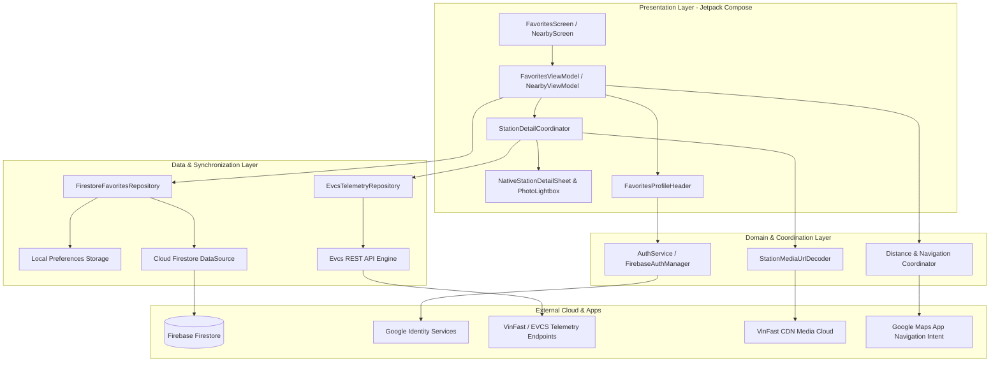

# ⚡ EV Plus (EV+) - Trạm Sạc Xe Điện Thông Minh

> **Native Android App** tra cứu trạm sạc xe điện thông minh, giám sát cổng sạc khả dụng thời gian thực, hiển thị album ảnh thực tế trạm sạc và đồng bộ trạm yêu thích đám mây (Local-First Cloud Firestore).

[-green.svg)](https://developer.android.com)
[](https://kotlinlang.org)
[](https://developer.android.com/jetpack/compose)
[](#-kiến-trúc-hệ-thống)
[](https://firebase.google.com)
[](https://developer.android.com/identity/sign-in/credential-manager)
[](https://gradle.org)

---

## 📖 Giới thiệu (Overview)

**EV Plus** được phát triển nhằm mang lại trải nghiệm Android Native thuần khiết, siêu tốc và hiện đại cho cộng đồng người dùng xe điện (EV):
- **Khởi động 0ms tức thì** với kiến trúc Local-First.
- **Giám sát số lượng súng sạc trống / đang sạc / bảo trì** theo từng phân cấp công suất thực tế.
- **Thư viện ảnh trạm sạc chân thực** từ VinFast CDN giải mã trực tiếp.
- **Đồng bộ danh sách Yêu thích xuyên suốt thiết bị** qua Google Sign-In & Firebase Firestore.
- **Dẫn đường 1-Chạm & Tính cự ly thông minh** (1-Tap Turn-by-Turn Navigation qua Google Maps, tính khoảng cách OSRM & Haversine 0ms).

---

## 🌟 Tính Năng Nổi Bật (Key Features)

### 1. ⚡ Tra cứu Trạm Sạc & Cổng Sạc Trực Tiếp (Live Telemetry)
- Tìm kiếm trạm sạc quanh vị trí GPS hiện tại với độ trễ siêu thấp (<200ms).
- Phân loại rõ ràng các loại cổng sạc: **11kW, 30kW, 60kW, 120kW, 150kW, 180kW, 250kW, 300kW, 360kW** (tự động loại trừ các trụ AC 3.5kW/7kW xe máy không tương thích ô tô).
- Hiển thị trực quan: Cổng đang rảnh (Xanh lá), Đang sạc (Xanh dương), Bảo trì/Lỗi (Xám/Đỏ).

### 2. 🖼️ Thư Viện Ảnh Trạm Sạc & Trình Phóng To Toàn Màn Hình (Photo Gallery & Lightbox)
- **VinFast CDN Direct Decoder**: Tự động bóc tách và giải mã URL ảnh gốc VinFast từ chuỗi Base64 tham số `url=`, vượt qua hoàn toàn cơ chế chặn 403 Cloudflare của proxy trung gian.
- **Image Lightbox Modal**: Trải nghiệm xem ảnh toàn màn hình với thanh trượt mượt mà, hỗ trợ zoom và tải ảnh bất đồng bộ với Coil.

### 3. 🔐 Đăng Nhập 1-Chạm Google Credential Manager & Guest Mode
- Hỗ trợ chế độ **Khách (Guest)** dùng ngay không cần tài khoản.
- Tích hợp **Google Credential Manager (1-Tap Sign-In)** thế hệ mới nhất của Android, an toàn và liền mạch.
- Tự động lắng nghe trạng thái đăng nhập qua `StateFlow<AuthState>`.

### 4. ☁️ Đồng Bộ Trạm Yêu Thích Đám Mây (Local-First Firestore Sync)
- **Zero-Latency (0ms Startup)**: Dữ liệu trạm yêu thích luôn được đọc từ Local Storage trước để hiển thị ngay lập tức.
- **3-Way Conflict Resolution**: Tự động hợp nhất (Merge) danh sách trạm đã lưu khi người dùng từ chế độ Khách chuyển sang đăng nhập Google, không bao giờ bị mất trạm đã ghim.
- Cập nhật thời gian thực 2 chiều với Cloud Firestore (`users/{uid}/favorites`).

### 5. 🗺️ Tính Cự Ly & Dẫn Đường 1-Chạm (Distance & 1-Tap Navigation)
- **1-Tap Google Maps Navigation**: Mở trực tiếp ứng dụng Google Maps với tọa độ chính xác của trạm sạc để bắt đầu dẫn đường tức thì.
- **OSRM Road Network Engine**: Tính toán cự ly lộ trình đường sá thực tế mã nguồn mở.
- **Haversine Baseline (Offline 0ms)**: Tính toán khoảng cách đường thẳng ngay lập tức không phụ thuộc mạng.

---

## 🛠️ Tech Stack Chi Tiết

Dự án tuân thủ triệt để tiêu chuẩn **Modern Android Development (MAD)**:

| Tầng / Thành phần | Công nghệ / Thư viện | Phiên bản | Vai trò & Mục đích |
|---|---|---|---|
| **Ngôn ngữ** | [Kotlin](https://kotlinlang.org/) | `1.9.23` | Ngôn ngữ chính, Type-safe, Null-safety, Coroutines & Flow |
| **Giao diện (UI)** | [Jetpack Compose](https://developer.android.com/jetpack/compose) | `BOM 2024.04.01` | Declarative UI, Animations, Custom Modals, BottomSheet |
| **Design System** | [Material 3 (Material You)](https://m3.material.io/) | `1.2.1` | Hệ thống thiết kế Material You với tone màu EV Emerald chủ đạo |
| **Tải & Cache Ảnh** | [Coil Compose](https://coil-kt.github.io/coil/) | `2.6.0` | Tải ảnh bất đồng bộ, tối ưu bộ nhớ RAM, caching thông minh |
| **Bảo mật & Định danh** | AndroidX Credential Manager & Google ID | `1.2.2` / `1.1.1` | Đăng nhập 1-chạm Google Sign-In bảo mật cao |
| **Cloud Authentication** | Firebase Auth KTX | `22.3.1` (BOM 32.8.0) | Quản lý phiên xác thực người dùng và Token đám mây |
| **Cloud Database** | Firebase Firestore KTX | `24.11.0` (BOM 32.8.0) | Cơ sở dữ liệu NoSQL đám mây lưu trữ danh sách trạm yêu thích |
| **Kiến trúc (Architecture)** | Clean Architecture + MVVM + UDF | Lifecycle `2.7.0` | Quản lý trạng thái StateFlow, tách biệt Data / Domain / Presentation |
| **Bất đồng bộ** | Kotlin Coroutines & Flow | `1.8.0` | Xử lý đa luồng ngầm, Reactive Streams |
| **Mạng (Networking)** | [OkHttp](https://square.github.io/okhttp/) | `4.12.0` | HTTP Client, Connection Pooling, CookieJar, Interceptors |
| **Phân tích dữ liệu** | Kotlinx Serialization JSON | `1.6.3` | Parse JSON tốc độ cao, type-safe |
| **Giải mã Ảnh CDN** | Custom VinFast CDN Decoder | Tự phát triển | Phân tích Base64 URI tham số để trích xuất URL ảnh gốc S3 |
| **Lưu trữ Cục bộ** | EncryptedSharedPreferences & DataStore | `1.1.0-alpha06` / `1.0.0` | Mã hóa phần cứng AES-256 GCM (Android KeyStore) |
| **Định vị GPS** | Google Play Services Location | `21.2.0` | FusedLocationProviderClient định vị GPS chính xác |
| **Dẫn đường & Bản đồ** | Android Intent Maps Deep Link | Native | Khởi chạy Google Maps dẫn đường 1-chạm |
| **Tính khoảng cách** | OSRM & Haversine Engine | Tự phát triển | Tính toán khoảng cách lái xe thực tế và khoảng cách đường thẳng 0ms offline |
| **Kiểm thử (Testing)** | JUnit 4, Kotlinx Coroutines Test, Mockito | `4.13.2` / `1.8.0` | Kiểm thử đơn vị (Unit Test) cho DataSources, Repositories, ViewModels |

---

## 🏛️ Kiến Trúc Hệ Thống (Architecture)



---

## 📂 Cấu Trúc Thư Mục Dự Án (Project Structure)

```text
EV-Plus/
├── app/
│   ├── src/
│   │   ├── main/
│   │   │   ├── AndroidManifest.xml
│   │   │   ├── java/com/evcs/favorites/
│   │   │   │   ├── data/
│   │   │   │   │   ├── auth/              # FirebaseAuthManager, AuthService, FakeAuthService
│   │   │   │   │   ├── model/             # Data DTOs, StationModels, ConnectorModels
│   │   │   │   │   ├── repository/        # FirestoreFavoritesRepository, EvcsTelemetryRepository
│   │   │   │   │   ├── storage/           # Encrypted Preferences, Local Favorites
│   │   │   │   │   └── telemetry/         # REST Telemetry Data Source
│   │   │   │   ├── domain/                # AuthModels, Routing Engines, Location Providers
│   │   │   │   ├── ui/
│   │   │   │   │   ├── components/        # NativeStationDetailSheet, PhotoViewer, ProfileHeader
│   │   │   │   │   ├── screens/           # FavoritesScreen, NearbyScreen, SettingsScreen
│   │   │   │   │   ├── theme/             # Material3 Emerald Color Scheme, Typography
│   │   │   │   │   └── viewmodel/         # FavoritesViewModel, NearbyViewModel, DetailCoordinator
│   │   │   │   └── util/                  # VinFastCdnUrlDecoder, StationSanitizer
│   │   │   └── res/                       # Drawable, Values (Colors, Strings)
│   │   └── test/                          # JVM Unit Test Suites (100% Pass)
│   └── build.gradle.kts                   # Module Gradle configuration
├── plans/                                 # Tài liệu kế hoạch & Milestone kiến trúc (AWF)
├── .brain/                                # Eternal Memory System (brain.json, session.json)
├── build.gradle.kts                       # Root Gradle
└── README.md                              # Tài liệu dự án
```

---

## 🚀 Hướng Dẫn Cài Đặt & Chạy (Getting Started)

### 1. Yêu cầu hệ thống:
- **JDK:** OpenJDK 17 trở lên.
- **Android SDK:** API Level 34 (Android 14) / Min SDK 26 (Android 8.0).
- **Thiết bị:** Thiết bị Android thật (bật USB Debugging) hoặc Android Emulator.

### 2. Biên dịch & Chạy kiểm thử:
```bash
# Cấp quyền thực thi cho Gradle
chmod +x gradlew

# Chạy toàn bộ Unit Tests
./gradlew test

# Biên dịch Debug APK
./gradlew assembleDebug
```
File APK kết quả được tạo tại: `app/build/outputs/apk/debug/app-debug.apk`.

### 3. Cài đặt trực tiếp lên điện thoại qua ADB:
```bash
# Cài đặt APK vào thiết bị
adb install -r app/build/outputs/apk/debug/app-debug.apk

# Khởi chạy ứng dụng
adb shell am start -n com.evcs.favorites/.MainActivity
```

---

## 🔒 Bảo Mật & Quyền Riêng Tư

- **Local-First & Không thu thập dữ liệu trái phép**: Tọa độ GPS chỉ được dùng trên máy để tính cự ly đến trạm sạc gần nhất.
- **Mã hóa phần cứng AES-256 GCM**: Khóa cấu hình được bảo vệ bằng Android KeyStore.
- **Xác thực an toàn Google Credential Manager**: Không lưu giữ mật khẩu người dùng ở client.

---

## 📄 Bản Quyền & Miễn Trừ Trách Nhiệm

- Dự án được phát triển phi thương mại nhằm phục vụ cộng đồng người dùng xe điện và học tập nghiên cứu kiến trúc Android Modern Architecture.
- Toàn bộ thương hiệu, biểu tượng và API dịch vụ thuộc quyền sở hữu của các đơn vị cung cấp tương ứng.
