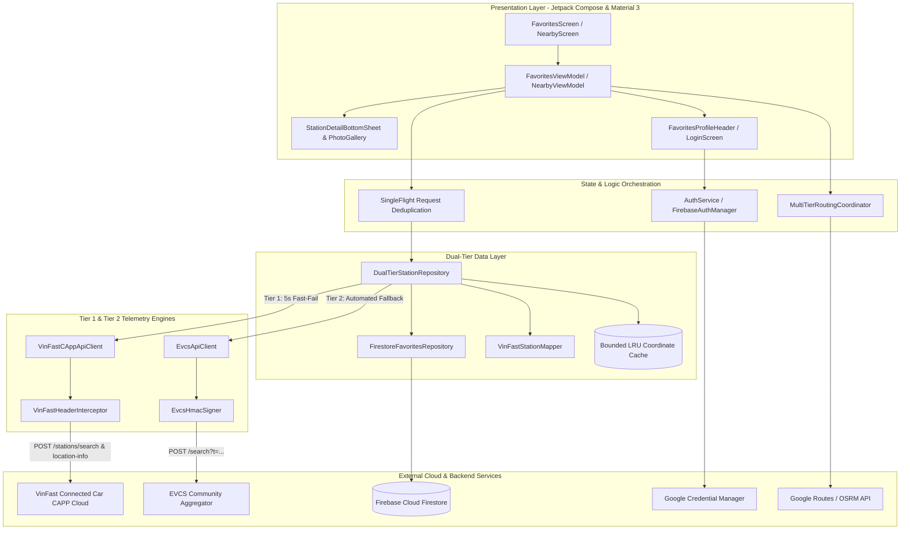

# ⚡ EV Plus (EV+) - Trạm Sạc Xe Điện Thông Minh

> **Native Android App** tra cứu trạm sạc xe điện thông minh với kiến trúc **Dual-Tier Fault Tolerance** (VinFast Connected Car Direct API & EVCS Fallback), lọc cổng sạc ô tô thời gian thực, hiển thị album ảnh CDN trạm sạc và đồng bộ trạm yêu thích đám mây (Local-First Cloud Firestore).

[-green.svg)](https://developer.android.com)
[](https://kotlinlang.org)
[](https://developer.android.com/jetpack/compose)
[](#-kiến-trúc-hệ-thống)
[](https://firebase.google.com)
[](https://developer.android.com/identity/sign-in/credential-manager)
[](https://gradle.org)

---

## 📖 Giới thiệu (Overview)

**EV Plus** được phát triển nhằm mang lại trải nghiệm Android Native thuần khiết, siêu tốc và tối ưu tối đa cho cộng đồng tài xế xe điện (EV):
- **Khởi động 0ms tức thì** với kiến trúc Local-First & Bounded LRU Coordinate Cache.
- **Dual-Tier Telemetry Pipeline**: Kết nối trực tiếp đến VinFast Connected Car (CAPP) API với độ trễ siêu thấp (<100ms), tự động chuyển đổi dự phòng (failover) sang cộng đồng EVCS HMAC-signed aggregator khi có sự cố.
- **Lọc cổng sạc chuẩn Ô tô (Car-Only EV Ports)**: Tự động loại bỏ hoàn toàn các trụ sạc xe máy 3.5kW/7kW, tái tổng hợp số lượng súng sạc trống / đang sạc chuẩn xác theo từng khoang xe hơi.
- **Thư viện ảnh trạm sạc chân thực**: Trực tiếp từ VinFast S3/CloudFront CDN & bộ giải mã Base64 CDN token.
- **Đồng bộ danh sách Yêu thích đám mây**: Hỗ trợ Google One-Tap Sign-In & Firebase Firestore với giải quyết xung đột 3 chiều (3-Way Merge).
- **Multi-Tier Routing & Dẫn đường 1-Chạm**: Haversine 0ms, OSRM Road Distance & Google Routes API kèm mật độ giao thông thực tế.

---

## 🌟 Tính Năng Nổi Bật (Key Features)

### 1. ⚡ Kiến Trúc Dual-Tier Telemetry & Chuyển Đổi Dự Phòng Tự Động
- **Tier 1 (Primary - Direct VinFast CAPP API)**: 
  - Giao tiếp trực tiếp với endpoint máy chủ VinFast Connected Car (`mobile.connected-car.vinfast.vn`).
  - Sử dụng `VinFastHeaderInterceptor` mô phỏng đầy đủ header chuẩn APK chính thức (`X-APP-VERSION: 2.25.7`, `X-SERVICE-NAME: CAPP`, Persistent UUID).
  - Áp dụng **5-second fast-fail timeout** giúp phát hiện ngắt kết nối tức thì.
- **Tier 2 (Fallback - EVCS Community Aggregator)**:
  - Tự động kích hoạt khi Tier 1 gặp lỗi (HTTP 401, 403, 5xx hoặc Timeout).
  - Ký số HMAC-SHA256 bảo mật theo giao thức EVCS community.
  - Chuyển đổi liền mạch, không gián đoạn giao diện (Zero UI Glitch/Crash).
- **Minh bạch nguồn dữ liệu**: Mỗi trạm sạc đều được gắn cờ xuất xứ dữ liệu (`sourceTier = "VINFAST_DIRECT"` hoặc `"EVCS_FALLBACK"`) và lưu vết tại `AppDebugLogger`.

### 2. 🚗 Lọc Chuyên Biệt Cổng Sạc Ô Tô (Automobile Port Hard-Filtering)
- Tự động nhận diện và loại bỏ các cổng sạc xe máy điện 2 bánh (công suất $\le$ 7000W như 3.5kW, 7.4kW AC).
- Phân loại rõ ràng các loại công suất sạc ô tô tiêu chuẩn: **11kW, 30kW, 60kW, 120kW, 150kW, 180kW, 250kW, 300kW, 360kW**.
- Tái tính toán tổng số cổng khả dụng (`totalAvailablePlugs`) và tổng số cổng (`totalPlugs`) hoàn toàn dựa trên các trụ sạc dành riêng cho xe ô tô.
- Tự động bỏ qua các trạm sạc chỉ phục vụ xe máy.

### 3. 🖼️ Thư Viện Ảnh Trạm Sạc & Lightbox Xem Toàn Màn Hình
- **VinFast Direct CDN & URL Decoder**: Tải ảnh trực tiếp từ `cpo-prod-s3.vinfastauto.com` và tự động giải mã Base64 cho các token ảnh fallback để vượt qua cơ chế chặn 403.
- **Image Lightbox Modal**: Trải nghiệm vuốt xem toàn bộ ảnh thực tế của trạm sạc, xem vị trí đặt trụ sạc, lối vào bãi đỗ xe trước khi đến nơi.

### 4. ☁️ Đồng Bộ Yêu Thích Local-First & Firebase Firestore
- **Local-First Caching**: Mở app hiển thị danh sách trạm yêu thích ngay lập tức (0ms latency) từ bộ nhớ thiết bị.
- **Background Telemetry Enrichment**: Tự động gọi `getLocationInfo` của VinFast để cập nhật trạng thái súng sạc trực tiếp theo thời gian thực cho từng trạm đã lưu.
- **3-Way Conflict Resolution**: Hỗ trợ 3 chiến lược hợp nhất (`MERGE`, `PREFER_CLOUD`, `PREFER_LOCAL`) khi người dùng chuyển đổi giữa chế độ Khách (Guest) và đăng nhập Google.

### 5. 🗺️ Multi-Tier Routing & Dẫn Đường 1-Chạm
- **1-Tap Navigation**: Khởi chạy trực tiếp Google Maps Turn-by-Turn Navigation với tọa độ chuẩn xác của trạm sạc.
- **Haversine Baseline (0ms)**: Tính khoảng cách đường thẳng tức thời phục vụ sắp xếp danh sách ban đầu.
- **OSRM Engine**: Tính toán lộ trình đường bộ thực tế mã nguồn mở.
- **Google Routes API**: Dự đoán thời gian di chuyển (ETA) và mật độ giao thông theo màu sắc (FREE_FLOW, MODERATE, HEAVY).

### 6. 📊 Diagnostic Logger & Ring Buffer Tích Hợp
- `AppDebugLogger`: Circular buffer 500 mục nhật ký trong bộ nhớ RAM ghi nhận chi tiết URL, latency, status code, tier telemetry phục vụ kiểm tra và hỗ trợ kỹ thuật trực tiếp trong ứng dụng.

---

## 🛠️ Tech Stack Chi Tiết

Dự án áp dụng các công nghệ tiên tiến nhất theo chuẩn **Modern Android Development (MAD)**:

| Tầng / Thành phần | Công nghệ / Thư viện | Phiên bản | Vai trò & Đặc tả kỹ thuật |
|---|---|---|---|
| **Ngôn ngữ** | [Kotlin](https://kotlinlang.org/) | `1.9.23` | Ngôn ngữ chính, Type-safe, Coroutines, StateFlow, Serialization |
| **Hệ điều hành mục tiêu** | Android SDK | `compileSdk 34` / `minSdk 26` | Tương thích từ Android 8.0 (Oreo) đến Android 14+ |
| **Giao diện (UI)** | [Jetpack Compose](https://developer.android.com/jetpack/compose) | `BOM 2024.04.01` | Declarative UI, Animations, BottomSheet, Modal |
| **Design System** | [Material 3](https://m3.material.io/) | `1.2.1` | Material You theme, dark mode, bảng màu Emerald EV |
| **Tải & Cache Ảnh** | [Coil Compose](https://coil-kt.github.io/coil/) | `2.6.0` | Tải ảnh bất đồng bộ từ S3/CloudFront, caching bộ nhớ thông minh |
| **Direct API Client** | VinFast CAPP API Engine | `2.25.7` headers | Giao tiếp trực tiếp máy chủ Connected Car VinFast, timeout 5s |
| **Fallback Aggregator** | EVCS Signed API | HMAC-SHA256 | Ký số HMAC header, dự phòng tự động khi Direct API ngắt quãng |
| **Mạng (Networking)** | [OkHttp](https://square.github.io/okhttp/) | `4.12.0` | Shared ConnectionPool & Dispatcher (AppOkHttpClientProvider) |
| **Xử lý JSON** | Kotlinx Serialization | `1.6.3` | Parse JSON phản hồi siêu tốc, hỗ trợ lenient & ignoreUnknownKeys |
| **Quản lý Luồng** | Kotlin Coroutines & Flow | `1.8.0` | Multi-threading, SingleFlight request deduplication, StateFlow UDF |
| **Bảo mật & Định danh** | AndroidX Credential Manager | `1.3.0` / `1.1.1` | Google One-Tap Sign-In thế hệ mới nhất của Android |
| **Cloud Authentication** | Firebase Auth | `BOM 33.10.0` | Quản lý phiên xác thực đám mây của người dùng |
| **Cloud Database** | Firebase Firestore | `BOM 33.10.0` | Cơ sở dữ liệu NoSQL đám mây lưu trữ danh mục trạm yêu thích |
| **Lưu trữ Cục bộ** | EncryptedSharedPreferences & SharedPreferences | `1.1.0-alpha06` | Lưu snapshot offline 0ms và Persistent Device UUID |
| **Định vị GPS** | Google Play Services Location | `21.2.0` | FusedLocationProviderClient lấy tọa độ GPS chính xác cao |
| **Bộ định tuyến** | OSRM + Google Routes + Haversine | Tự phát triển | Điều phối tính khoảng cách và ETA đa tầng linh hoạt |
| **Kiểm thử (Testing)** | JUnit 4, MockWebServer, Coroutines Test | `4.13.2` / `4.12.0` / `1.8.0` | Kiểm thử toàn diện 100% các luồng Direct, Fallback, UI ViewModel |

---

## 🏛️ Kiến Trúc Hệ Thống (Architecture)



---

## 📂 Cấu Trúc Thư Mục Dự Án (Project Structure)

```text
EV-Plus/
├── app/
│   ├── src/
│   │   ├── main/
│   │   │   ├── AndroidManifest.xml
│   │   │   ├── java/com/evcs/favorites/
│   │   │   │   ├── MainActivity.kt            # DI & Wiring, Compose entrypoint, Permissions
│   │   │   │   ├── data/
│   │   │   │   │   ├── api/                   # EvcsApiClient (Tier-2 Fallback API), HMAC Signer
│   │   │   │   │   ├── auth/                  # FirebaseAuthManager, SessionManager, Storages
│   │   │   │   │   ├── cache/                 # BoundedLruMap coordinate cache
│   │   │   │   │   ├── logging/               # AppDebugLogger (In-memory ring buffer)
│   │   │   │   │   ├── model/                 # Station, PowerPort, SearchStationRaw DTOs
│   │   │   │   │   ├── network/
│   │   │   │   │   │   ├── AppOkHttpClientProvider.kt  # Unified ConnectionPool & Dispatcher
│   │   │   │   │   │   └── vinfast/           # VinFastCAppApiClient, Headers, DTOs, Mapper
│   │   │   │   │   ├── preferences/           # NearbyFilterPreferences, SmartFilterPreferences
│   │   │   │   │   ├── repository/            # DualTierStationRepository, FirestoreFavoritesRepository
│   │   │   │   │   ├── routing/               # MultiTierRoutingCoordinator, OSRM, Google Routes
│   │   │   │   │   └── telemetry/             # Station telemetry stream
│   │   │   │   ├── domain/                    # LocationService, DistanceCalculator, WattageOption
│   │   │   │   ├── navigation/                # AppNavigationBar, MapNavigator
│   │   │   │   ├── ui/
│   │   │   │   │   ├── components/            # StationCard, NativeStationDetailSheet, Lightbox
│   │   │   │   │   ├── screens/               # FavoritesScreen, NearbyScreen, LoginScreen
│   │   │   │   │   ├── theme/                 # Material 3 Emerald Color Scheme, Typography
│   │   │   │   │   └── viewmodel/             # FavoritesViewModel, NearbyViewModel
│   │   │   │   └── util/                      # StationNameSanitizer, VinFastCdnUrlDecoder, SingleFlight
│   │   │   └── res/                           # Drawables, M3 Colors, Strings
│   │   └── test/                              # Comprehensive JVM Test Suites (100% Pass)
│   │       ├── VinFastDirectIntegrationTest.kt # End-to-end integration test (Phase 04)
│   │       ├── DualTierStationRepositoryFallbackTest.kt
│   │       ├── VinFastStationMapperTest.kt
│   │       └── VinFastCAppApiClientTest.kt
│   └── build.gradle.kts                       # Module Gradle configuration
├── plans/                                     # Kế hoạch kiến trúc (AWF Multi-Phase Documentation)
├── build.gradle.kts                           # Root Gradle
└── README.md                                  # Tài liệu dự án
```

---

## 🚀 Hướng Dẫn Cài Đặt & Chạy (Getting Started)

### 1. Yêu cầu môi trường:
- **JDK:** OpenJDK 17 trở lên.
- **Android SDK:** API Level 34 (Android 14) / Min SDK 26 (Android 8.0+).
- **Thiết bị:** Thiết bị Android thật (bật USB Debugging) hoặc Android Emulator API 26-34.

### 2. Biên dịch & Chạy kiểm thử:
```bash
# Cấp quyền thực thi cho Gradle Wrapper (trên Linux/macOS)
chmod +x gradlew

# Chạy toàn bộ Unit & Integration Test Suites
./gradlew testDebugUnitTest

# Biên dịch Debug APK
./gradlew assembleDebug
```
File APK kết quả được tạo tại: `app/build/outputs/apk/debug/app-debug.apk`.

### 3. Cài đặt trực tiếp lên điện thoại qua ADB:
```bash
# Cài đặt APK vào thiết bị
adb install -r app/build/outputs/apk/debug/app-debug.apk

# Khởi chạy ứng dụng
adb shell am start -n com.evplus.app/com.evcs.favorites.MainActivity
```

---

## 🔒 Bảo Mật & Quyền Riêng Tư (Security & Privacy)

- **Không lưu trữ trái phép GPS**: Tọa độ GPS của người dùng chỉ được xử lý tạm thời trên thiết bị để tính khoảng cách và định tuyến đến trạm sạc.
- **Mã hóa phần cứng AES-256 GCM**: Các cấu hình khóa API (Google Routes API key) được lưu trữ qua Android KeyStore bảo mật.
- **Bảo vệ danh tính với Google Credential Manager**: Mọi thao tác xác thực danh tính diễn ra trên hạ tầng bảo mật của Google Play Services, mật khẩu tài khoản không bao giờ lưu trữ trên client.
- **Direct VinFast Payload Integrity**: Phân tích dữ liệu theo lược đồ JSON cố định, tự động làm sạch và bỏ qua các trường dữ liệu lạ để ngăn ngừa tấn công injection.

---

## 📄 Bản Quyền & Miễn Trừ Trách Nhiệm

- Dự án được phát triển phi thương mại nhằm phục vụ cộng đồng người dùng xe điện và học tập nghiên cứu kiến trúc Android Modern Development.
- Toàn bộ thương hiệu, biểu tượng (VinFast, EVCS) và API dịch vụ thuộc quyền sở hữu của các đơn vị cung cấp tương ứng.
