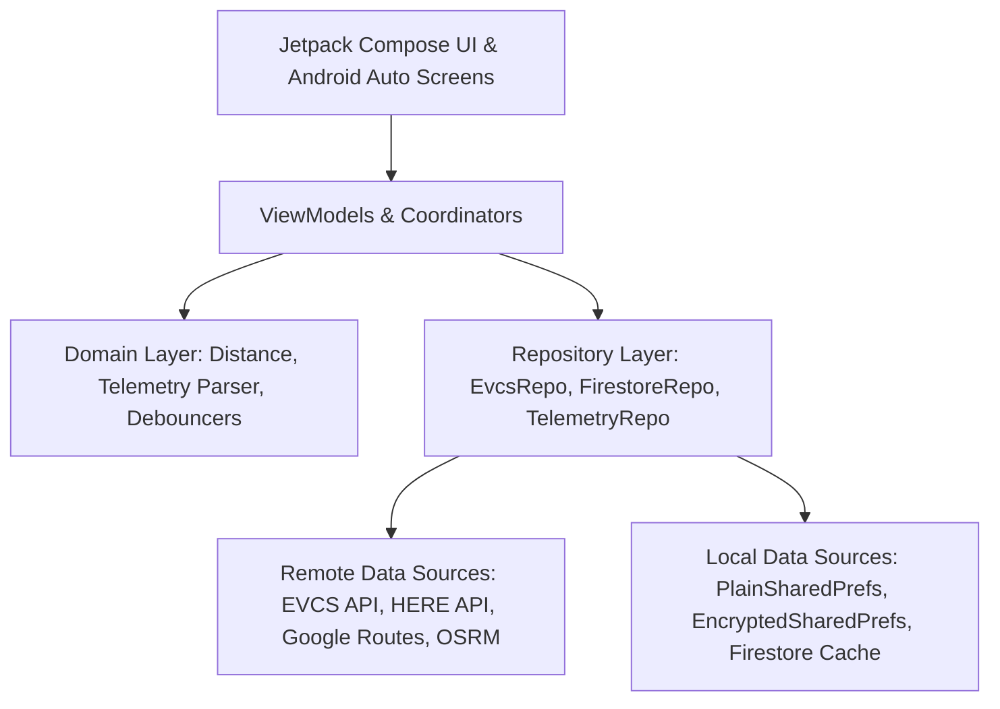

# ⚡ EV Plus (EV+) - Hệ Thống Giám Sát Trạm Sạc & Dẫn Đường Xe Điện Thông Minh

> **Ứng dụng Android Native thuần khiết (Jetpack Compose & Kotlin Modern Architecture)** hỗ trợ tài xế xe điện tra cứu trạm sạc, theo dõi tình trạng trụ sạc khả dụng theo thời gian thực (Live DC Telemetry), dẫn đường thông minh với bóng nổi đè trên bản đồ (Floating Capsule Overlay over Google Maps), cảnh báo giọng nói tiếng Việt (Voice TTS), tích hợp màn hình xe hơi (Android Auto) và đồng bộ trạm yêu thích đám mây (Local-First Cloud Firestore).

[-green.svg?style=for-the-badge&logo=android)](https://developer.android.com)
[-purple.svg?style=for-the-badge&logo=kotlin)](https://kotlinlang.org)
[](https://developer.android.com/jetpack/compose)
[](https://developer.android.com/training/cars/apps)
[](#-kiến-trúc-hệ-thống-architecture)
[-yellow.svg?style=for-the-badge&logo=firebase)](https://firebase.google.com)
[](https://developer.android.com/identity/sign-in/credential-manager)
[-brightgreen.svg?style=for-the-badge&logo=junit5)](#-kiểm-thử--đảm-bảo-chất-lượng-testing--qa)

---

## 📑 Mục Lục
1. [📖 Giới Thiệu (Overview)](#-giới-thiệu-overview)
2. [🌟 Tính Năng Cốt Lõi (Key Features)](#-tính-năng-cốt-lõi-key-features)
3. [⚡ Chế Độ Focus Mode & Dẫn Đường Thời Gian Thực](#-chế-độ-focus-mode--dẫn-đường-thời-gian-thực)
4. [🚗 Tích Hợp Android Auto (Car App Library)](#-tích-hợp-android-auto-car-app-library)
5. [🛠️ Tech Stack Chi Tiết (Detailed Tech Stack)](#️-tech-stack-chi-tiết-detailed-tech-stack)
6. [🏛️ Kiến Trúc Hệ Thống (System Architecture)](#️-kiến-trúc-hệ-thống-system-architecture)
7. [📂 Cấu Trúc Thư Mục (Project Structure)](#-cấu-trúc-thư-mục-project-structure)
8. [🛡️ Cơ Chế Phòng Thủ Chống Click-Spam & Edge Cases](#️-cơ-chế-phòng-thủ-chống-click-spam--edge-cases)
9. [🚀 Hướng Dẫn Cài Đặt & Biên Dịch (Getting Started)](#-hướng-dẫn-cài-đặt--biên-dịch-getting-started)
10. [🧪 Kiểm Thử & Đảm Bảo Chất Lượng (Testing & QA)](#-kiểm-thử--đảm-bảo-chất-lượng-testing--qa)
11. [🔒 Bảo Mật & Quyền Riêng Tư](#-bảo-mật--quyền-riêng-tư)

---

## 📖 Giới Thiệu (Overview)

Khi di chuyển bằng xe điện, một trong những nỗi lo lớn nhất của người lái xe là đến nơi thì trạm sạc bị **kẹt kín trụ, súng sạc hỏng hoặc trạm quá tải**. Các ứng dụng thông thường chỉ dừng lại ở việc hiển thị vị trí tĩnh hoặc bắt buộc người dùng chuyển đổi qua lại giữa app bản đồ và app tra cứu trạm sạc.

**EV Plus** giải quyết triệt để vấn đề này bằng mô hình **Live Telemetry Tracker & Overlay HUD**:
- **Khởi động tức thì (0ms Startup)** nhờ kiến trúc Local-First và bất đồng bộ hóa hoàn toàn disk I/O.
- **Giám sát số lượng súng sạc trống / đang sạc / bảo trì** trực tiếp từ hệ thống dữ liệu trạm sạc theo từng phân cấp công suất thực tế (20kW, 30kW, 60kW, 120kW, 150kW, 180kW, 250kW, 300kW, 360kW).
- **Viên nang nổi (Floating Capsule Overlay)** đè mượt mà trên ứng dụng Google Maps giúp tài xế theo dõi số trụ sạc trống theo từng giây mà không cần rời khỏi màn hình dẫn đường.
- **Trợ lý âm thanh tiếng Việt (Voice Announcements)** tự động đọc thông báo và giảm nhẹ âm lượng nhạc (Audio Ducking) khi trạm sạc sắp hết chỗ hoặc đã hết cổng sạc khả dụng.
- **Điều hướng thay thế 1-Chạm (1-Tap Smart Auto-Reroute)**: Tự động tính toán và đề xuất trạm sạc gần nhất có cùng cấp công suất khả dụng khi trạm đích bị đầy.
- **Đồng hành trên màn hình ô tô qua Android Auto**: Tận dụng Android Auto Car App Library (API level 7) để tài xế quan sát trạm sạc yêu thích và dẫn đường ngay trên taplo xe.

---

## 🌟 Tính Năng Cốt Lõi (Key Features)

### 1. ⚡ Tra Cứu Trạm Sạc & Cổng Sạc Trực Tiếp (Live Telemetry)
- Tìm kiếm trạm sạc quanh vị trí GPS hiện tại với độ trễ siêu thấp (<200ms).
- Phân loại rõ ràng các loại cổng sạc: **20kW DC** (hỗ trợ xe VF3/VF5), **30kW, 60kW, 120kW, 150kW, 180kW, 250kW, 300kW, 360kW DC** và **11kW/22kW AC**.
- Hiển thị trực quan: Cổng đang rảnh (Xanh lá), Đang sạc (Xanh dương), Bảo trì/Lỗi (Xám/Đỏ).
- Hỗ trợ bộ lọc nhanh: Chế độ sạc AC/DC, Cấp công suất DC mong muốn, Trạm còn chỗ trống.
- **Tự động cuộn lên đầu (Auto-Scroll)** khi người dùng làm mới dữ liệu hoặc thay đổi bộ lọc.

### 2. 🗺️ Multi-Tier Routing Coordinator (Dẫn Đường 3 Tầng)
- **Tier 1 (Google Routes API v2)**: Hỗ trợ tính toán ma trận lộ trình đa điểm chính xác theo thời gian thực (real-time traffic) qua cơ chế BYOK (Bring Your Own Key).
- **Tier 2 (OSRM Table Service)**: Dự phòng lộ trình đường sá thực tế (Road Distance & Duration) hoàn toàn miễn phí, không tốn quota.
- **Tier 3 (Haversine Formula Baseline)**: Dự phòng tính toán khoảng cách đường thẳng offline 0ms và tự động ước tính ETA (heuristic 30km/h nội đô) để đảm bảo danh sách trạm luôn được sắp xếp chuẩn xác.
- **Single-Flight & Coalescing**: Gom các yêu cầu tính toán routing gần nhau, chống nghẽn mạng và chống nhảy GPS (micro-jitter).

### 3. 🖼️ Thư Viện Ảnh Trạm Sạc & Phóng To Toàn Màn Hình (Photo Gallery & Lightbox)
- **VinFast CDN Direct Decoder**: Tự động bóc tách và giải mã URL ảnh gốc VinFast từ chuỗi Base64 tham số `url=`, vượt qua hoàn toàn cơ chế chặn 403 Cloudflare của proxy trung gian.
- **Image Lightbox Modal**: Trải nghiệm xem ảnh toàn màn hình với cử chỉ vuốt mượt mà, hỗ trợ zoom đa điểm và tải ảnh bất đồng bộ tối ưu bộ nhớ với Coil.

### 4. 🔐 Đăng Nhập 1-Chạm Google Credential Manager & Guest Mode
- Hỗ trợ chế độ **Khách (Guest)** dùng ngay không cần tài khoản.
- Tích hợp **Google Credential Manager (1-Tap Sign-In)** thế hệ mới nhất của Android, an toàn và liền mạch.
- Tự động lắng nghe trạng thái đăng nhập qua `StateFlow<AuthState>`.

### 5. ☁️ Đồng Bộ Trạm Yêu Thích Đám Mây (Local-First Firestore Sync)
- **Zero-Latency (0ms Startup)**: Dữ liệu trạm yêu thích luôn được đọc từ Local Storage trước để hiển thị ngay lập tức.
- **3-Way Conflict Resolution**: Tự động hợp nhất (Merge) danh sách trạm đã lưu khi người dùng từ chế độ Khách chuyển sang đăng nhập Google, không bao giờ bị mất trạm đã ghim.
- Cập nhật thời gian thực 2 chiều với Cloud Firestore (`users/{uid}/userdata/favorites`).
- Cơ chế Rollback an toàn: Tự động khôi phục giao diện và bộ nhớ khi gặp sự cố mất mạng hoặc lỗi máy chủ.

---

## ⚡ Chế Độ Focus Mode & Dẫn Đường Thời Gian Thực

Focus Mode là tính năng độc quyền được thiết kế chuyên biệt cho tài xế xe điện khi đang trên đường di chuyển đến trạm sạc:

```text
[Bấm ⚡ Focus Mode] ➔ [Khởi chạy Google Maps dẫn đường]
                    ➔ [Hiện bóng nổi Floating Capsule đè trên Google Maps]
                    ➔ [Adaptive Polling telemetry: 15s -> 10s -> 5s]
                    ➔ [Cảnh báo giọng nói tiếng Việt khi trạm đầy / có cổng trống]
                    ➔ [1-Tap Đổi lộ trình sang trạm khả dụng gần nhất]
```

### Chi Tiết Kỹ Thuật Của Focus Mode:
1. **Kiến Trúc Dữ Liệu 2 Tầng (2-Tier Hybrid Telemetry)**:
   - **Tier 1 (Ưu tiên)**: Kết nối trực tiếp tới **HERE EV Stations API** sử dụng xác thực **OAuth 1.0a HMAC-SHA256 Client Credentials** (hoặc VinFast extracted API key), lấy dữ liệu trạng thái cổng sạc trực tiếp theo chu kỳ.
   - **Tier 2 (Dự phòng)**: Tự động chuyển đổi sang EVCS API nếu mất kết nối Tier 1.
2. **Chu Kỳ Polling Động Tiết Kiệm Pin (Adaptive Distance-Based Polling)**:
   - Khoảng cách **> 3km**: Polling mỗi **15 giây** (tiết kiệm pin & 4G).
   - Khoảng cách **1.5km - 3km**: Polling mỗi **10 giây**.
   - Khoảng cách **< 1.5km (Đang tiếp cận trạm)**: Polling siêu tốc mỗi **5 giây** để phát hiện xe khác vừa cắm sạc.
3. **Bóng Nổi Hệ Thống (Draggable Floating Capsule Overlay)**:
   - Vẽ trực tiếp lên `WindowManager` qua quyền `SYSTEM_ALERT_WINDOW (TYPE_APPLICATION_OVERLAY)`.
   - Hỗ trợ cử chỉ chạm kéo thả (Drag & Drop), tự động hít vào mép màn hình (Edge Snapping).
   - Hiển thị số cổng sạc DC trống, khoảng cách còn lại và nút bấm Đổi lộ trình nhanh.
   - Cơ chế dự phòng **Persistent Notification Fallback** trên Android 13+ nếu người dùng không cấp quyền vẽ bóng nổi.
4. **Trợ Lý Cảnh Báo Giọng Nói Tiếng Việt (Vietnamese Voice TTS Engine)**:
   - Tích hợp Android `TextToSpeech` với locale `vi-VN`.
   - Cơ chế **Transient Audio Ducking** (`AUDIOFOCUS_GAIN_TRANSIENT_MAY_DUCK`): Tự động hạ âm lượng nhạc nền/radio trên xe khi đọc cảnh báo và khôi phục âm lượng ngay sau khi đọc xong.
   - Quy tắc thông báo thông minh: Cảnh báo khi trạm còn 1 trụ cuối, cảnh báo khi trạm hết sạch chỗ, và thông báo chúc mừng khi trạm có cổng sạc vừa giải phóng.

---

## 🚗 Tích Hợp Android Auto (Car App Library)

EV Plus tích hợp chính thức thư viện **Android Auto Car App Library (v1.7.0)**, cho phép người lái xe tương tác trực tiếp trên màn hình ô tô:
- **`EVPlusCarAppService`**: Dịch vụ nền khởi tạo phiên làm việc với hệ điều hành xe (CarHost).
- **`FavoritesCarScreen`**: Hiển thị danh sách các trạm sạc yêu thích đã ghim cùng số lượng cổng trống và khoảng cách ước tính.
- **1-Tap Navigate on Car**: Bấm trực tiếp từ màn hình xe để kích hoạt bản đồ xe hơi (Google Maps for Auto / Waze).

---

## 🛠️ Tech Stack Chi Tiết (Detailed Tech Stack)

| Phân Hệ | Công Nghệ / Thư Viện | Phiên Bản | Ghi Chú Kỹ Thuật |
|:---|:---|:---|:---|
| **Hệ Điều Hành & SDK** | Android OS | **API 26 – 34** | Min SDK 26 (Android 8.0 Oreo), Target SDK 34 (Android 14) |
| **Ngôn Ngữ & Runtime** | Kotlin | **1.9.23** | Chạy trên nền Java 17 (JVM Target 17) |
| **Bất Đồng Bộ (Async)** | Kotlinx Coroutines | **1.8.0** | `StateFlow`, `SharedFlow`, `withContext`, Structured Concurrency |
| **Serialization** | Kotlinx Serialization | **1.6.3** | JSON parser phi-reflection hiệu năng cao |
| **Giao Diện (UI)** | Jetpack Compose BOM | **2024.04.01** | Khung giao diện Reactive Declarative thuần khiết |
| **Hệ Thống Thiết Kế** | Material Design 3 | **1.2.1** | Theme Dark/Light hiện đại, Material You dynamic color |
| **Vòng Đời (Lifecycle)** | AndroidX Lifecycle | **2.7.0** | `lifecycle-runtime-compose`, `lifecycle-viewmodel-compose` |
| **Màn Hình Ô Tô** | Android Auto Car App | **1.7.0** | `androidx.car.app:app` & `app-projected` (API Level 7) |
| **Đăng Nhập & Định Danh** | Google Credential Manager | **1.3.0** | `androidx.credentials` + `googleid:1.1.1` (1-Tap Google Sign-In) |
| **Đám Mây & Cơ Sở Dữ Liệu**| Firebase BOM | **33.10.0** | Cloud Firestore (Local-First sync) & Firebase Authentication |
| **Mạng (Networking)** | Square OkHttp | **4.12.0** | HTTP/2, Connection Pooling, Interceptors, Timeout Guards |
| **Định Vị (Location)** | Play Services Location | **21.2.0** | FusedLocationProviderClient, High Accuracy GPS updates |
| **Bản Đồ & Lộ Trình** | Multi-Tier Routing | Google v2 / OSRM | Google Routes API Matrix v2 + OSRM Table Engine + Haversine |
| **Tải Ảnh (Image Loader)**| Coil Compose | **2.6.0** | Asynchronous image pipeline, Disk/Memory LRU caching |
| **Bảo Mật & Mã Hóa** | AndroidX Security Crypto | **1.1.0-alpha06** | `EncryptedSharedPreferences` với AES-256 GCM & MasterKey |
| **Bộ Nhớ Đệm Phi Mã Hóa**| PlainSharedPrefsStorage | In-house | Thread-safe Multi-Instance Registry, 0ms non-blocking cold start |
| **Kiểm Thử (Testing)** | JUnit 4 + MockWebServer | **4.13.2 / 4.12.0**| `kotlinx-coroutines-test:1.8.0`, `car.app:app-testing:1.7.0` |
| **Hệ Thống Build & CI/CD** | Gradle Wrapper & AGP | **8.7 / 8.3.2** | GitHub Actions Workflow tự động ký APK Release |

---

## 🏛️ Kiến Trúc Hệ Thống (System Architecture)

Ứng dụng tuân thủ nghiêm ngặt mô hình **Clean Architecture + MVVM + Local-First Reactive Data Flow**:



### Các Nguyên Tắc Thiết Kế Trọng Yếu:
1. **Unidirectional Data Flow (UDF)**: ViewModels phát ra `StateFlow<UiState>` bất biến; UI chỉ phát ra các Intent/Action, không được phép thay đổi state trực tiếp.
2. **Local-First Caching**: Mọi màn hình đọc cache từ bộ nhớ đĩa cục bộ trước để giao diện sẵn sàng trong **0ms**, sau đó mới nạp dữ liệu mạng và âm thầm cập nhật.
3. **Dispatcher Isolation**:
   - `Dispatchers.Main`: Xử lý cập nhật UI State và sự kiện người dùng.
   - `Dispatchers.IO`: Xử lý HTTP network call và disk cache JSON serialization.
   - `Dispatchers.Default`: Xử lý các phép toán nặng (tính Haversine ma trận, lọc danh sách công suất, phân loại trạm).
4. **Single-Flight & Coalescing Pattern**: Triệt tiêu hoàn toàn các request trùng lặp khi người dùng bấm refresh liên tục hoặc khi GPS phát tín hiệu với độ trễ micro-giây.

---

## 📂 Cấu Trúc Thư Mục (Project Structure)

```text
app/src/main/java/com/evcs/favorites/
├── auto/                         # Tích hợp Android Auto Car App Library
│   ├── EVPlusCarAppService.kt    # Entrypoint dịch vụ xe hơi
│   └── FavoritesCarScreen.kt     # Màn hình trạm sạc trên taplo ô tô
├── data/
│   ├── api/                      # OkHttp HTTP Clients (EVCS, HERE, Google Routes, OSRM)
│   ├── auth/                     # Session Management, AuthEngine & EncryptedStorage
│   ├── cache/                    # Bounded LRU Cache, Coordinate Cache
│   ├── model/                    # Data Classes: Station, PowerPort, DrivingMetrics
│   └── repository/               # EvcsRepository, FirestoreFavoritesRepository, TelemetryRepository
├── domain/                       # Pure Business Logic
│   ├── location/                 # Haversine Distance, Cluster Coordinates
│   └── telemetry/                # Live Port Status derivation & JSON parsing
├── focus/                        # Hệ thống Focus Mode HUD
│   ├── FocusModeService.kt       # Foreground Service điều phối Polling & Notifications
│   ├── FloatingCapsuleManager.kt # Quản lý WindowManager Floating Overlay
│   └── VoiceAlertManager.kt      # Quản lý TextToSpeech tiếng Việt & Audio Ducking
├── navigation/                   # Map Intent Navigator (Google Maps app URI handler)
└── ui/
    ├── components/               # Compose UI Components (StationCard, Modals, Chips, TopBar)
    ├── screens/                  # FavoritesScreen, NearbyScreen, LoginScreen
    ├── state/                    # Sealed Interfaces UiState (Loading, Success, Error)
    └── viewmodel/                # FavoritesViewModel, NearbyViewModel, Coordinators
```

---

## 🛡️ Cơ Chế Phòng Thủ Chống Click-Spam & Edge Cases

1. **Hardware Click Debounce & Rapid Tap Guard**:
   - Mọi nút bấm nhạy cảm (Đổi lộ trình, Bật Focus Mode, Đăng nhập, Mở bản đồ) đều được bọc qua `DebounceHelper` với ngưỡng chặn từ **500ms – 1000ms**, triệt tiêu tình trạng mở 2 bản đồ cùng lúc.
2. **OTP Race Condition Prevention**:
   - Khóa cờ `isOtpVerificationInFlight` bằng `AtomicBoolean`. Các lần bấm nút Xác nhận mã OTP kế tiếp khi request trước chưa hoàn tất sẽ bị hủy ngay lập tức (`job.isCompleted == true`).
3. **Cloud Sync Rollback Guarantee**:
   - Khi xóa trạm khỏi danh sách yêu thích, hệ thống cập nhật lạc quan (Optimistic Update) để UI phản hồi 0ms. Nếu server trả về lỗi HTTP 5xx hoặc mất mạng, trạng thái trên UI và bộ nhớ cục bộ sẽ tự động rollback nguyên vẹn.
4. **GPS Micro-Jitter Coalescing**:
   - Bỏ qua các tín hiệu GPS di chuyển dưới 20 mét để tránh kích hoạt tính toán lộ trình ma trận liên tục gây tốn pin và cạn kiệt API quota.

---

## 🚀 Hướng Dẫn Cài Đặt & Biên Dịch (Getting Started)

### Yêu Cầu Môi Trường:
- **Android Studio**: Hedgehog (2023.1.1) trở lên (khuyến nghị Iguana / Jellyfish / Koala).
- **JDK**: Java Development Kit **17** (Temurin / OpenJDK 17).
- **Android SDK**: Build-Tools **34.0.0**, SDK Platform **34**.

### Các Bước Biên Dịch & Chạy Ứng Dụng:

1. **Clone repository về máy**:
   ```bash
   git clone https://github.com/skul9x/EV-Plus.git
   cd EV-Plus
   ```

2. **Cấu hình Google Services & Firebase**:
   - Đặt file `google-services.json` của dự án Firebase vào thư mục `app/`.

3. **Biên dịch bản Debug**:
   ```bash
   ./gradlew :app:assembleDebug
   ```

4. **Biên dịch bản Release (Tự động ký APK qua Release Keystore nếu có)**:
   ```bash
   ./gradlew :app:assembleRelease
   ```
   *File APK hoàn chỉnh sẽ được xuất ra tại:* `app/build/outputs/apk/release/app-release.apk`.

---

## 🧪 Kiểm Thử & Đảm Bảo Chất Lượng (Testing & QA)

EV Plus sở hữu bộ kiểm thử tự động toàn diện với **724 Unit & Integration Test Cases**, kiểm tra toàn bộ luồng nghiệp vụ:

```bash
./gradlew testDebugUnitTest
```

### Kết Quả Kiểm Thử Toàn Diện:
```text
> Task :app:testDebugUnitTest

com.evcs.favorites.FavoritesViewModelTest > PASSED
com.evcs.favorites.NearbyRoutingViewModelTest > PASSED
com.evcs.favorites.focus.FocusModeDirectNavigationTest > PASSED
com.evcs.favorites.data.routing.MultiTierRoutingCoordinatorTest > PASSED
com.evcs.favorites.data.repository.FirestoreFavoritesRepositoryTest > PASSED
com.evcs.favorites.data.repository.LocalFirstFirestoreFavoritesSyncTest > PASSED
com.evcs.favorites.performance.NetworkRoutingAndCoalescingOptimizationTest > PASSED
...
==============================================================================
724 tests completed, 0 failed, 0 ignored | 100% Successful
Build Duration: ~50s
==============================================================================
```

### Các Kịch Bản Test Trọng Tâm:
- **Cold Start & Threading**: Kiểm chứng 0ms block Main Thread, không truy cập `EncryptedSharedPreferences` đồng bộ trong UI thread.
- **Multi-Tier Routing Fallback**: Giả lập lỗi Google API -> tự động chuyển sang OSRM -> giả lập OSRM timeout -> tự động fallback sang Haversine trong vòng 5.0 giây.
- **Concurrency & Race Conditions**: Thử nghiệm gọi đồng thời nhiều request xác thực OTP, thêm/xóa trạm yêu thích song song.
- **Android Auto UI Testing**: Kiểm tra render màn hình xe hơi và điều hướng bản đồ qua `CarAppTesting`.

---

## 🔒 Bảo Mật & Quyền Riêng Tư

1. **Không Lưu Trữ Mật Khẩu**: Xác thực hoàn toàn qua mật mã một lần (OTP) hoặc Google Credential Manager (OAuth 2.0).
2. **Mã Hóa Phần Cứng**: Các session token nhạy cảm được bảo vệ trong `EncryptedSharedPreferences` với khóa MasterKey sinh bởi Android KeyStore bằng thuật toán **AES-256 GCM**.
3. **Bảo Vệ API Key (BYOK)**: Khóa Google Routes API được lưu trữ độc lập trong bộ nhớ nội bộ của thiết bị, không gửi lên bất kỳ máy chủ trung gian nào.
4. **Quyền Tối Thiểu**:
   - `ACCESS_FINE_LOCATION`: Chỉ yêu cầu khi quét trạm sạc gần vị trí tài xế.
   - `SYSTEM_ALERT_WINDOW`: Chỉ yêu cầu khi người dùng chủ động kích hoạt Focus Mode bóng nổi.

---

## 📄 Bản Quyền & Giấy Phép (License)

Dự án được phát triển và duy trì bởi cộng đồng yêu xe điện Việt Nam.
Mã nguồn mở phục vụ mục đích học tập và chia sẻ cộng đồng tài xế EV.
