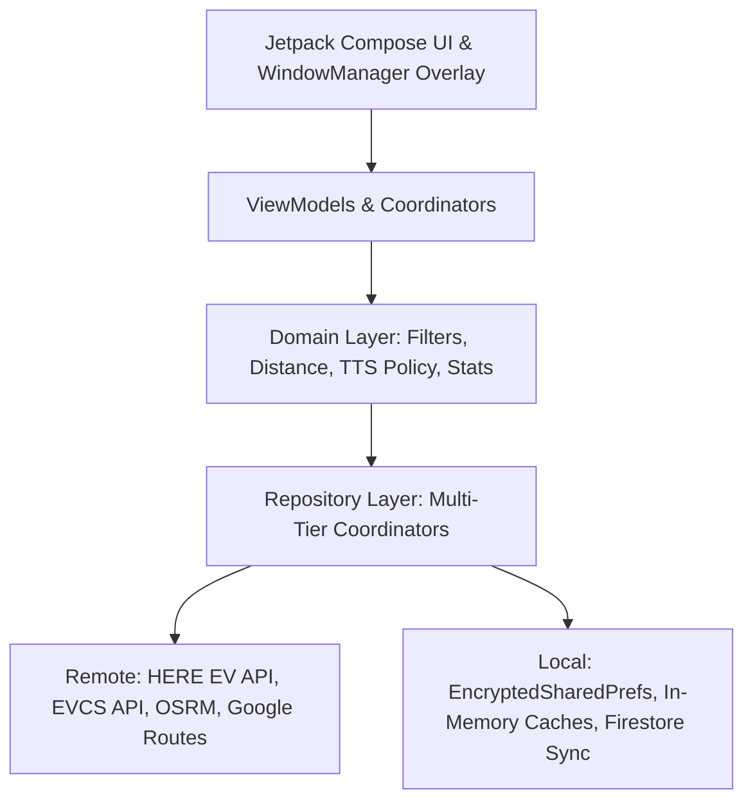

# EV-Plus System Overview & Architecture

## 1. Overview
**EV-Plus** (EV+) is a high-performance Android companion application designed for electric vehicle (EV) drivers in Vietnam (primarily VinFast EV ecosystem). It delivers real-time DC fast charging station discovery, live connector slot telemetry, 3-tier routing matrix calculation, persistent cloud favorites synchronization, and **Focus Mode** (hands-free live navigation tracking with system alert overlay and audio alerts).

---

## 2. Core Architectural Pillars

### A. Focus Mode Subsystem
* **Foreground Service (`FocusModeForegroundService`)**: Maintains an Android foreground service (`location|dataSync`) managing continuous telemetry polling when external navigation apps (Google Maps) occupy the screen.
* **Telemetry Engine (`FocusModeTelemetryEngine`)**: Headless business engine providing dynamic polling intervals (`15s > 3km`, `10s 1.5-3km`, `5s < 1.5km`), offline detection in underground basements, and 1-tap alternative DC station auto-rerouting.
* **Floating Capsule UI (`FocusModeFloatingViewManager`)**: Draggable, edge-snapping system alert overlay (`TYPE_APPLICATION_OVERLAY`) displaying real-time DC slot availability (`3/4 Trống`) and 1-tap reroute CTA button.
* **Audio & Voice Alerts (`FocusModeTtsManager`, `FocusModeVoiceAlertPolicy`)**: Android TextToSpeech in Vietnamese (`vi-VN`) with transient audio ducking to alert drivers when DC slots become full or available.

### B. Live Telemetry & 2-Tier Network Architecture
* **Tier 1 (HERE Maps EV API)**: Zero-login direct DC connector status parser via OAuth 1.0a HMAC-SHA256 Client Credentials and extracted VinFast API credentials.
* **Tier 2 (EVCS Public API Fallback)**: HMAC-SHA256 signed fallback telemetry.

### C. Multi-Tier Driving Routing Engine
* **Tier 1**: Google Routes API v2 (ComputeRouteMatrix with real-time traffic and ETA).
* **Tier 2**: Open Source Routing Machine (OSRM Table Service) for precise road distance without API keys.
* **Tier 3**: Haversine great-circle trigonometric baseline calculation.

### D. Local-First Cloud Favorites Sync
* **Cloud Firestore**: Single-document atomic map structure at `/users/{userId}/userdata/favorites`.
* **Local Persistence**: Instant 0ms reads from `EncryptedSharedPreferences` with 4-branch bidirectional sync and redundant write suppression.
