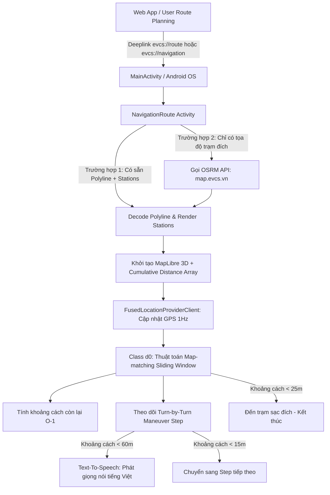

# PHÂN TÍCH CHI TIẾT THUẬT TOÁN CHỈ ĐƯỜNG THEO TRẠM SẠC (EVCS NAVIGATION ALGORITHM)

Tài liệu này phân tích chi tiết toàn bộ logic và các thuật toán liên quan đến tính toán lộ trình, hiển thị trạm sạc xe điện và dẫn đường thời gian thực (Turn-by-Turn Navigation) được trích xuất và dịch ngược từ file APK của ứng dụng **EVCS** (`/home/skul9x/Desktop/Code/evcs/jadx_out_evcs`).

---

## 1. TỔNG QUAN KIẾN TRÚC VÀ LUỒNG HOẠT ĐỘNG (SYSTEM ARCHITECTURE & WORKFLOW)

Ứng dụng EVCS kết hợp giữa **Web App (lập lộ trình & tối ưu trạm sạc)** và **Native Android Activity (`NavigationRoute`)** để cung cấp trải nghiệm dẫn đường GPS trực quan thời gian thực.

### Hai phương thức kích hoạt dẫn đường:
1. **Qua Deeplink lộ trình nhiều trạm (`evcs://route`)**:
   - Tham số URL: `pl` (chuỗi Polyline mã hóa của cả lộ trình) và `stations` (mảng JSON chứa danh sách các trạm sạc dọc đường gồm `name`, `latitude`/`lat`, `longitude`/`lng`, `power`).
2. **Qua Deeplink trạm đơn lẻ (`evcs://navigation`)**:
   - Tham số URL: `name`, `lat`/`latitude`, `lng`/`longitude`, `power`.
   - Native App sẽ tự động gọi Routing Server để tính toán tuyến đường từ vị trí hiện tại đến trạm đích.

---

## 2. NGUỒN DỮ LIỆU VÀ GIAO THỨC TÌM ĐƯỜNG (ROUTING ENGINE & API)

Khi ứng dụng cần tự động tính toán lộ trình, nó gọi đến máy chủ OSRM chuyên dụng của EVCS:

### 2.1. API Routing Endpoint
- **URL**: `https://map.evcs.vn/route/v1/driving/{lng1},{lat1};{lng2},{lat2}?overview=full&key=OmfaxrD1G96VQfCSFFAnNtahX5gtrMr8L83asUHV&geometries=polyline&steps=true`
- **Phương thức**: `GET` (kèm HTTP Headers: `User-Agent` giả lập phiên bản app, `Referer: https://evcs.vn`, `Origin: https://evcs.vn`).
- **Engine**: **OSRM (Open Source Routing Machine)** chạy trên tập dữ liệu bản đồ OpenStreetMap (OSM) với profile lái xe ô tô (`driving`).
- **Cơ chế thuật toán bên dưới của OSRM**: Sử dụng giải thuật **Contraction Hierarchies (CH)** hoặc **Multi-Level Dijkstra (MLD)** giúp tính toán đường đi ngắn nhất giữa hai điểm trong thời gian chỉ vài mili-giây.

### 2.2. Dữ liệu trả về (JSON Response Structure)
- `routes[0].geometry`: Chuỗi mã hóa Polyline 5 ký tự thập phân đại diện cho toàn bộ quỹ đạo đường đi.
- `routes[0].legs[0].steps`: Danh sách các điểm rẽ / chuyển hướng (Maneuver Steps):
  - `maneuver.location`: Tọa độ `[lng, lat]` của điểm diễn ra chuyển hướng.
  - `maneuver.type`: Loại thao tác (`turn`, `depart`, `arrive`, `roundabout`, v.v.).
  - `maneuver.modifier`: Hướng rẽ (`left`, `right`, `slight left`, `sharp right`, `uturn`, `straight`, v.v.).
  - `name`: Tên con đường chuẩn bị đi vào.
  - `distance`: Khoảng cách mét của chặng đó.

---

## 3. CÁC THUẬT TOÁN CỐT LÕI TRONG NATIVE NAVIGATION (`NavigationRoute.java` & `d0.java`)

### 3.1. Thuật toán giải mã Polyline (Google Encoded Polyline Algorithm)
Tuyến đường hình học được nén dưới dạng chuỗi ASCII để giảm dung lượng mạng:
- Ứng dụng sử dụng phương thức `LineString.fromPolyline(polylineString, 5)` để giải mã thành danh sách các điểm `List<Point>` với độ chính xác cố định $10^{-5}$ độ.
- Toàn bộ danh sách điểm được chuyển đổi thành `ArrayList<LatLng>` để phục vụ render và xử lý hình học.

### 3.2. Thuật toán tiền tính toán khoảng cách lũy kế (Cumulative Distance Precomputation)
Được triển khai trong hàm `NavigationRoute.w(ArrayList<LatLng> points)`:
- Thay vì mỗi lần nhận tọa độ GPS lại phải tính tổng khoảng cách của hàng nghìn đoạn thẳng, hệ thống tính trước mảng lũy kế $H$:
  $$H[0] = 0$$
  $$H[i] = H[i-1] + \text{GeodesicDistance}(P_{i-1}, P_i) \quad (\forall i \ge 1)$$
- **Độ phức tạp tính trước**: $O(N)$ khi tải tuyến đường.
- **Lợi ích**: Cho phép tính khoảng cách còn lại dọc tuyến từ điểm bất kỳ đến đích chỉ mất thời gian **$O(1)$**.

### 3.3. Thuật toán bám đường bằng cửa sổ trượt (Sliding-Window Polyline Snapping)
Khi xe di chuyển và GPS liên tục trả về tọa độ thực tế $L(lat, lng)$ (tần suất ~1Hz):
1. **Tìm điểm gần nhất trên Polyline**:
   - Nếu duyệt qua toàn bộ $N$ điểm ($N$ có thể lên đến hàng vạn điểm trên đường dài), CPU sẽ bị quá tải và gây giật lag (frame drop).
   - Mã nguồn trong [d0.java](file:///home/skul9x/Desktop/Code/evcs/jadx_out_evcs/sources/com/evcs/vn/d0.java#L111-L148) tối ưu bằng **Cửa sổ trượt (Sliding Window)** quanh chỉ số điểm hiện tại `i0`:
     $$\text{Search Range} = \left[ \max(0, i_0 - 3), \; \min(i_0 + 100, N - 1) \right]$$
   - Thuật toán tìm điểm $P_{min}$ trong phạm vi này có khoảng cách trắc địa tới $L$ là nhỏ nhất:
     $$i_{min} = \arg\min_{k \in \text{Range}} \text{distanceBetween}(L, P_k)$$
   - Cập nhật con trỏ vị trí hiện tại: $i_0 \leftarrow i_{min}$.

2. **Tính toán khoảng cách còn lại đến đích**:
   $$\text{Total Remaining Distance} = (H[N - 1] - H[i_0]) + \text{distanceBetween}(L, P_{i_0})$$
   - Hiển thị theo đơn vị `MÉT` (nếu $\le 1000$m) hoặc `KM` (làm tròn 1 chữ số thập phân nếu $> 1000$m).

### 3.4. Thuật toán bám sát chặng rẽ Turn-by-Turn & Cảnh báo âm thanh (Step-Matching & Navigation Guidance)
Các bước chuyển hướng được lưu trong danh sách `List<RouteStep> e0`:
1. **Khớp chặng hiện tại với Polyline**:
   - Sử dụng một cửa sổ trượt mở rộng:
     $$\text{Step Search Range} = \left[ i_0, \; \min(i_0 + 300, N - 1) \right]$$
   - Tìm chỉ số $i_{step}$ trên Polyline tương ứng với tọa độ ngã rẽ $S_{current}$.
   - Khoảng cách từ xe tới điểm rẽ tiếp theo:
     $$\text{DistanceToTurn} = (H[i_{step}] - H[i_0]) + \text{distanceBetween}(L, P_{i_0})$$

2. **Cơ chế chuyển chặng (Step Transition)**:
   - Khi $\text{DistanceToTurn} < 15\text{m}$, ứng dụng xác định người lái đã vượt qua điểm chuyển hướng:
     $$\text{step\_index} \leftarrow \text{step\_index} + 1$$
     Tự động cập nhật giao diện `tvNextInstruction` và `tvArStatus`.

3. **Cơ chế kích hoạt cảnh báo giọng nói (Text-To-Speech Triggers)**:
   - Ngay khi chuyển chặng mới: Đọc thông báo hướng đi tiếp theo.
   - Khi $\text{DistanceToTurn} < 60\text{m}$: Kích hoạt TTS đọc lệnh chuẩn bị thực hiện thao tác (ví dụ: *"Rẽ phải vào Nguyễn Trãi"*).
   - Sử dụng cờ đánh dấu `g0` để đảm bảo mỗi chặng chỉ đọc một lần duy nhất, tránh lặp âm thanh.

### 3.5. Thuật toán phiên dịch câu lệnh chỉ đường tiếng Việt tự nhiên (Natural Language Maneuver Generator)
Trong hàm `NavigationRoute.u(type, modifier, roadName)`:
- Chuyển đổi mã lệnh OSRM chuẩn quốc tế sang câu thoại dẫn đường tiếng Việt tự nhiên:

| OSRM Maneuver `type` / `modifier` | Bản dịch tiếng Việt xuất ra UI & TTS |
| :--- | :--- |
| `depart` | *"Bắt đầu di chuyển"* |
| `arrive` | *"Bạn sẽ đến nơi"* / *"Bạn sẽ đến trạm sạc"* |
| `roundabout` | *"Đi vào vòng xuyến"* |
| `turn` + `left` | *"Rẽ trái"* |
| `turn` + `right` | *"Rẽ phải"* |
| `turn` + `slight left` | *"Chếch sang trái"* |
| `turn` + `slight right` | *"Chếch sang phải"* |
| `turn` + `sharp left` | *"Rẽ ngoặt sang trái"* |
| `turn` + `sharp right` | *"Rẽ ngoặt sang phải"* |
| `turn` + `uturn` | *"Quay đầu"* |
| `turn` + `straight` | *"Đi thẳng"* |
| Khác | *"Tiếp tục đi"* |

- **Ghép tên đường**: Nếu có thuộc tính tên đường (`name`), câu lệnh tự động ghép đuôi:
  $$\text{Instruction} = \text{Action} + \text{ " vào " } + \text{RoadName}$$

### 3.6. Thuật toán điều khiển Camera 3D thời gian thực (Dynamic 3D Navigation Camera)
Trong hàm `NavigationRoute.A(Location)`:
- **Khởi động**: Bay camera (`flyTo`) đến vị trí xe với góc nhìn tổng quan (Tilt 60°, Zoom 17.0).
- **Khi đang chạy**:
  - Tọa độ mục tiêu: `LatLng(latitude, longitude)`.
  - Góc nghiêng bản đồ 3D: Cố định góc nhìn phối cảnh $\approx 60^\circ - 70^\circ$.
  - Góc xoay bản đồ (Bearing): Tự động quay theo hướng di chuyển thực tế của xe (`location.getBearing()`), thuật toán chuẩn hóa góc $0^\circ \le \text{bearing} < 360^\circ$.
  - Hiệu ứng chuyển động mượt với thời gian nội suy `duration = 1000ms`.

### 3.7. Thuật toán hiển thị trạm sạc và đồ họa lộ trình (Marker & Polyline Rendering)
1. **Lộ trình 2 lớp (Dual-layer High-visibility Polyline)**:
   - Lớp dưới (Glow/Casing): Màu xanh thẫm bán trong suốt `#40166534`, độ rộng `22.0f` tạo viền đổ bóng nổi khối.
   - Lớp trên (Core Line): Màu xanh thương hiệu EVCS `R.color.evcs_green`, độ rộng `8.0f`.
2. **Hiển thị các trạm sạc dọc đường**:
   - Trạm đích chính: Marker đặc biệt có màu sắc nổi bật, hiển thị tên trạm và công suất sạc (`power` kW).
   - Các trạm sạc trung gian / lân cận: Được lọc và ghim Marker lên bản đồ dựa trên danh sách `stations` truyền từ web.

### 3.8. Xử lý địa lý và chủ quyền bản đồ (Territory Boundary & 3D Building Engine)
Trong hàm `NavigationRoute.x()` và `NavigationRoute.s()`:
- Ứng dụng nạp file [vietnam_mainland.geojson](file:///home/skul9x/Desktop/Code/evcs/jadx_out_evcs/resources/assets/vietnam_mainland.geojson) để áp bộ lọc không gian (`within filter`).
- Nạp lớp tòa nhà 3D (`3d-buildings`) qua thuộc tính `render_height` và `render_min_height` với độ trong suốt 0.6.
- Sử dụng hàm vẽ Canvas động `s()` để tạo nhãn chủ quyền biển đảo *"Quần đảo Hoàng Sa (Việt Nam)"* và *"Quần đảo Trường Sa (Việt Nam)"* gắn trực tiếp vào tọa độ thực tế trên lớp `SymbolLayer` của MapLibre.

---

## 4. TỔNG KẾT VÀ ĐÁNH GIÁ THUẬT TOÁN

| Tiêu chí | Cơ chế áp dụng | Đánh giá kỹ thuật |
| :--- | :--- | :--- |
| **Tốc độ tìm đường** | OSRM Contraction Hierarchies | Rất nhanh (phản hồi trong < 50ms), tối ưu cho xe hơi. |
| **Hiệu năng bám đường (Tracking)** | Sliding Window ($O(K)$, với $K \le 100$) | Tiết kiệm CPU/Pin đáng kể so với tìm kiếm tuyến tính toàn bộ $O(N)$. |
| **Tính toán khoảng cách còn lại** | Mảng khoảng cách tích lũy (Prefix Sum) | Thời gian truy vấn $O(1)$. |
| **Độ mượt điều hướng** | MapLibre Native 3D + Nội suy Bearing | Trải nghiệm lái xe góc nhìn 3D trực quan như Google Maps / Apple Maps. |
| **Dẫn đường bằng giọng nói** | TTS offline tiếng Việt (`Locale("vi", "VN")`) | Phản hồi tức thì, không phụ thuộc vào kết nối mạng khi đang di chuyển. |
