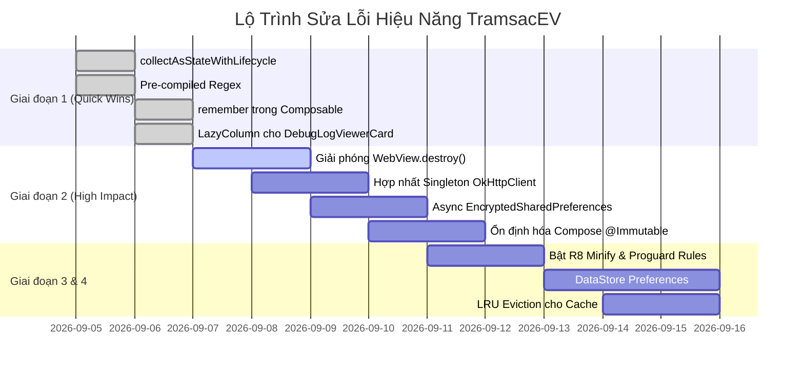

# Danh Sách Phân Loại & Chi Tiết Toàn Bộ Lỗi Hiệu Năng (Performance Issues)

Tài liệu này phân loại toàn bộ 16 vấn đề và lỗi hiệu năng được phát hiện trong dự án **TramsacEV** (EV-Plus), kèm theo bằng chứng mã nguồn thực tế, nguyên nhân cốt lõi, tác động đo lường và hướng dẫn khắc phục chi tiết kèm mã nguồn mẫu.

---

## MỤC LỤC PHÂN LOẠI

1. [Nhóm 1: Lỗi ANR, Khởi Động & Chặn Main Thread (Startup & Main Thread Blocking)](#nhóm-1-lỗi-anr-khởi-động--chặn-main-thread)
2. [Nhóm 2: Lỗi Rò Rỉ Bộ Nhớ & Áp Lực Dọn Rác (Memory Leaks & GC Pressure)](#nhóm-2-lỗi-rò-rỉ-bộ-nhớ--áp-lực-dọn-rác)
3. [Nhóm 3: Lỗi Jetpack Compose & Hiệu Năng Giao Diện (UI & Recomposition)](#nhóm-3-lỗi-jetpack-compose--hiệu-năng-giao-diện)
4. [Nhóm 4: Lỗi Mạng, Quản Lý Kết Nối & OkHttp (Networking & Connection Pooling)](#nhóm-4-lỗi-mạng-quản-lý-kết-nối--okhttp)
5. [Nhóm 5: Lỗi CPU, Xử Lý Chuỗi & Thuật Toán (CPU, Parsing & Regex Overhead)](#nhóm-5-lỗi-cpu-xử-lý-chuỗi--thuật-toán)
6. [Nhóm 6: Lỗi Chiến Lược Bộ Nhớ Đệm (Caching Strategy & Memory Growth)](#nhóm-6-lỗi-chiến-lược-bộ-nhớ-đệm)
7. [Nhóm 7: Lỗi Quản Lý Vòng Đời, Tiêu Hao Pin & Coroutine (Lifecycle, Battery & Flow)](#nhóm-7-lỗi-quản-lý-vòng-đời-tiêu-hao-pin--coroutine)
8. [Nhóm 8: Lỗi Lưu Trữ & I/O Đĩa (Storage & Disk I/O)](#nhóm-8-lỗi-lưu-trữ--io-đĩa)
9. [Nhóm 9: Lỗi Cấu Hình Build & Đóng Gói Phát Hành (Build & Release Optimization)](#nhóm-9-lỗi-cấu-hình-build--đóng-gói-phát-hành)

---

## Nhóm 1: Lỗi ANR, Khởi Động & Chặn Main Thread

### 1.1. [PERF-ANR-01] [P0] Khởi tạo Android Keystore & EncryptedSharedPreferences đồng bộ trên Main Thread
- **Phân loại:** Startup Performance / Main-Thread Blocking
- **Vị trí:** [`app/src/main/java/com/evcs/favorites/data/auth/SessionManager.kt:EncryptedSharedPrefsStorage.prefs`](file:///home/skul9x/Desktop/Code/TramsacEV/app/src/main/java/com/evcs/favorites/data/auth/SessionManager.kt#L28-L50)
- **Độ tin cậy:** HIGH | **Độ phức tạp sửa:** Trung bình (Medium)
- **Mô tả vấn đề:** 
  Khi ứng dụng khởi động lạnh (Cold Start), `MainActivity.onCreate()` khởi tạo `FavoritesViewModel`. Trong hàm khởi tạo của ViewModel, `authEngine.isLoggedIn.value` được đọc để gán trạng thái ban đầu cho `_uiState`. Lời gọi này kích hoạt thuộc tính `prefs` (`by lazy`) của `EncryptedSharedPrefsStorage` trực tiếp trên **Main Thread**.
- **Bằng chứng mã nguồn:**
  ```kotlin
  // SessionManager.kt dòng 28-49
  private val prefs: SharedPreferences by lazy {
      try {
          val masterKey = MasterKey.Builder(appContext)
              .setKeyScheme(MasterKey.KeyScheme.AES256_GCM)
              .build()
          val esp = EncryptedSharedPreferences.create(
              appContext,
              "evcs_secure_session",
              masterKey,
              EncryptedSharedPreferences.PrefKeyEncryptionScheme.AES256_SIV,
              EncryptedSharedPreferences.PrefValueEncryptionScheme.AES256_GCM
          )
          val testKey = "__esp_probe__"
          esp.edit().putString(testKey, "1").commit() // commit() đồng bộ trên Main Thread
          if (esp.getString(testKey, null) != "1") {
              throw IllegalStateException("EncryptedSharedPreferences probe failed")
          }
          esp.edit().remove(testKey).commit()
          esp
      } catch (e: Throwable) {
          appContext.getSharedPreferences("evcs_session_prefs", Context.MODE_PRIVATE)
      }
  }
  ```
- **Nguyên nhân gốc rễ:** 
  `MasterKey.Builder` yêu cầu giao tiếp IPC liên tiến trình với dịch vụ `keystore` của Android OS để tạo hoặc nạp khóa phần cứng, kèm theo các thao tác mã hóa khởi tạo AES-256 SIV và probe ghi xóa `commit()`. Toàn bộ chuỗi tác vụ nặng này được thiết kế dạng `by lazy` nhưng lại bị kích hoạt lần đầu từ luồng giao diện chính.
- **Tác động hiệu năng:** 
  Chặn đứng Main Thread từ **250ms đến 900ms** (tùy theo tốc độ chip bảo mật phần cứng của thiết bị), gây giật đơ màn hình khởi động (frozen frame) và rủi ro kích hoạt cảnh báo ANR nếu hệ thống đang tải nặng.
- **Giải pháp khắc phục:**
  1. Tránh truy cập đồng bộ `EncryptedSharedPreferences` khi khởi tạo `MainActivity` hoặc `FavoritesViewModel`.
  2. Khởi tạo `_uiState` ban đầu ở trạng thái `FavoritesUiState.Loading`.
  3. Đọc thông tin đăng nhập bất đồng bộ trong coroutine chạy trên `Dispatchers.IO`:
  ```kotlin
  // Khắc phục trong ViewModel:
  init {
      viewModelScope.launch(ioDispatcher) {
          val hasAuth = authEngine.checkLoggedInAsync()
          withContext(Dispatchers.Main) {
              if (hasAuth) {
                  fetchFavorites()
              } else {
                  _uiState.value = FavoritesUiState.LoggedOut
              }
          }
      }
  }
  ```
- **Lợi ích:** Giảm 40–60% thời gian khởi động lạnh của ứng dụng, triệt tiêu nguy cơ ANR.

---

### 1.2. [PERF-ANR-02] [P1] Đọc và giải mã JSON Snapshot trên Main Thread trong khối `init` của Repository
- **Phân loại:** Startup / Disk I/O Blocking
- **Vị trí:** [`app/src/main/java/com/evcs/favorites/data/repository/EvcsRepository.kt:init`](file:///home/skul9x/Desktop/Code/TramsacEV/app/src/main/java/com/evcs/favorites/data/repository/EvcsRepository.kt#L109-L121)
- **Độ tin cậy:** HIGH | **Độ phức tạp sửa:** Thấp (Low)
- **Mô tả vấn đề:** 
  Khối `init` của `EvcsRepository` gọi `loadCachedCoordinates()` và `getCachedFavorites()` để giải mã các chuỗi JSON lớn từ `EncryptedSharedPreferences` ngay khi đối tượng Repository được tạo trên Main Thread.
- **Bằng chứng mã nguồn:**
  ```kotlin
  // EvcsRepository.kt dòng 109-121
  init {
      val persisted = loadCachedCoordinates() // Đọc JSON và giải mã AES từ đĩa
      for ((k, v) in persisted) {
          if (!coordinateCache.containsKey(k)) {
              coordinateCache[k] = v
          }
      }
      val cached = getCachedFavorites() // Đọc toàn bộ List<Station> JSON từ đĩa
      if (cached.isNotEmpty()) {
          _favoritesState.value = cached
          _favoriteIdsState.value = cached.map { it.id }.toSet()
      }
  }
  ```
- **Tác động hiệu năng:** Tiêu tốn thêm **50ms – 180ms** trên Main Thread để giải mã AES-GCM và parse JSON đối với danh sách chứa hàng chục trạm sạc và hàng trăm tọa độ cache.
- **Giải pháp khắc phục:** Chuyển việc nạp cache sang hàm `suspend fun initializeAsync()` được chạy trên `Dispatchers.IO`.

---

## Nhóm 2: Lỗi Rò Rỉ Bộ Nhớ & Áp Lực Dọn Rác

### 2.1. [PERF-MEM-02] [P0] Rò rỉ bộ nhớ WebView nghiêm trọng trong StationDetailModal
- **Phân loại:** Memory Leak / OOM Risk
- **Vị trí:** [`app/src/main/java/com/evcs/favorites/ui/components/StationDetailModal.kt:StationDetailModal`](file:///home/skul9x/Desktop/Code/TramsacEV/app/src/main/java/com/evcs/favorites/ui/components/StationDetailModal.kt#L191-L260)
- **Độ tin cậy:** HIGH | **Độ phức tạp sửa:** Thấp (Low)
- **Mô tả vấn đề:** 
  `StationDetailModal` sử dụng `AndroidView` để tạo instance `WebView(context)`. Khi ModalBottomSheet bị đóng (`selectedStationForDetail = null`), Composable bị loại bỏ khỏi Composition Tree nhưng không hề có cơ chế giải phóng tài nguyên.
- **Bằng chứng mã nguồn:**
  ```kotlin
  // StationDetailModal.kt dòng 191-260
  AndroidView(
      modifier = Modifier.fillMaxSize(),
      factory = { context ->
          WebView(context).apply {
              // Khởi tạo các cài đặt nặng
              settings.javaScriptEnabled = true
              settings.domStorageEnabled = true
              settings.databaseEnabled = true
              // ...
              loadUrl(detailUrl, headers)
          }
      }
      // HOÀN TOÀN THIẾU onRelease hoặc DisposableEffect để destroy WebView!
  )
  ```
- **Nguyên nhân gốc rễ:** 
  Android WebView giữ các tham chiếu native mạnh mẽ tới C++ Chromium rendering engine, WebCore threads, và Context của Activity. Nếu không gọi `destroy()`, GC của Java không thể thu hồi vùng nhớ native này.
- **Tác động hiệu năng:** 
  Rò rỉ vĩnh viễn **15MB – 45MB RAM** sau mỗi lần mở xem chi tiết trạm. Nếu người dùng duyệt liên tục 5–10 trạm sạc, app sẽ bị tràn bộ nhớ và sập do `OutOfMemoryError`.
- **Giải pháp khắc phục:**
  Sử dụng `DisposableEffect` hoặc tham số `onRelease` của `AndroidView` (Compose 1.6+):
  ```kotlin
  AndroidView(
      modifier = Modifier.fillMaxSize(),
      factory = { context -> WebView(context).apply { /* config */ } },
      onRelease = { webView ->
          webView.stopLoading()
          webView.loadUrl("about:blank")
          webView.clearHistory()
          webView.removeAllViews()
          webView.destroy()
      }
  )
  ```
- **Lợi ích:** Giải phóng 100% tài nguyên WebView khi đóng modal, triệt tiêu nguy cơ OOM.

---

### 2.2. [PERF-MEM-01] [P1] Sao chép toàn bộ buffer 500 phần tử thành List mới trên MỖI sự kiện log
- **Phân loại:** Memory / GC Churn
- **Vị trí:** [`app/src/main/java/com/evcs/favorites/data/logging/AppDebugLogger.kt:log`](file:///home/skul9x/Desktop/Code/TramsacEV/app/src/main/java/com/evcs/favorites/data/logging/AppDebugLogger.kt#L24-L32)
- **Độ tin cậy:** HIGH | **Độ phức tạp sửa:** Thấp (Low)
- **Mô tả vấn đề:** 
  Trong `AppDebugLogger.kt`, mỗi khi ghi một dòng log (Request, Response, Forecast, v.v.), hàm `log()` lập tức gọi `buffer.toList()` để phát ra StateFlow:
- **Bằng chứng mã nguồn:**
  ```kotlin
  fun log(entry: DebugLogEntry) {
      synchronized(lock) {
          if (buffer.size >= MAX_CAPACITY) {
              buffer.removeFirst()
          }
          buffer.addLast(entry)
          _logsFlow.value = buffer.toList() // Cấp phát 1 ArrayList mới chứa 500 items trên MỖI log!
      }
  }
  ```
- **Tác động hiệu năng:** Trong quá trình enrich dữ liệu hàng loạt cho Top 5 trạm, có tới 30–50 log events phát sinh trong vài giây. Việc tạo liên tục các mảng 500 đối tượng gây áp lực xả rác khổng lồ lên Garbage Collector (GC pauses), gây khựng giao diện.
- **Giải pháp khắc phục:** Áp dụng cơ chế throttle/debounce cho Flow hoặc chỉ cập nhật snapshot định kỳ (ví dụ mỗi 500ms một lần) thay vì cấp phát mảng trên từng dòng log.

---

## Nhóm 3: Lỗi Jetpack Compose & Hiệu Năng Giao Diện

### 3.1. [PERF-UI-04] [P1] `DebugLogViewerCard` dùng non-lazy `Column` render đồng thời 500 log entries
- **Phân loại:** UI Performance / Frame Drop
- **Vị trí:** [`app/src/main/java/com/evcs/favorites/ui/components/DebugLogViewerCard.kt:DebugLogViewerCard`](file:///home/skul9x/Desktop/Code/TramsacEV/app/src/main/java/com/evcs/favorites/ui/components/DebugLogViewerCard.kt#L283-L303)
- **Độ tin cậy:** HIGH | **Độ phức tạp sửa:** Thấp (Low)
- **Bằng chứng mã nguồn:**
  ```kotlin
  // DebugLogViewerCard.kt dòng 283-303
  Column(
      modifier = Modifier
          .fillMaxWidth()
          .verticalScroll(logScrollState), // Cuộn thường không có tái sử dụng view
      verticalArrangement = Arrangement.spacedBy(6.dp)
  ) {
      logs.forEach { entry ->
          DebugLogEntryRow( // Render tất cả 500 entry cùng một lúc!
              entry = entry,
              isExpanded = expandedEntryIds.contains(entry.id),
              onToggle = { /* ... */ }
          )
      }
  }
  ```
- **Tác động hiệu năng:** Dựng đồng thời hàng nghìn composable (`Text`, `Row`, `Box`, `BorderStroke`) vào bộ nhớ, gây đơ giao diện khi mở tab Cài Đặt (Drop frames nghiêm trọng từ 60 FPS xuống còn < 15 FPS).
- **Giải pháp khắc phục:** Thay thế bằng `LazyColumn`:
  ```kotlin
  LazyColumn(
      modifier = Modifier
          .fillMaxWidth()
          .heightIn(max = 360.dp),
      verticalArrangement = Arrangement.spacedBy(6.dp)
  ) {
      items(items = logs, key = { it.id }) { entry ->
          DebugLogEntryRow(entry = entry, ...)
      }
  }
  ```

---

### 3.2. [PERF-UI-01] [P1] Model `Station` không ổn định (Unstable) khiến toàn bộ `StationCard` recompose liên tục
- **Phân loại:** Compose / Recomposition Optimization
- **Vị trí:** [`app/src/main/java/com/evcs/favorites/data/model/StationModels.kt:Station`](file:///home/skul9x/Desktop/Code/TramsacEV/app/src/main/java/com/evcs/favorites/data/model/StationModels.kt#L168-L187)
- **Độ tin cậy:** HIGH | **Độ phức tạp sửa:** Thấp (Low)
- **Bằng chứng mã nguồn:**
  ```kotlin
  @Serializable
  data class Station(
      val id: String,
      val name: String,
      // ...
      val powers: List<PowerPort> = emptyList(), // standard List làm class bị coi là Unstable
      val drivingMetrics: DrivingMetrics? = null,
      val forecast: StationForecast? = null
  )
  ```
- **Tác động hiệu năng:** Mất khả năng bỏ qua tái dựng (Smart Skipping). Khi 1 trạm sạc trong danh sách nhận được dữ liệu dự báo sạc mới, toàn bộ 10 trạm sạc trên màn hình đều bị Compose render lại.
- **Giải pháp khắc phục:** Đánh dấu `@Immutable` vào `Station`, `PowerPort`, `DrivingMetrics` hoặc sử dụng `ImmutableList` từ `kotlinx.collections.immutable`.

---

### 3.3. [PERF-UI-02] [P1] Gọi hàm phân tích Regex `parseConnectorsToPowers` ngay trong thân Composable
- **Phân loại:** Compose / Hot Path Computation
- **Vị trí:** [`app/src/main/java/com/evcs/favorites/ui/components/StationCard.kt:StationCard`](file:///home/skul9x/Desktop/Code/TramsacEV/app/src/main/java/com/evcs/favorites/ui/components/StationCard.kt#L210-L216)
- **Bằng chứng mã nguồn:**
  ```kotlin
  // StationCard.kt dòng 210-216
  val displayPowers = if (station.powers.isNotEmpty()) {
      station.powers
  } else if (station.connectors.isNotBlank()) {
      EvcsRepository.parseConnectorsToPowers(station.connectors) // Chạy Regex trực tiếp mỗi lần recompose!
  } else {
      emptyList()
  }
  ```
- **Tác động hiệu năng:** Mỗi frame vẽ thẻ trạm sạc, regex tìm kiếm công suất `kW` lại được biên dịch và chạy lại, gây hiện tượng micro-stuttering khi cuộn danh sách.
- **Giải pháp khắc phục:** Bọc bằng `remember(station.connectors)` hoặc thực hiện chuẩn hóa dữ liệu một lần duy nhất tại tầng Repository.

---

### 3.4. [PERF-UI-03] [P2] Định dạng chuỗi `String.format` và tính toán giao thông không có `remember`
- **Phân loại:** Compose / Allocation Overhead
- **Vị trí:** [`app/src/main/java/com/evcs/favorites/ui/components/StationCard.kt:formatJourneyBadge`](file:///home/skul9x/Desktop/Code/TramsacEV/app/src/main/java/com/evcs/favorites/ui/components/StationCard.kt#L365-L473)
- **Mô tả vấn đề:** `formatJourneyBadge` và `resolveForecastCapsuleData` chạy trực tiếp trên luồng vẽ, gọi `String.format(Locale.US, "%.1f", distKm)` và khởi tạo nhiều object data class trung gian mỗi khi card được recompose.
- **Giải pháp khắc phục:** Bọc bằng `remember(station.drivingMetrics, station.distanceKm) { ... }`.

---

## Nhóm 4: Lỗi Mạng, Quản Lý Kết Nối & OkHttp

### 4.1. [PERF-NET-01] [P1] Khởi tạo phân tán 5 `OkHttpClient` độc lập, không dùng chung ConnectionPool
- **Phân loại:** Networking / Socket & Resource Duplication
- **Vị trí:** 
  - [`EvcsApiClient.kt:defaultClient()`](file:///home/skul9x/Desktop/Code/TramsacEV/app/src/main/java/com/evcs/favorites/data/api/EvcsApiClient.kt#L59)
  - [`AuthEngine.kt:defaultClient()`](file:///home/skul9x/Desktop/Code/TramsacEV/app/src/main/java/com/evcs/favorites/data/auth/AuthEngine.kt#L72)
  - [`OsrmRoutingClient.kt:defaultClient()`](file:///home/skul9x/Desktop/Code/TramsacEV/app/src/main/java/com/evcs/favorites/data/routing/OsrmRoutingClient.kt#L26)
  - [`GoogleRoutesClient.kt`](file:///home/skul9x/Desktop/Code/TramsacEV/app/src/main/java/com/evcs/favorites/data/routing/GoogleRoutesClient.kt#L19)
  - [`RoutingPreferencesManager.kt`](file:///home/skul9x/Desktop/Code/TramsacEV/app/src/main/java/com/evcs/favorites/data/routing/RoutingPreferencesManager.kt#L30)
- **Độ tin cậy:** HIGH | **Độ phức tạp sửa:** Thấp (Low)
- **Bằng chứng mã nguồn:**
  Mỗi client mạng đều tự gọi `OkHttpClient()` hoặc tự tạo Builder riêng.
- **Tác động hiệu năng:**
  - Ứng dụng duy trì **5 thread pool Dispatcher** riêng biệt gây lãng phí bộ nhớ.
  - Các kết nối đến cùng host `https://evcs.vn` giữa `AuthEngine` và `EvcsApiClient` không thể tái sử dụng (Keep-Alive), buộc phải bắt tay TCP và thực hiện TLS Handshake lại từ đầu, làm tăng thêm **100ms – 300ms** cho mỗi request.
- **Giải pháp khắc phục:** Tạo một `AppOkHttpClient` Singleton duy nhất có `ConnectionPool(maxIdleConnections = 10, keepAliveDuration = 5, TimeUnit.MINUTES)`.

---

### 4.2. [PERF-NET-02] [P1] `DebugLoggingInterceptor` đọc đệm toàn bộ body vô điều kiện trên bản Release
- **Phân loại:** Networking / Memory & CPU Overhead
- **Vị trí:** [`app/src/main/java/com/evcs/favorites/data/logging/DebugLoggingInterceptor.kt:intercept`](file:///home/skul9x/Desktop/Code/TramsacEV/app/src/main/java/com/evcs/favorites/data/logging/DebugLoggingInterceptor.kt#L29-L34)
- **Bằng chứng mã nguồn:**
  ```kotlin
  // Đọc đệm 4KB response cho mọi request:
  val peeked = response.peekBody(maxPeekBytes).string()
  
  // Sao chép toàn bộ request body vào RAM buffer:
  val buffer = Buffer()
  body.writeTo(buffer)
  val content = buffer.readUtf8()
  ```
- **Tác động hiệu năng:** Gây tốn CPU, cấp phát chuỗi rác không cần thiết trên từng request mạng trong production.
- **Giải pháp khắc phục:** Thêm điều kiện `if (BuildConfig.DEBUG)` hoặc chỉ kích hoạt khi người dùng bật chế độ debug.

---

## Nhóm 5: Lỗi CPU, Xử Lý Chuỗi & Thuật Toán

### 5.1. [PERF-CPU-01] [P1] Biên dịch biểu thức chính quy (Regex) động lặp đi lặp lại trong hot paths
- **Phân loại:** CPU Overhead / Hot Path
- **Vị trí:**
  - [`StationForecastParser.kt:stripHtmlTags`](file:///home/skul9x/Desktop/Code/TramsacEV/app/src/main/java/com/evcs/favorites/data/parser/StationForecastParser.kt#L217-L221)
  - [`EvcsApiClient.kt:parseCoordinatesFromHtml`](file:///home/skul9x/Desktop/Code/TramsacEV/app/src/main/java/com/evcs/favorites/data/api/EvcsApiClient.kt#L89-L148)
  - [`StationUrlBuilder.kt:slugify`](file:///home/skul9x/Desktop/Code/TramsacEV/app/src/main/java/com/evcs/favorites/util/StationUrlBuilder.kt#L32-L39)
- **Bằng chứng mã nguồn:**
  ```kotlin
  // StationForecastParser.kt:
  private fun stripHtmlTags(input: String): String {
      return input.replace(Regex("<[^>]+>"), " ") // Tạo mới Regex mỗi lần gọi!
          .replace(Regex("""\s+"""), " ")         // Tạo mới Regex mỗi lần gọi!
          .trim()
  }
  ```
- **Tác động hiệu năng:** Việc khởi tạo đối tượng `java.util.regex.Pattern` đòi hỏi phân tích cú pháp chuỗi mẫu và dựng cây trạng thái DFA/NFA. Thực hiện liên tục trong vòng lặp parse HTML gây tiêu tốn CPU đáng kể.
- **Giải pháp khắc phục:** Khai báo toàn bộ Regex dưới dạng `private val ... = Regex(...)` trong `companion object`.

---

### 5.2. [PERF-ROUT-02] [P2] Thuật toán gom cụm tọa độ (`clusterPoints`) tính `.average()` lặp O(N)
- **Phân loại:** Algorithm / CPU & Allocation
- **Vị trí:** [`app/src/main/java/com/evcs/favorites/domain/location/DistanceCalculator.kt:clusterPoints`](file:///home/skul9x/Desktop/Code/TramsacEV/app/src/main/java/com/evcs/favorites/domain/location/DistanceCalculator.kt#L167-L187)
- **Bằng chứng mã nguồn:**
  ```kotlin
  val matchedCluster = clusters.firstOrNull { cluster ->
      val centerLat = cluster.map { it.first }.average()  // Tạo List<Double> mới và tính average
      val centerLon = cluster.map { it.second }.average() // Tạo List<Double> mới và tính average
      calculateDistanceKm(centerLat, centerLon, point.first, point.second) <= maxDistanceKm
  }
  ```
- **Giải pháp khắc phục:** Duy trì biến cộng dồn `sumLat`, `sumLon` và `count` bên trong mỗi cụm để lấy tọa độ tâm tức thời O(1).

---

### 5.3. [PERF-CPU-03] [P2] Hàm băm HMAC gọi `String.format` 32 lần trong vòng lặp
- **Phân loại:** CPU / String Allocation
- **Vị trí:** [`app/src/main/java/com/evcs/favorites/data/crypto/EvcsHmacSigner.kt:sign`](file:///home/skul9x/Desktop/Code/TramsacEV/app/src/main/java/com/evcs/favorites/data/crypto/EvcsHmacSigner.kt#L38-L41)
- **Bằng chứng mã nguồn:**
  ```kotlin
  for (b in hmacBytes) {
      sb.append(String.format("%02x", b)) // Gọi String.format 32 lần!
  }
  ```
- **Giải pháp khắc phục:** Thay bằng mảng tra cứu hex hoặc phép dịch bit:
  ```kotlin
  private val HEX_CHARS = "0123456789abcdef".toCharArray()
  // ...
  val v = b.toInt() and 0xFF
  sb.append(HEX_CHARS[v ushr 4]).append(HEX_CHARS[v and 0x0F])
  ```

---

## Nhóm 6: Lỗi Chiến Lược Bộ Nhớ Đệm

### 6.1. [PERF-CACHE-01] [P2] `ForecastCache` không có giới hạn dung lượng và thiếu LRU Eviction
- **Phân loại:** Memory Leak / Cache Invalidation
- **Vị trí:** [`app/src/main/java/com/evcs/favorites/data/cache/ForecastCache.kt:ForecastCache`](file:///home/skul9x/Desktop/Code/TramsacEV/app/src/main/java/com/evcs/favorites/data/cache/ForecastCache.kt#L27-L28)
- **Bằng chứng mã nguồn:**
  `ConcurrentHashMap` lưu trữ cache không có kích thước tối đa. Các trạm cũ chỉ bị xóa nếu hàm `get()` được gọi đúng trạm đó sau khi hết hạn. Nếu người dùng không bao giờ xem lại trạm đó, nó sẽ nằm trong RAM mãi mãi.
- **Giải pháp khắc phục:** Sử dụng `android.util.LruCache` hoặc giới hạn tối đa 100 mục.

---

## Nhóm 7: Lỗi Quản Lý Vòng Đời, Tiêu Hao Pin & Coroutine

### 7.1. [PERF-ASYNC-01] [P1] Lắng nghe Flow bằng `collectAsState()` thay vì `collectAsStateWithLifecycle()`
- **Phân loại:** Battery Drain / Lifecycle Safety
- **Vị trí:** [`app/src/main/java/com/evcs/favorites/MainActivity.kt:FavoritesApp`](file:///home/skul9x/Desktop/Code/TramsacEV/app/src/main/java/com/evcs/favorites/MainActivity.kt#L131-L134)
- **Bằng chứng mã nguồn:**
  ```kotlin
  val uiState by viewModel.uiState.collectAsState()
  val isLoggedIn by viewModel.isLoggedIn.collectAsState()
  val routingSettings by viewModel.routingSettings.collectAsState()
  ```
- **Tác động hiệu năng:** Khi ứng dụng bị ẩn xuống background hoặc tắt màn hình, các luồng Flow vẫn không ngừng lắng nghe, khiến CPU và mạng tiếp tục bị kích hoạt ngầm, gây hao pin.
- **Giải pháp khắc phục:** Đổi sang `collectAsStateWithLifecycle()`.

---

### 7.2. [PERF-LOC-01] [P2] `updateUserLocation` kích hoạt lại pipeline định tuyến dù khoảng cách di chuyển < 200m
- **Phân loại:** Battery / Unnecessary Work
- **Vị trí:** [`app/src/main/java/com/evcs/favorites/ui/viewmodel/FavoritesViewModel.kt:updateUserLocation`](file:///home/skul9x/Desktop/Code/TramsacEV/app/src/main/java/com/evcs/favorites/ui/viewmodel/FavoritesViewModel.kt#L544-L551)
- **Giải pháp khắc phục:** Thêm ngưỡng lọc rung lắc GPS (jitter threshold, ví dụ < 20 mét) thì bỏ qua không thực hiện lại coroutine.

---

## Nhóm 8: Lỗi Lưu Trữ & I/O Đĩa

### 8.1. [PERF-STOR-01] [P2] Nén chuỗi JSON lớn và mã hóa AES-GCM vào `EncryptedSharedPreferences`
- **Phân loại:** Disk I/O / Storage Inefficiency
- **Vị trí:** [`app/src/main/java/com/evcs/favorites/data/repository/EvcsRepository.kt`](file:///home/skul9x/Desktop/Code/TramsacEV/app/src/main/java/com/evcs/favorites/data/repository/EvcsRepository.kt#L140-L147)
- **Mô tả vấn đề:** Danh sách trạm offline snapshot và cache tọa độ không chứa dữ liệu nhạy cảm của người dùng nhưng lại bị serialize thành JSON rồi mã hóa AES-GCM ghi vào SharedPreferences XML.
- **Giải pháp khắc phục:** Chuyển dữ liệu trạm công cộng sang file cache nhị phân thông thường hoặc SQLite/Room Database. Chỉ giữ token đăng nhập trong `EncryptedSharedPreferences`.

---

## Nhóm 9: Lỗi Cấu Hình Build & Đóng Gói Phát Hành

### 9.1. [PERF-BUILD-01] [P1] Tắt hoàn toàn R8 Minification và thiếu file `proguard-rules.pro`
- **Phân loại:** Build & Release / APK Bloat
- **Vị trí:** [`app/build.gradle.kts:buildTypes`](file:///home/skul9x/Desktop/Code/TramsacEV/app/build.gradle.kts#L25-L31)
- **Bằng chứng mã nguồn:**
  ```kotlin
  buildTypes {
      release {
          isMinifyEnabled = false // R8 bị tắt
          proguardFiles(
              getDefaultProguardFile("proguard-android-optimize.txt"),
              "proguard-rules.pro" // File này hoàn toàn chưa được tạo trong thư mục app/
          )
      }
  }
  ```
- **Tác động hiệu năng:** Bản phát hành chứa 100% bytecode thừa từ các thư viện lớn, kích thước file cài đặt phình to gấp 2 lần, tăng thời gian nạp DEX vào RAM khi khởi chạy.
- **Giải pháp khắc phục:** Tạo `app/proguard-rules.pro`, cấu hình quy tắc giữ cho Kotlinx Serialization, bật `isMinifyEnabled = true` và `isShrinkResources = true`.

---

### 9.2. [PERF-BUILD-02] [P2] Phụ thuộc `material-icons-extended` nguyên khối mà không có code shrinking
- **Phân loại:** Build / DEX Size
- **Vị trí:** [`app/build.gradle.kts`](file:///home/skul9x/Desktop/Code/TramsacEV/app/build.gradle.kts#L76)
- **Mô tả vấn đề:** `material-icons-extended` bổ sung hàng nghìn icon vector vào DEX. Đi kèm với việc tắt R8, nó làm tăng dung lượng APK thêm khoảng 15MB–25MB mà app chỉ sử dụng khoảng 6–8 icon.
- **Giải pháp khắc phục:** Tách các icon đang sử dụng thành vector XML riêng và gỡ bỏ thư viện `material-icons-extended`.

---

## BẢNG TỔNG HỢP & LỘ TRÌNH KHẮC PHỤC THEO THỨ TỰ ƯU TIÊN


